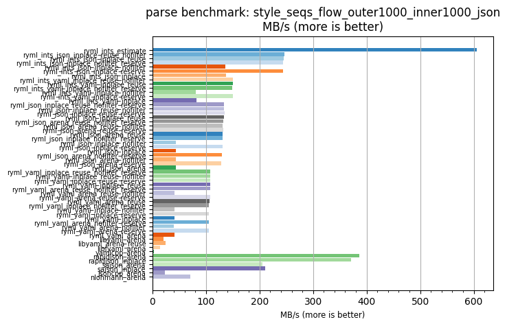
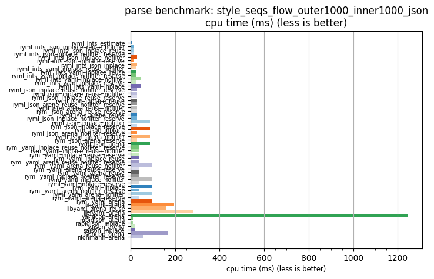

## parse benchmark: style_seqs_flow_outer1000_inner1000_json

<p>Data type benchmark results:</p>
<ul>
   <li><pre><a href='#ryml-bm-parse-style_seqs_flow_outer1000_inner1000_json-ryml_ints_estimate'>ryml_ints_estimate</a></pre></li> </ul>


<br/>
<br/>

---

<a id="ryml-bm-parse-style_seqs_flow_outer1000_inner1000_json-ryml_ints_estimate"/>

### parse benchmark: style_seqs_flow_outer1000_inner1000_json

* Interactive html graphs
  * [MB/s](./ryml-bm-parse-style_seqs_flow_outer1000_inner1000_json-mega_bytes_per_second.html)
  * [CPU time](./ryml-bm-parse-style_seqs_flow_outer1000_inner1000_json-cpu_time_ms.html)

[](./ryml-bm-parse-style_seqs_flow_outer1000_inner1000_json-mega_bytes_per_second.png)
[](./ryml-bm-parse-style_seqs_flow_outer1000_inner1000_json-cpu_time_ms.png)

```
+----------------------------------------------------------------------------------------------------------------------+
|                              parse benchmark: style_seqs_flow_outer1000_inner1000_json                               |
+------------------------------------------+---------+---------+-----------+---------------+-------------+-------------+
| function                                 |    MB/s | MB/s(x) |   MB/s(%) | cpu time (ms) | cpu time(x) | cpu time(%) |
+------------------------------------------+---------+---------+-----------+---------------+-------------+-------------+
| ryml_ints_estimate                       |  606.22 | 194.22x | 19321.50% |          6.42 |       0.01x |     -99.49% |
| ryml_ints_json_inplace_reuse_nofilter    |  246.89 |  79.10x |  7809.62% |         15.77 |       0.01x |     -98.74% |
| ryml_ints_json_inplace_reuse             |  244.86 |  78.45x |  7744.62% |         15.90 |       0.01x |     -98.73% |
| ryml_ints_json_inplace_nofilter_reserve  |  244.24 |  78.25x |  7724.58% |         15.94 |       0.01x |     -98.72% |
| ryml_ints_json_inplace_nofilter          |  136.70 |  43.79x |  4279.47% |         28.49 |       0.02x |     -97.72% |
| ryml_ints_json_inplace_reserve           |  244.50 |  78.33x |  7733.15% |         15.93 |       0.01x |     -98.72% |
| ryml_ints_json_inplace                   |  137.67 |  44.11x |  4310.54% |         28.28 |       0.02x |     -97.73% |
| ryml_ints_yaml_inplace_reuse_nofilter    |  150.15 |  48.10x |  4710.40% |         25.93 |       0.02x |     -97.92% |
| ryml_ints_yaml_inplace_reuse             |  149.68 |  47.95x |  4695.25% |         26.02 |       0.02x |     -97.91% |
| ryml_ints_yaml_inplace_nofilter_reserve  |  149.36 |  47.85x |  4685.01% |         26.07 |       0.02x |     -97.91% |
| ryml_ints_yaml_inplace_nofilter          |   81.31 |  26.05x |  2504.93% |         47.89 |       0.04x |     -96.16% |
| ryml_ints_yaml_inplace_reserve           |  150.45 |  48.20x |  4719.95% |         25.88 |       0.02x |     -97.93% |
| ryml_ints_yaml_inplace                   |   81.74 |  26.19x |  2518.84% |         47.64 |       0.04x |     -96.18% |
| ryml_json_inplace_reuse_nofilter_reserve |  133.06 |  42.63x |  4162.91% |         29.26 |       0.02x |     -97.65% |
| ryml_json_inplace_reuse_nofilter         |  133.42 |  42.74x |  4174.38% |         29.19 |       0.02x |     -97.66% |
| ryml_json_inplace_reuse_reserve          |  134.30 |  43.02x |  4202.49% |         29.00 |       0.02x |     -97.68% |
| ryml_json_inplace_reuse                  |  133.38 |  42.73x |  4173.14% |         29.19 |       0.02x |     -97.66% |
| ryml_json_arena_reuse_nofilter_reserve   |  132.21 |  42.36x |  4135.70% |         29.45 |       0.02x |     -97.64% |
| ryml_json_arena_reuse_nofilter           |  131.45 |  42.11x |  4111.15% |         29.62 |       0.02x |     -97.63% |
| ryml_json_arena_reuse_reserve            |  132.39 |  42.41x |  4141.32% |         29.41 |       0.02x |     -97.64% |
| ryml_json_arena_reuse                    |  130.69 |  41.87x |  4086.93% |         29.80 |       0.02x |     -97.61% |
| ryml_json_inplace_nofilter_reserve       |  130.80 |  41.90x |  4090.32% |         29.77 |       0.02x |     -97.61% |
| ryml_json_inplace_nofilter               |   44.30 |  14.19x |  1319.31% |         87.90 |       0.07x |     -92.95% |
| ryml_json_inplace_reserve                |  130.49 |  41.81x |  4080.54% |         29.84 |       0.02x |     -97.61% |
| ryml_json_inplace                        |   44.24 |  14.17x |  1317.18% |         88.03 |       0.07x |     -92.94% |
| ryml_json_arena_nofilter_reserve         |  129.73 |  41.56x |  4056.24% |         30.02 |       0.02x |     -97.59% |
| ryml_json_arena_nofilter                 |   44.03 |  14.11x |  1310.61% |         88.44 |       0.07x |     -92.91% |
| ryml_json_arena_reserve                  |  128.86 |  41.28x |  4028.40% |         30.22 |       0.02x |     -97.58% |
| ryml_json_arena                          |   44.04 |  14.11x |  1311.01% |         88.41 |       0.07x |     -92.91% |
| ryml_yaml_inplace_reuse_nofilter_reserve |  108.33 |  34.71x |  3370.57% |         35.95 |       0.03x |     -97.12% |
| ryml_yaml_inplace_reuse_nofilter         |  108.29 |  34.69x |  3369.41% |         35.96 |       0.03x |     -97.12% |
| ryml_yaml_inplace_reuse_reserve          |  107.99 |  34.60x |  3359.52% |         36.06 |       0.03x |     -97.11% |
| ryml_yaml_inplace_reuse                  |  107.60 |  34.47x |  3347.07% |         36.19 |       0.03x |     -97.10% |
| ryml_yaml_arena_reuse_nofilter_reserve   |  107.24 |  34.35x |  3335.49% |         36.31 |       0.03x |     -97.09% |
| ryml_yaml_arena_reuse_nofilter           |   40.78 |  13.06x |  1206.32% |         95.50 |       0.08x |     -92.34% |
| ryml_yaml_arena_reuse_reserve            |  107.34 |  34.39x |  3338.81% |         36.28 |       0.03x |     -97.09% |
| ryml_yaml_arena_reuse                    |  106.68 |  34.18x |  3317.85% |         36.50 |       0.03x |     -97.07% |
| ryml_yaml_inplace_nofilter_reserve       |  104.73 |  33.55x |  3255.30% |         37.18 |       0.03x |     -97.02% |
| ryml_yaml_inplace_nofilter               |   40.86 |  13.09x |  1209.09% |         95.30 |       0.08x |     -92.36% |
| ryml_yaml_inplace_reserve                |  105.85 |  33.91x |  3291.11% |         36.79 |       0.03x |     -97.05% |
| ryml_yaml_inplace                        |   40.82 |  13.08x |  1207.67% |         95.40 |       0.08x |     -92.35% |
| ryml_yaml_arena_nofilter_reserve         |  105.34 |  33.75x |  3274.91% |         36.96 |       0.03x |     -97.04% |
| ryml_yaml_arena_nofilter                 |   40.39 |  12.94x |  1193.82% |         96.42 |       0.08x |     -92.27% |
| ryml_yaml_arena_reserve                  |  105.21 |  33.71x |  3270.50% |         37.01 |       0.03x |     -97.03% |
| ryml_yaml_arena                          |   40.82 |  13.08x |  1207.85% |         95.39 |       0.08x |     -92.35% |
| libyaml_arena                            |   19.94 |   6.39x |   538.94% |        195.25 |       0.16x |     -84.35% |
| libyaml_arena_reuse                      |   24.51 |   7.85x |   685.23% |        158.87 |       0.13x |     -87.26% |
| libfyaml_arena                           |   13.90 |   4.45x |   345.17% |        280.24 |       0.22x |     -77.54% |
| yamlcpp_arena                            |    3.12 |   1.00x |     0.00% |       1247.52 |       1.00x |       0.00% |
| rapidjson_arena                          |  385.85 | 123.61x | 12261.30% |         10.09 |       0.01x |     -99.19% |
| rapidjson_inplace                        |  370.77 | 118.78x | 11778.20% |         10.50 |       0.01x |     -99.16% |
| sajson_arena                             |  205.04 |  65.69x |  6468.82% |         18.99 |       0.02x |     -98.48% |
| sajson_inplace                           |  210.07 |  67.30x |  6629.98% |         18.54 |       0.01x |     -98.51% |
| jsoncpp_arena                            |   23.52 |   7.54x |   653.57% |        165.55 |       0.13x |     -86.73% |
| nlohmann_arena                           |   70.78 |  22.68x |  2167.51% |         55.02 |       0.04x |     -95.59% |
+------------------------------------------+---------+---------+-----------+---------------+-------------+-------------+
```

