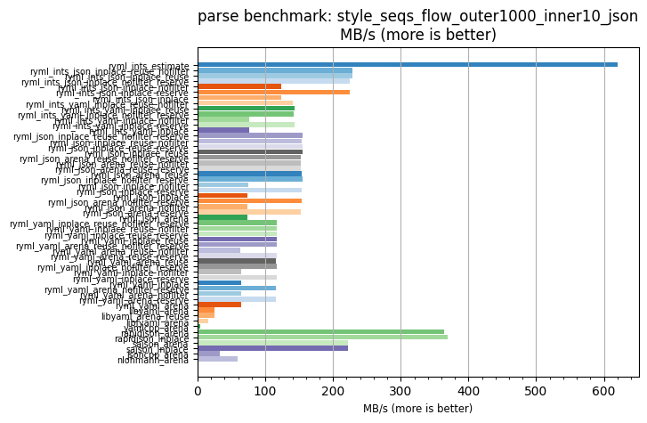
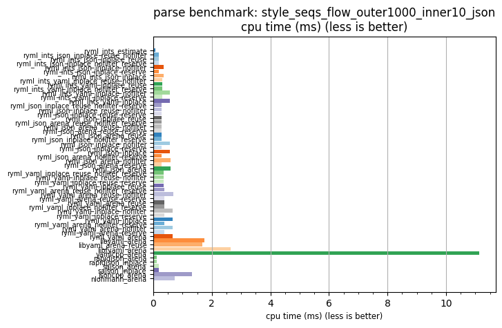

## parse benchmark: style_seqs_flow_outer1000_inner10_json

<p>Data type benchmark results:</p>
<ul>
   <li><pre><a href='#ryml-bm-parse-style_seqs_flow_outer1000_inner10_json-ryml_ints_estimate'>ryml_ints_estimate</a></pre></li> </ul>


<br/>
<br/>

---

<a id="ryml-bm-parse-style_seqs_flow_outer1000_inner10_json-ryml_ints_estimate"/>

### parse benchmark: style_seqs_flow_outer1000_inner10_json

* Interactive html graphs
  * [MB/s](./ryml-bm-parse-style_seqs_flow_outer1000_inner10_json-mega_bytes_per_second.html)
  * [CPU time](./ryml-bm-parse-style_seqs_flow_outer1000_inner10_json-cpu_time_ms.html)

[](./ryml-bm-parse-style_seqs_flow_outer1000_inner10_json-mega_bytes_per_second.png)
[](./ryml-bm-parse-style_seqs_flow_outer1000_inner10_json-cpu_time_ms.png)

```
+----------------------------------------------------------------------------------------------------------------------+
|                               parse benchmark: style_seqs_flow_outer1000_inner10_json                                |
+------------------------------------------+---------+---------+-----------+---------------+-------------+-------------+
| function                                 |    MB/s | MB/s(x) |   MB/s(%) | cpu time (ms) | cpu time(x) | cpu time(%) |
+------------------------------------------+---------+---------+-----------+---------------+-------------+-------------+
| ryml_ints_estimate                       |  620.70 | 161.15x | 16015.23% |          0.07 |       0.01x |     -99.38% |
| ryml_ints_json_inplace_reuse_nofilter    |  228.37 |  59.29x |  5829.14% |          0.19 |       0.02x |     -98.31% |
| ryml_ints_json_inplace_reuse             |  228.47 |  59.32x |  5831.71% |          0.19 |       0.02x |     -98.31% |
| ryml_ints_json_inplace_nofilter_reserve  |  225.16 |  58.46x |  5745.74% |          0.19 |       0.02x |     -98.29% |
| ryml_ints_json_inplace_nofilter          |  123.62 |  32.10x |  3109.61% |          0.35 |       0.03x |     -96.88% |
| ryml_ints_json_inplace_reserve           |  224.99 |  58.41x |  5741.49% |          0.19 |       0.02x |     -98.29% |
| ryml_ints_json_inplace                   |  123.43 |  32.05x |  3104.67% |          0.35 |       0.03x |     -96.88% |
| ryml_ints_yaml_inplace_reuse_nofilter    |  140.66 |  36.52x |  3552.00% |          0.31 |       0.03x |     -97.26% |
| ryml_ints_yaml_inplace_reuse             |  142.66 |  37.04x |  3603.94% |          0.30 |       0.03x |     -97.30% |
| ryml_ints_yaml_inplace_nofilter_reserve  |  142.58 |  37.02x |  3601.77% |          0.30 |       0.03x |     -97.30% |
| ryml_ints_yaml_inplace_nofilter          |   76.33 |  19.82x |  1881.81% |          0.56 |       0.05x |     -94.95% |
| ryml_ints_yaml_inplace_reserve           |  142.93 |  37.11x |  3610.85% |          0.30 |       0.03x |     -97.31% |
| ryml_ints_yaml_inplace                   |   76.30 |  19.81x |  1880.98% |          0.56 |       0.05x |     -94.95% |
| ryml_json_inplace_reuse_nofilter_reserve |  155.11 |  40.27x |  3927.23% |          0.28 |       0.02x |     -97.52% |
| ryml_json_inplace_reuse_nofilter         |  154.32 |  40.07x |  3906.74% |          0.28 |       0.02x |     -97.50% |
| ryml_json_inplace_reuse_reserve          |  154.72 |  40.17x |  3917.08% |          0.28 |       0.02x |     -97.51% |
| ryml_json_inplace_reuse                  |  154.67 |  40.16x |  3915.65% |          0.28 |       0.02x |     -97.51% |
| ryml_json_arena_reuse_nofilter_reserve   |  152.90 |  39.70x |  3869.67% |          0.28 |       0.03x |     -97.48% |
| ryml_json_arena_reuse_nofilter           |  153.10 |  39.75x |  3875.02% |          0.28 |       0.03x |     -97.48% |
| ryml_json_arena_reuse_reserve            |  153.11 |  39.75x |  3875.29% |          0.28 |       0.03x |     -97.48% |
| ryml_json_arena_reuse                    |  153.12 |  39.75x |  3875.46% |          0.28 |       0.03x |     -97.48% |
| ryml_json_inplace_nofilter_reserve       |  154.45 |  40.10x |  3909.99% |          0.28 |       0.02x |     -97.51% |
| ryml_json_inplace_nofilter               |   74.30 |  19.29x |  1829.06% |          0.58 |       0.05x |     -94.82% |
| ryml_json_inplace_reserve                |  154.39 |  40.08x |  3908.44% |          0.28 |       0.02x |     -97.51% |
| ryml_json_inplace                        |   74.26 |  19.28x |  1828.09% |          0.58 |       0.05x |     -94.81% |
| ryml_json_arena_nofilter_reserve         |  153.15 |  39.76x |  3876.21% |          0.28 |       0.03x |     -97.49% |
| ryml_json_arena_nofilter                 |   73.81 |  19.16x |  1816.27% |          0.58 |       0.05x |     -94.78% |
| ryml_json_arena_reserve                  |  152.83 |  39.68x |  3867.87% |          0.28 |       0.03x |     -97.48% |
| ryml_json_arena                          |   73.97 |  19.21x |  1820.54% |          0.58 |       0.05x |     -94.79% |
| ryml_yaml_inplace_reuse_nofilter_reserve |  117.39 |  30.48x |  2947.93% |          0.37 |       0.03x |     -96.72% |
| ryml_yaml_inplace_reuse_nofilter         |  117.20 |  30.43x |  2942.89% |          0.37 |       0.03x |     -96.71% |
| ryml_yaml_inplace_reuse_reserve          |  117.38 |  30.47x |  2947.43% |          0.37 |       0.03x |     -96.72% |
| ryml_yaml_inplace_reuse                  |  117.52 |  30.51x |  2951.24% |          0.37 |       0.03x |     -96.72% |
| ryml_yaml_arena_reuse_nofilter_reserve   |  116.59 |  30.27x |  2927.04% |          0.37 |       0.03x |     -96.70% |
| ryml_yaml_arena_reuse_nofilter           |   63.47 |  16.48x |  1547.97% |          0.68 |       0.06x |     -93.93% |
| ryml_yaml_arena_reuse_reserve            |  116.44 |  30.23x |  2923.23% |          0.37 |       0.03x |     -96.69% |
| ryml_yaml_arena_reuse                    |  116.00 |  30.12x |  2911.71% |          0.37 |       0.03x |     -96.68% |
| ryml_yaml_inplace_nofilter_reserve       |  116.92 |  30.36x |  2935.53% |          0.37 |       0.03x |     -96.71% |
| ryml_yaml_inplace_nofilter               |   64.38 |  16.72x |  1571.54% |          0.67 |       0.06x |     -94.02% |
| ryml_yaml_inplace_reserve                |  117.08 |  30.40x |  2939.80% |          0.37 |       0.03x |     -96.71% |
| ryml_yaml_inplace                        |   64.41 |  16.72x |  1572.33% |          0.67 |       0.06x |     -94.02% |
| ryml_yaml_arena_nofilter_reserve         |  116.25 |  30.18x |  2918.18% |          0.37 |       0.03x |     -96.69% |
| ryml_yaml_arena_nofilter                 |   64.13 |  16.65x |  1565.00% |          0.67 |       0.06x |     -93.99% |
| ryml_yaml_arena_reserve                  |  116.31 |  30.20x |  2919.73% |          0.37 |       0.03x |     -96.69% |
| ryml_yaml_arena                          |   64.25 |  16.68x |  1568.05% |          0.67 |       0.06x |     -94.00% |
| libyaml_arena                            |   24.74 |   6.42x |   542.23% |          1.73 |       0.16x |     -84.43% |
| libyaml_arena_reuse                      |   25.47 |   6.61x |   561.26% |          1.68 |       0.15x |     -84.88% |
| libfyaml_arena                           |   16.29 |   4.23x |   322.85% |          2.63 |       0.24x |     -76.35% |
| yamlcpp_arena                            |    3.85 |   1.00x |     0.00% |         11.14 |       1.00x |       0.00% |
| rapidjson_arena                          |  363.83 |  94.46x |  9346.07% |          0.12 |       0.01x |     -98.94% |
| rapidjson_inplace                        |  369.03 |  95.81x |  9481.23% |          0.12 |       0.01x |     -98.96% |
| sajson_arena                             |  222.02 |  57.64x |  5664.44% |          0.19 |       0.02x |     -98.27% |
| sajson_inplace                           |  222.39 |  57.74x |  5673.97% |          0.19 |       0.02x |     -98.27% |
| jsoncpp_arena                            |   32.36 |   8.40x |   740.18% |          1.33 |       0.12x |     -88.10% |
| nlohmann_arena                           |   59.55 |  15.46x |  1445.98% |          0.72 |       0.06x |     -93.53% |
+------------------------------------------+---------+---------+-----------+---------------+-------------+-------------+
```

