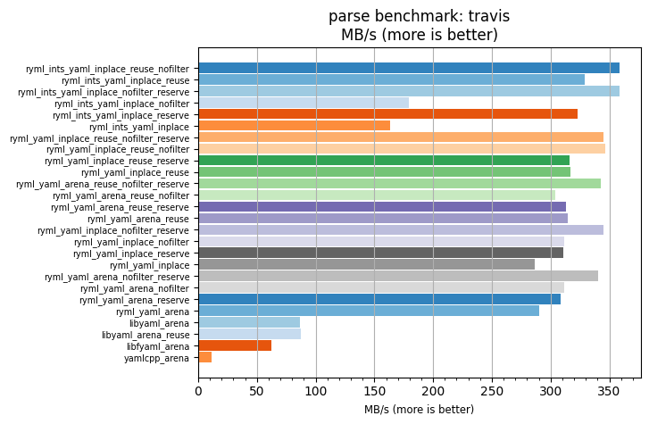
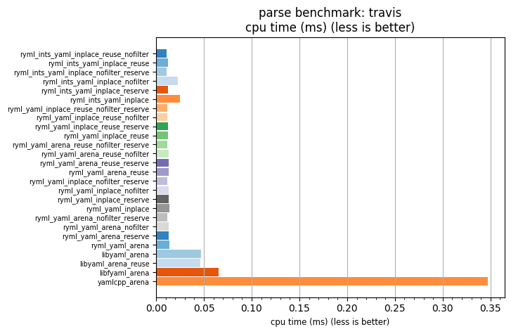

## parse benchmark: travis

<p>Data type benchmark results:</p>
<ul>
   <li><pre><a href='#ryml-bm-parse-travis-ryml_ints_yaml_inplace_reuse_nofilter'>ryml_ints_yaml_inplace_reuse_nofilter</a></pre></li> </ul>


<br/>
<br/>

---

<a id="ryml-bm-parse-travis-ryml_ints_yaml_inplace_reuse_nofilter"/>

### parse benchmark: travis

* Interactive html graphs
  * [MB/s](./ryml-bm-parse-travis-mega_bytes_per_second.html)
  * [CPU time](./ryml-bm-parse-travis-cpu_time_ms.html)

[](./ryml-bm-parse-travis-mega_bytes_per_second.png)
[](./ryml-bm-parse-travis-cpu_time_ms.png)

```
+---------------------------------------------------------------------------------------------------------------------+
|                                               parse benchmark: travis                                               |
+------------------------------------------+---------+---------+----------+---------------+-------------+-------------+
| function                                 |    MB/s | MB/s(x) |  MB/s(%) | cpu time (ms) | cpu time(x) | cpu time(%) |
+------------------------------------------+---------+---------+----------+---------------+-------------+-------------+
| ryml_ints_yaml_inplace_reuse_nofilter    |  358.98 |  30.66x | 2965.82% |          0.01 |       0.03x |     -96.74% |
| ryml_ints_yaml_inplace_reuse             |  328.72 |  28.07x | 2707.36% |          0.01 |       0.04x |     -96.44% |
| ryml_ints_yaml_inplace_nofilter_reserve  |  358.56 |  30.62x | 2962.19% |          0.01 |       0.03x |     -96.73% |
| ryml_ints_yaml_inplace_nofilter          |  179.43 |  15.32x | 1432.37% |          0.02 |       0.07x |     -93.47% |
| ryml_ints_yaml_inplace_reserve           |  323.27 |  27.61x | 2660.81% |          0.01 |       0.04x |     -96.38% |
| ryml_ints_yaml_inplace                   |  163.41 |  13.96x | 1295.54% |          0.02 |       0.07x |     -92.83% |
| ryml_yaml_inplace_reuse_nofilter_reserve |  344.77 |  29.44x | 2844.45% |          0.01 |       0.03x |     -96.60% |
| ryml_yaml_inplace_reuse_nofilter         |  346.22 |  29.57x | 2856.82% |          0.01 |       0.03x |     -96.62% |
| ryml_yaml_inplace_reuse_reserve          |  315.79 |  26.97x | 2596.99% |          0.01 |       0.04x |     -96.29% |
| ryml_yaml_inplace_reuse                  |  317.15 |  27.09x | 2608.58% |          0.01 |       0.04x |     -96.31% |
| ryml_yaml_arena_reuse_nofilter_reserve   |  343.12 |  29.30x | 2830.33% |          0.01 |       0.03x |     -96.59% |
| ryml_yaml_arena_reuse_nofilter           |  304.18 |  25.98x | 2497.84% |          0.01 |       0.04x |     -96.15% |
| ryml_yaml_arena_reuse_reserve            |  313.30 |  26.76x | 2575.66% |          0.01 |       0.04x |     -96.26% |
| ryml_yaml_arena_reuse                    |  314.27 |  26.84x | 2583.98% |          0.01 |       0.04x |     -96.27% |
| ryml_yaml_inplace_nofilter_reserve       |  345.12 |  29.47x | 2847.48% |          0.01 |       0.03x |     -96.61% |
| ryml_yaml_inplace_nofilter               |  311.35 |  26.59x | 2559.06% |          0.01 |       0.04x |     -96.24% |
| ryml_yaml_inplace_reserve                |  310.71 |  26.54x | 2553.61% |          0.01 |       0.04x |     -96.23% |
| ryml_yaml_inplace                        |  286.67 |  24.48x | 2348.26% |          0.01 |       0.04x |     -95.92% |
| ryml_yaml_arena_nofilter_reserve         |  340.68 |  29.10x | 2809.52% |          0.01 |       0.03x |     -96.56% |
| ryml_yaml_arena_nofilter                 |  311.56 |  26.61x | 2560.86% |          0.01 |       0.04x |     -96.24% |
| ryml_yaml_arena_reserve                  |  308.52 |  26.35x | 2534.85% |          0.01 |       0.04x |     -96.20% |
| ryml_yaml_arena                          |  290.27 |  24.79x | 2379.04% |          0.01 |       0.04x |     -95.97% |
| libyaml_arena                            |   86.79 |   7.41x |  641.22% |          0.05 |       0.13x |     -86.51% |
| libyaml_arena_reuse                      |   87.20 |   7.45x |  644.72% |          0.05 |       0.13x |     -86.57% |
| libfyaml_arena                           |   62.47 |   5.34x |  433.51% |          0.07 |       0.19x |     -81.26% |
| yamlcpp_arena                            |   11.71 |   1.00x |    0.00% |          0.35 |       1.00x |       0.00% |
+------------------------------------------+---------+---------+----------+---------------+-------------+-------------+
```

