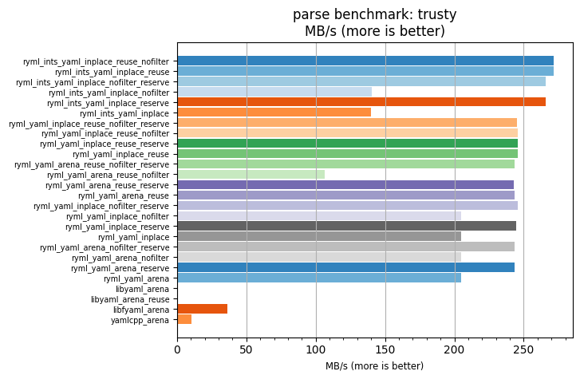
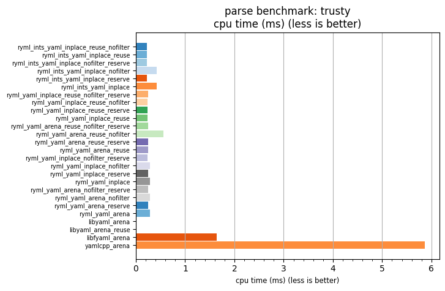

## parse benchmark: trusty

<p>Data type benchmark results:</p>
<ul>
   <li><pre><a href='#ryml-bm-parse-trusty-ryml_ints_yaml_inplace_reuse_nofilter'>ryml_ints_yaml_inplace_reuse_nofilter</a></pre></li> </ul>


<br/>
<br/>

---

<a id="ryml-bm-parse-trusty-ryml_ints_yaml_inplace_reuse_nofilter"/>

### parse benchmark: trusty

* Interactive html graphs
  * [MB/s](./ryml-bm-parse-trusty-mega_bytes_per_second.html)
  * [CPU time](./ryml-bm-parse-trusty-cpu_time_ms.html)

[](./ryml-bm-parse-trusty-mega_bytes_per_second.png)
[](./ryml-bm-parse-trusty-cpu_time_ms.png)

```
+---------------------------------------------------------------------------------------------------------------------+
|                                               parse benchmark: trusty                                               |
+------------------------------------------+---------+---------+----------+---------------+-------------+-------------+
| function                                 |    MB/s | MB/s(x) |  MB/s(%) | cpu time (ms) | cpu time(x) | cpu time(%) |
+------------------------------------------+---------+---------+----------+---------------+-------------+-------------+
| ryml_ints_yaml_inplace_reuse_nofilter    |  271.61 |  26.81x | 2580.83% |          0.22 |       0.04x |     -96.27% |
| ryml_ints_yaml_inplace_reuse             |  271.85 |  26.83x | 2583.18% |          0.22 |       0.04x |     -96.27% |
| ryml_ints_yaml_inplace_nofilter_reserve  |  265.90 |  26.24x | 2524.47% |          0.22 |       0.04x |     -96.19% |
| ryml_ints_yaml_inplace_nofilter          |  140.26 |  13.84x | 1284.41% |          0.42 |       0.07x |     -92.78% |
| ryml_ints_yaml_inplace_reserve           |  266.00 |  26.25x | 2525.47% |          0.22 |       0.04x |     -96.19% |
| ryml_ints_yaml_inplace                   |  140.10 |  13.83x | 1282.78% |          0.42 |       0.07x |     -92.77% |
| ryml_yaml_inplace_reuse_nofilter_reserve |  244.92 |  24.17x | 2317.43% |          0.24 |       0.04x |     -95.86% |
| ryml_yaml_inplace_reuse_nofilter         |  245.47 |  24.23x | 2322.84% |          0.24 |       0.04x |     -95.87% |
| ryml_yaml_inplace_reuse_reserve          |  245.59 |  24.24x | 2324.00% |          0.24 |       0.04x |     -95.87% |
| ryml_yaml_inplace_reuse                  |  245.81 |  24.26x | 2326.24% |          0.24 |       0.04x |     -95.88% |
| ryml_yaml_arena_reuse_nofilter_reserve   |  243.38 |  24.02x | 2302.23% |          0.24 |       0.04x |     -95.84% |
| ryml_yaml_arena_reuse_nofilter           |  106.62 |  10.52x |  952.36% |          0.56 |       0.10x |     -90.50% |
| ryml_yaml_arena_reuse_reserve            |  243.02 |  23.99x | 2298.68% |          0.24 |       0.04x |     -95.83% |
| ryml_yaml_arena_reuse                    |  243.45 |  24.03x | 2302.90% |          0.24 |       0.04x |     -95.84% |
| ryml_yaml_inplace_nofilter_reserve       |  245.91 |  24.27x | 2327.23% |          0.24 |       0.04x |     -95.88% |
| ryml_yaml_inplace_nofilter               |  204.99 |  20.23x | 1923.28% |          0.29 |       0.05x |     -95.06% |
| ryml_yaml_inplace_reserve                |  244.73 |  24.16x | 2315.59% |          0.24 |       0.04x |     -95.86% |
| ryml_yaml_inplace                        |  204.94 |  20.23x | 1922.86% |          0.29 |       0.05x |     -95.06% |
| ryml_yaml_arena_nofilter_reserve         |  243.33 |  24.02x | 2301.74% |          0.24 |       0.04x |     -95.84% |
| ryml_yaml_arena_nofilter                 |  204.72 |  20.21x | 1920.65% |          0.29 |       0.05x |     -95.05% |
| ryml_yaml_arena_reserve                  |  243.58 |  24.04x | 2304.18% |          0.24 |       0.04x |     -95.84% |
| ryml_yaml_arena                          |  205.11 |  20.24x | 1924.48% |          0.29 |       0.05x |     -95.06% |
| libyaml_arena                            |    0.00 |   0.00x | -100.00% |          0.00 |       0.00x |    -100.00% |
| libyaml_arena_reuse                      |    0.00 |   0.00x | -100.00% |          0.00 |       0.00x |    -100.00% |
| libfyaml_arena                           |   36.38 |   3.59x |  259.12% |          1.63 |       0.28x |     -72.15% |
| yamlcpp_arena                            |   10.13 |   1.00x |    0.00% |          5.87 |       1.00x |       0.00% |
+------------------------------------------+---------+---------+----------+---------------+-------------+-------------+
```

