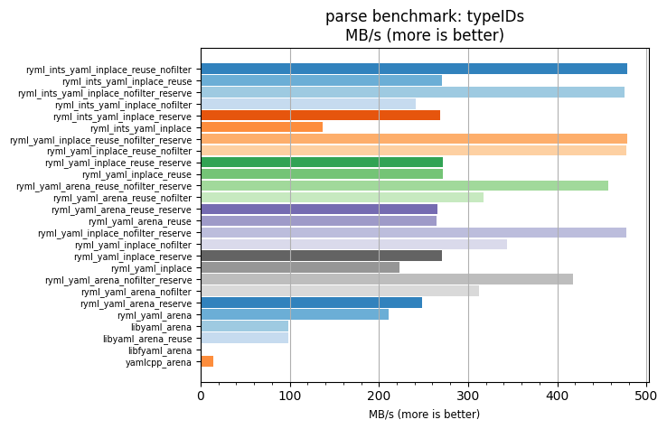
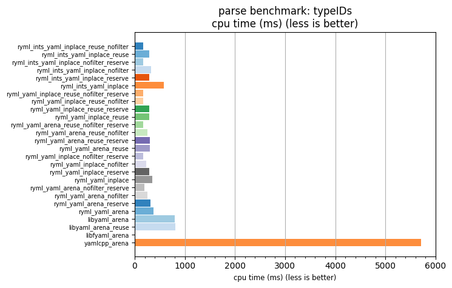

## parse benchmark: typeIDs

<p>Data type benchmark results:</p>
<ul>
   <li><pre><a href='#ryml-bm-parse-typeIDs-ryml_ints_yaml_inplace_reuse_nofilter'>ryml_ints_yaml_inplace_reuse_nofilter</a></pre></li> </ul>


<br/>
<br/>

---

<a id="ryml-bm-parse-typeIDs-ryml_ints_yaml_inplace_reuse_nofilter"/>

### parse benchmark: typeIDs

* Interactive html graphs
  * [MB/s](./ryml-bm-parse-typeIDs-mega_bytes_per_second.html)
  * [CPU time](./ryml-bm-parse-typeIDs-cpu_time_ms.html)

[](./ryml-bm-parse-typeIDs-mega_bytes_per_second.png)
[](./ryml-bm-parse-typeIDs-cpu_time_ms.png)

```
+---------------------------------------------------------------------------------------------------------------------+
|                                               parse benchmark: typeIDs                                              |
+------------------------------------------+---------+---------+----------+---------------+-------------+-------------+
| function                                 |    MB/s | MB/s(x) |  MB/s(%) | cpu time (ms) | cpu time(x) | cpu time(%) |
+------------------------------------------+---------+---------+----------+---------------+-------------+-------------+
| ryml_ints_yaml_inplace_reuse_nofilter    |  477.94 |  34.42x | 3342.48% |        166.04 |       0.03x |     -97.10% |
| ryml_ints_yaml_inplace_reuse             |  270.88 |  19.51x | 1851.07% |        292.96 |       0.05x |     -94.87% |
| ryml_ints_yaml_inplace_nofilter_reserve  |  475.65 |  34.26x | 3326.04% |        166.84 |       0.03x |     -97.08% |
| ryml_ints_yaml_inplace_nofilter          |  240.75 |  17.34x | 1634.06% |        329.63 |       0.06x |     -94.23% |
| ryml_ints_yaml_inplace_reserve           |  268.57 |  19.34x | 1834.43% |        295.48 |       0.05x |     -94.83% |
| ryml_ints_yaml_inplace                   |  136.45 |   9.83x |  882.83% |        581.58 |       0.10x |     -89.83% |
| ryml_yaml_inplace_reuse_nofilter_reserve |  478.77 |  34.49x | 3348.52% |        165.75 |       0.03x |     -97.10% |
| ryml_yaml_inplace_reuse_nofilter         |  477.53 |  34.40x | 3339.57% |        166.18 |       0.03x |     -97.09% |
| ryml_yaml_inplace_reuse_reserve          |  271.79 |  19.58x | 1857.64% |        291.98 |       0.05x |     -94.89% |
| ryml_yaml_inplace_reuse                  |  271.55 |  19.56x | 1855.93% |        292.23 |       0.05x |     -94.89% |
| ryml_yaml_arena_reuse_nofilter_reserve   |  456.71 |  32.90x | 3189.55% |        173.76 |       0.03x |     -96.96% |
| ryml_yaml_arena_reuse_nofilter           |  317.72 |  22.88x | 2188.45% |        249.77 |       0.04x |     -95.63% |
| ryml_yaml_arena_reuse_reserve            |  266.08 |  19.17x | 1816.51% |        298.24 |       0.05x |     -94.78% |
| ryml_yaml_arena_reuse                    |  265.02 |  19.09x | 1808.90% |        299.43 |       0.05x |     -94.76% |
| ryml_yaml_inplace_nofilter_reserve       |  476.90 |  34.35x | 3334.99% |        166.40 |       0.03x |     -97.09% |
| ryml_yaml_inplace_nofilter               |  343.40 |  24.73x | 2373.42% |        231.09 |       0.04x |     -95.96% |
| ryml_yaml_inplace_reserve                |  270.27 |  19.47x | 1846.67% |        293.62 |       0.05x |     -94.86% |
| ryml_yaml_inplace                        |  222.67 |  16.04x | 1503.87% |        356.38 |       0.06x |     -93.77% |
| ryml_yaml_arena_nofilter_reserve         |  417.23 |  30.05x | 2905.24% |        190.20 |       0.03x |     -96.67% |
| ryml_yaml_arena_nofilter                 |  311.88 |  22.46x | 2146.42% |        254.44 |       0.04x |     -95.55% |
| ryml_yaml_arena_reserve                  |  248.20 |  17.88x | 1687.76% |        319.72 |       0.06x |     -94.41% |
| ryml_yaml_arena                          |  211.24 |  15.22x | 1421.52% |        375.67 |       0.07x |     -93.43% |
| libyaml_arena                            |   98.70 |   7.11x |  610.89% |        804.04 |       0.14x |     -85.93% |
| libyaml_arena_reuse                      |   98.45 |   7.09x |  609.10% |        806.07 |       0.14x |     -85.90% |
| libfyaml_arena                           |    0.00 |   0.00x | -100.00% |          0.00 |       0.00x |    -100.00% |
| yamlcpp_arena                            |   13.88 |   1.00x |    0.00% |       5715.89 |       1.00x |       0.00% |
+------------------------------------------+---------+---------+----------+---------------+-------------+-------------+
```

