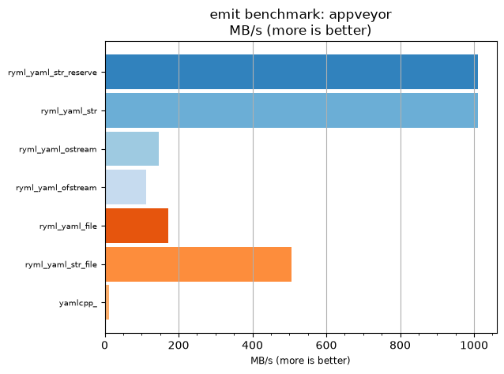
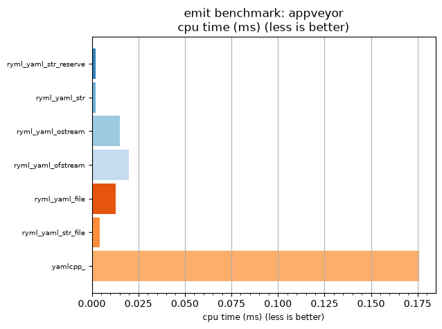

## emit benchmark: appveyor

<p>Data type benchmark results:</p>
<ul>
   <li><pre><a href='#ryml-bm-emit-appveyor-ryml_yaml_str_reserve'>ryml_yaml_str_reserve</a></pre></li> </ul>


<br/>
<br/>

---

<a id="ryml-bm-emit-appveyor-ryml_yaml_str_reserve"/>

### emit benchmark: appveyor

* Interactive html graphs
  * [MB/s](./ryml-bm-emit-appveyor-mega_bytes_per_second.html)
  * [CPU time](./ryml-bm-emit-appveyor-cpu_time_ms.html)

[](./ryml-bm-emit-appveyor-mega_bytes_per_second.png)
[](./ryml-bm-emit-appveyor-cpu_time_ms.png)

```
+--------------------------------------------------------------------------------------------------+
|                                     emit benchmark: appveyor                                     |
+-----------------------+---------+---------+----------+---------------+-------------+-------------+
| function              |    MB/s | MB/s(x) |  MB/s(%) | cpu time (ms) | cpu time(x) | cpu time(%) |
+-----------------------+---------+---------+----------+---------------+-------------+-------------+
| ryml_yaml_str_reserve | 1010.35 |  80.01x | 7900.71% |          0.00 |       0.01x |     -98.75% |
| ryml_yaml_str         | 1010.35 |  80.01x | 7900.71% |          0.00 |       0.01x |     -98.75% |
| ryml_yaml_ostream     |  147.34 |  11.67x | 1066.78% |          0.02 |       0.09x |     -91.43% |
| ryml_yaml_ofstream    |  111.28 |   8.81x |  781.21% |          0.02 |       0.11x |     -88.65% |
| ryml_yaml_file        |  172.97 |  13.70x | 1269.69% |          0.01 |       0.07x |     -92.70% |
| ryml_yaml_str_file    |  505.17 |  40.00x | 3900.36% |          0.00 |       0.02x |     -97.50% |
| yamlcpp_              |   12.63 |   1.00x |    0.00% |          0.18 |       1.00x |       0.00% |
+-----------------------+---------+---------+----------+---------------+-------------+-------------+
```

