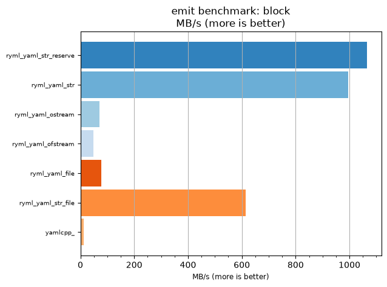
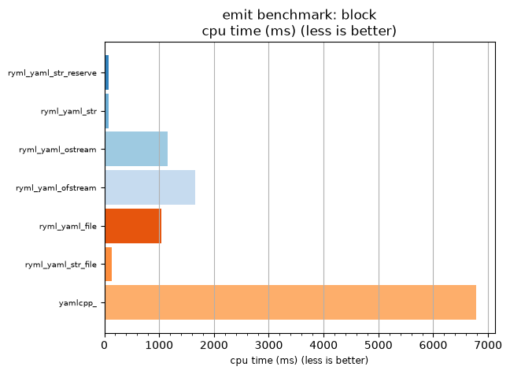

## emit benchmark: block

<p>Data type benchmark results:</p>
<ul>
   <li><pre><a href='#ryml-bm-emit-block-ryml_yaml_str_reserve'>ryml_yaml_str_reserve</a></pre></li> </ul>


<br/>
<br/>

---

<a id="ryml-bm-emit-block-ryml_yaml_str_reserve"/>

### emit benchmark: block

* Interactive html graphs
  * [MB/s](./ryml-bm-emit-block-mega_bytes_per_second.html)
  * [CPU time](./ryml-bm-emit-block-cpu_time_ms.html)

[](./ryml-bm-emit-block-mega_bytes_per_second.png)
[](./ryml-bm-emit-block-cpu_time_ms.png)

```
+--------------------------------------------------------------------------------------------------+
|                                      emit benchmark: block                                       |
+-----------------------+---------+---------+----------+---------------+-------------+-------------+
| function              |    MB/s | MB/s(x) |  MB/s(%) | cpu time (ms) | cpu time(x) | cpu time(%) |
+-----------------------+---------+---------+----------+---------------+-------------+-------------+
| ryml_yaml_str_reserve | 1064.90 |  88.41x | 8740.74% |         76.70 |       0.01x |     -98.87% |
| ryml_yaml_str         |  995.75 |  82.67x | 8166.67% |         82.03 |       0.01x |     -98.79% |
| ryml_yaml_ostream     |   70.64 |   5.86x |  486.49% |       1156.25 |       0.17x |     -82.95% |
| ryml_yaml_ofstream    |   49.32 |   4.09x |  309.43% |       1656.25 |       0.24x |     -75.58% |
| ryml_yaml_file        |   78.03 |   6.48x |  547.76% |       1046.88 |       0.15x |     -84.56% |
| ryml_yaml_str_file    |  615.02 |  51.06x | 5005.88% |        132.81 |       0.02x |     -98.04% |
| yamlcpp_              |   12.05 |   1.00x |    0.00% |       6781.25 |       1.00x |       0.00% |
+-----------------------+---------+---------+----------+---------------+-------------+-------------+
```

