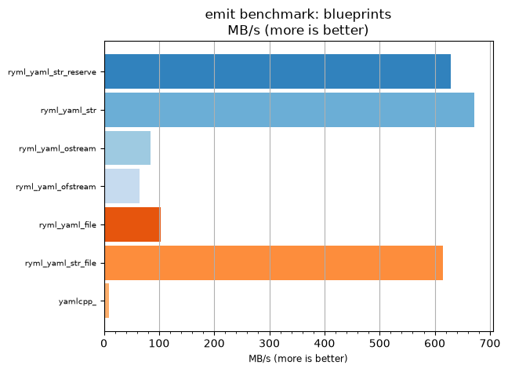
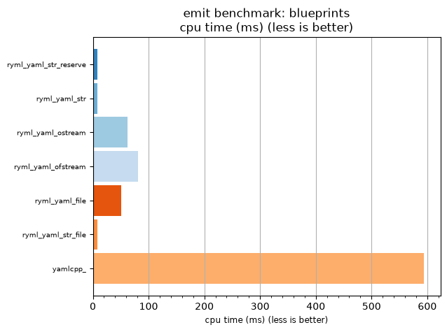

## emit benchmark: blueprints

<p>Data type benchmark results:</p>
<ul>
   <li><pre><a href='#ryml-bm-emit-blueprints-ryml_yaml_str_reserve'>ryml_yaml_str_reserve</a></pre></li> </ul>


<br/>
<br/>

---

<a id="ryml-bm-emit-blueprints-ryml_yaml_str_reserve"/>

### emit benchmark: blueprints

* Interactive html graphs
  * [MB/s](./ryml-bm-emit-blueprints-mega_bytes_per_second.html)
  * [CPU time](./ryml-bm-emit-blueprints-cpu_time_ms.html)

[](./ryml-bm-emit-blueprints-mega_bytes_per_second.png)
[](./ryml-bm-emit-blueprints-cpu_time_ms.png)

```
+--------------------------------------------------------------------------------------------------+
|                                    emit benchmark: blueprints                                    |
+-----------------------+---------+---------+----------+---------------+-------------+-------------+
| function              |    MB/s | MB/s(x) |  MB/s(%) | cpu time (ms) | cpu time(x) | cpu time(%) |
+-----------------------+---------+---------+----------+---------------+-------------+-------------+
| ryml_yaml_str_reserve |  629.56 |  71.25x | 7025.00% |          8.33 |       0.01x |     -98.60% |
| ryml_yaml_str         |  671.53 |  76.00x | 7500.00% |          7.81 |       0.01x |     -98.68% |
| ryml_yaml_ostream     |   83.94 |   9.50x |  850.00% |         62.50 |       0.11x |     -89.47% |
| ryml_yaml_ofstream    |   64.30 |   7.28x |  627.66% |         81.60 |       0.14x |     -86.26% |
| ryml_yaml_file        |  102.59 |  11.61x | 1061.11% |         51.14 |       0.09x |     -91.39% |
| ryml_yaml_str_file    |  614.20 |  69.51x | 6851.22% |          8.54 |       0.01x |     -98.56% |
| yamlcpp_              |    8.84 |   1.00x |    0.00% |        593.75 |       1.00x |       0.00% |
+-----------------------+---------+---------+----------+---------------+-------------+-------------+
```

