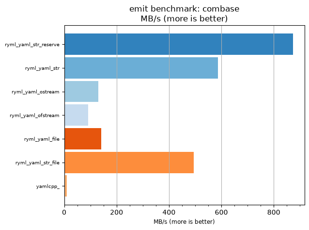
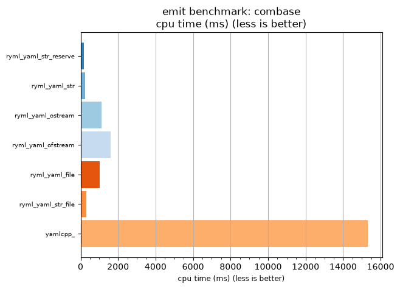

## emit benchmark: combase

<p>Data type benchmark results:</p>
<ul>
   <li><pre><a href='#ryml-bm-emit-combase-ryml_yaml_str_reserve'>ryml_yaml_str_reserve</a></pre></li> </ul>


<br/>
<br/>

---

<a id="ryml-bm-emit-combase-ryml_yaml_str_reserve"/>

### emit benchmark: combase

* Interactive html graphs
  * [MB/s](./ryml-bm-emit-combase-mega_bytes_per_second.html)
  * [CPU time](./ryml-bm-emit-combase-cpu_time_ms.html)

[](./ryml-bm-emit-combase-mega_bytes_per_second.png)
[](./ryml-bm-emit-combase-cpu_time_ms.png)

```
+--------------------------------------------------------------------------------------------------+
|                                     emit benchmark: combase                                      |
+-----------------------+---------+---------+----------+---------------+-------------+-------------+
| function              |    MB/s | MB/s(x) |  MB/s(%) | cpu time (ms) | cpu time(x) | cpu time(%) |
+-----------------------+---------+---------+----------+---------------+-------------+-------------+
| ryml_yaml_str_reserve |  873.46 |  91.16x | 9016.28% |        167.97 |       0.01x |     -98.90% |
| ryml_yaml_str         |  586.86 |  61.25x | 6025.00% |        250.00 |       0.02x |     -98.37% |
| ryml_yaml_ostream     |  130.41 |  13.61x | 1261.11% |       1125.00 |       0.07x |     -92.65% |
| ryml_yaml_ofstream    |   91.16 |   9.51x |  851.46% |       1609.38 |       0.11x |     -89.49% |
| ryml_yaml_file        |  142.27 |  14.85x | 1384.85% |       1031.25 |       0.07x |     -93.27% |
| ryml_yaml_str_file    |  494.19 |  51.58x | 5057.89% |        296.88 |       0.02x |     -98.06% |
| yamlcpp_              |    9.58 |   1.00x |    0.00% |      15312.50 |       1.00x |       0.00% |
+-----------------------+---------+---------+----------+---------------+-------------+-------------+
```

