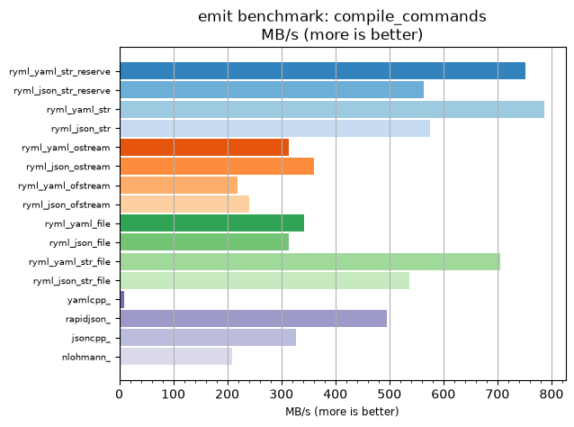
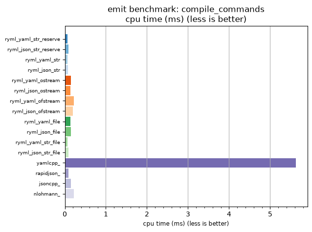

## emit benchmark: compile_commands

<p>Data type benchmark results:</p>
<ul>
   <li><pre><a href='#ryml-bm-emit-compile_commands-ryml_yaml_str_reserve'>ryml_yaml_str_reserve</a></pre></li> </ul>


<br/>
<br/>

---

<a id="ryml-bm-emit-compile_commands-ryml_yaml_str_reserve"/>

### emit benchmark: compile_commands

* Interactive html graphs
  * [MB/s](./ryml-bm-emit-compile_commands-mega_bytes_per_second.html)
  * [CPU time](./ryml-bm-emit-compile_commands-cpu_time_ms.html)

[](./ryml-bm-emit-compile_commands-mega_bytes_per_second.png)
[](./ryml-bm-emit-compile_commands-cpu_time_ms.png)

```
+--------------------------------------------------------------------------------------------------+
|                                 emit benchmark: compile_commands                                 |
+-----------------------+---------+---------+----------+---------------+-------------+-------------+
| function              |    MB/s | MB/s(x) |  MB/s(%) | cpu time (ms) | cpu time(x) | cpu time(%) |
+-----------------------+---------+---------+----------+---------------+-------------+-------------+
| ryml_yaml_str_reserve |  751.64 |  89.60x | 8860.00% |          0.06 |       0.01x |     -98.88% |
| ryml_json_str_reserve |  563.73 |  67.20x | 6620.00% |          0.08 |       0.01x |     -98.51% |
| ryml_yaml_str         |  786.60 |  93.77x | 9276.74% |          0.06 |       0.01x |     -98.93% |
| ryml_json_str         |  575.72 |  68.63x | 6762.98% |          0.08 |       0.01x |     -98.54% |
| ryml_yaml_ostream     |  314.64 |  37.51x | 3650.70% |          0.15 |       0.03x |     -97.33% |
| ryml_json_ostream     |  359.83 |  42.89x | 4189.36% |          0.13 |       0.02x |     -97.67% |
| ryml_yaml_ofstream    |  219.63 |  26.18x | 2518.18% |          0.21 |       0.04x |     -96.18% |
| ryml_json_ofstream    |  239.86 |  28.59x | 2759.32% |          0.20 |       0.03x |     -96.50% |
| ryml_yaml_file        |  341.67 |  40.73x | 3972.91% |          0.14 |       0.02x |     -97.54% |
| ryml_json_file        |  313.20 |  37.34x | 3633.50% |          0.15 |       0.03x |     -97.32% |
| ryml_yaml_str_file    |  704.66 |  84.00x | 8300.00% |          0.07 |       0.01x |     -98.81% |
| ryml_json_str_file    |  536.91 |  64.00x | 6300.29% |          0.09 |       0.02x |     -98.44% |
| yamlcpp_              |    8.39 |   1.00x |    0.00% |          5.62 |       1.00x |       0.00% |
| rapidjson_            |  495.58 |  59.08x | 5807.69% |          0.10 |       0.02x |     -98.31% |
| jsoncpp_              |  326.81 |  38.96x | 3795.83% |          0.14 |       0.03x |     -97.43% |
| nlohmann_             |  209.78 |  25.01x | 2400.74% |          0.22 |       0.04x |     -96.00% |
+-----------------------+---------+---------+----------+---------------+-------------+-------------+
```

