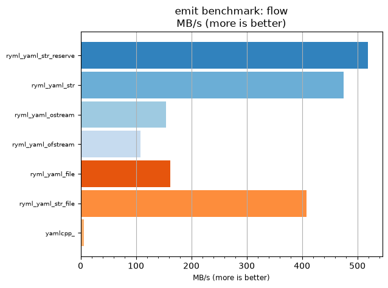
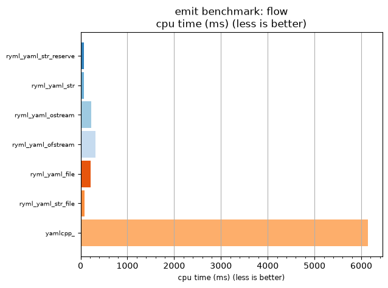

## emit benchmark: flow

<p>Data type benchmark results:</p>
<ul>
   <li><pre><a href='#ryml-bm-emit-flow-ryml_yaml_str_reserve'>ryml_yaml_str_reserve</a></pre></li> </ul>


<br/>
<br/>

---

<a id="ryml-bm-emit-flow-ryml_yaml_str_reserve"/>

### emit benchmark: flow

* Interactive html graphs
  * [MB/s](./ryml-bm-emit-flow-mega_bytes_per_second.html)
  * [CPU time](./ryml-bm-emit-flow-cpu_time_ms.html)

[](./ryml-bm-emit-flow-mega_bytes_per_second.png)
[](./ryml-bm-emit-flow-cpu_time_ms.png)

```
+--------------------------------------------------------------------------------------------------+
|                                       emit benchmark: flow                                       |
+-----------------------+---------+---------+----------+---------------+-------------+-------------+
| function              |    MB/s | MB/s(x) |  MB/s(%) | cpu time (ms) | cpu time(x) | cpu time(%) |
+-----------------------+---------+---------+----------+---------------+-------------+-------------+
| ryml_yaml_str_reserve |  518.92 |  91.98x | 9097.87% |         66.76 |       0.01x |     -98.91% |
| ryml_yaml_str         |  475.11 |  84.21x | 8321.43% |         72.92 |       0.01x |     -98.81% |
| ryml_yaml_ostream     |  154.69 |  27.42x | 2641.86% |        223.96 |       0.04x |     -96.35% |
| ryml_yaml_ofstream    |  108.16 |  19.17x | 1817.07% |        320.31 |       0.05x |     -94.78% |
| ryml_yaml_file        |  162.23 |  28.76x | 2775.61% |        213.54 |       0.03x |     -96.52% |
| ryml_yaml_str_file    |  408.43 |  72.39x | 7139.47% |         84.82 |       0.01x |     -98.62% |
| yamlcpp_              |    5.64 |   1.00x |    0.00% |       6140.62 |       1.00x |       0.00% |
+-----------------------+---------+---------+----------+---------------+-------------+-------------+
```

