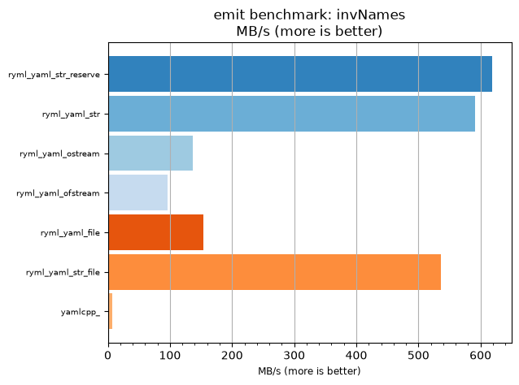
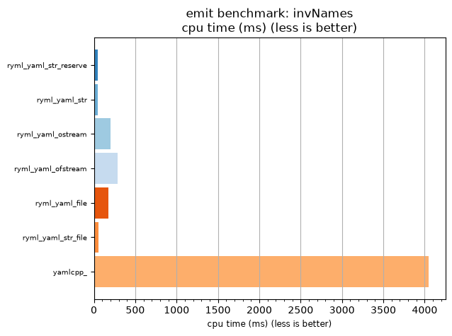

## emit benchmark: invNames

<p>Data type benchmark results:</p>
<ul>
   <li><pre><a href='#ryml-bm-emit-invNames-ryml_yaml_str_reserve'>ryml_yaml_str_reserve</a></pre></li> </ul>


<br/>
<br/>

---

<a id="ryml-bm-emit-invNames-ryml_yaml_str_reserve"/>

### emit benchmark: invNames

* Interactive html graphs
  * [MB/s](./ryml-bm-emit-invNames-mega_bytes_per_second.html)
  * [CPU time](./ryml-bm-emit-invNames-cpu_time_ms.html)

[](./ryml-bm-emit-invNames-mega_bytes_per_second.png)
[](./ryml-bm-emit-invNames-cpu_time_ms.png)

```
+--------------------------------------------------------------------------------------------------+
|                                     emit benchmark: invNames                                     |
+-----------------------+---------+---------+----------+---------------+-------------+-------------+
| function              |    MB/s | MB/s(x) |  MB/s(%) | cpu time (ms) | cpu time(x) | cpu time(%) |
+-----------------------+---------+---------+----------+---------------+-------------+-------------+
| ryml_yaml_str_reserve |  618.59 |  90.35x | 8934.88% |         44.79 |       0.01x |     -98.89% |
| ryml_yaml_str         |  591.09 |  86.33x | 8533.33% |         46.88 |       0.01x |     -98.84% |
| ryml_yaml_ostream     |  136.41 |  19.92x | 1892.31% |        203.12 |       0.05x |     -94.98% |
| ryml_yaml_ofstream    |   95.85 |  14.00x | 1300.00% |        289.06 |       0.07x |     -92.86% |
| ryml_yaml_file        |  154.20 |  22.52x | 2152.17% |        179.69 |       0.04x |     -95.56% |
| ryml_yaml_str_file    |  536.11 |  78.30x | 7730.23% |         51.68 |       0.01x |     -98.72% |
| yamlcpp_              |    6.85 |   1.00x |    0.00% |       4046.88 |       1.00x |       0.00% |
+-----------------------+---------+---------+----------+---------------+-------------+-------------+
```

