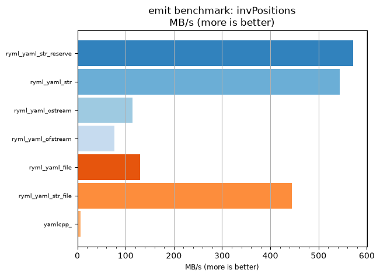
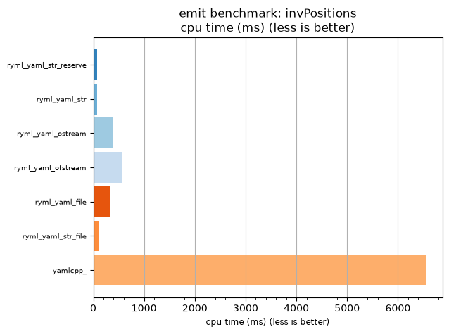

## emit benchmark: invPositions

<p>Data type benchmark results:</p>
<ul>
   <li><pre><a href='#ryml-bm-emit-invPositions-ryml_yaml_str_reserve'>ryml_yaml_str_reserve</a></pre></li> </ul>


<br/>
<br/>

---

<a id="ryml-bm-emit-invPositions-ryml_yaml_str_reserve"/>

### emit benchmark: invPositions

* Interactive html graphs
  * [MB/s](./ryml-bm-emit-invPositions-mega_bytes_per_second.html)
  * [CPU time](./ryml-bm-emit-invPositions-cpu_time_ms.html)

[](./ryml-bm-emit-invPositions-mega_bytes_per_second.png)
[](./ryml-bm-emit-invPositions-cpu_time_ms.png)

```
+--------------------------------------------------------------------------------------------------+
|                                   emit benchmark: invPositions                                   |
+-----------------------+---------+---------+----------+---------------+-------------+-------------+
| function              |    MB/s | MB/s(x) |  MB/s(%) | cpu time (ms) | cpu time(x) | cpu time(%) |
+-----------------------+---------+---------+----------+---------------+-------------+-------------+
| ryml_yaml_str_reserve |  571.56 |  83.80x | 8280.00% |         78.12 |       0.01x |     -98.81% |
| ryml_yaml_str         |  544.35 |  79.81x | 7880.95% |         82.03 |       0.01x |     -98.75% |
| ryml_yaml_ostream     |  114.31 |  16.76x | 1576.00% |        390.62 |       0.06x |     -94.03% |
| ryml_yaml_ofstream    |   77.24 |  11.32x | 1032.43% |        578.12 |       0.09x |     -91.17% |
| ryml_yaml_file        |  129.90 |  19.05x | 1804.55% |        343.75 |       0.05x |     -94.75% |
| ryml_yaml_str_file    |  444.55 |  65.18x | 6417.78% |        100.45 |       0.02x |     -98.47% |
| yamlcpp_              |    6.82 |   1.00x |    0.00% |       6546.88 |       1.00x |       0.00% |
+-----------------------+---------+---------+----------+---------------+-------------+-------------+
```

