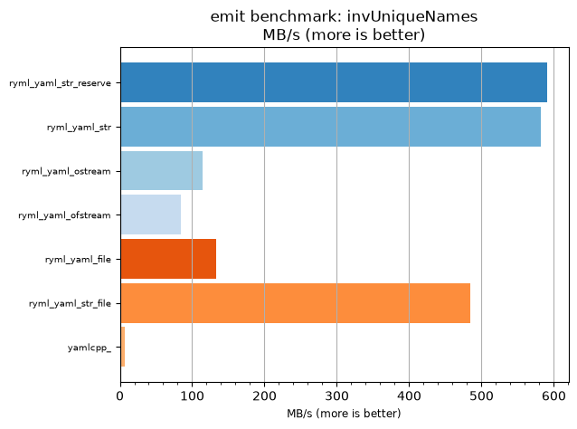
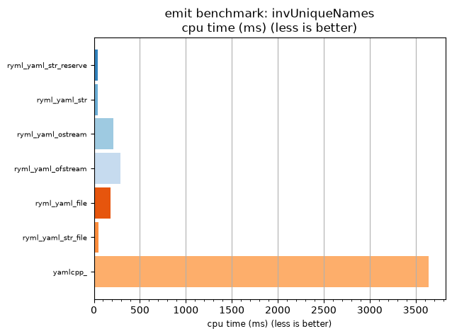

## emit benchmark: invUniqueNames

<p>Data type benchmark results:</p>
<ul>
   <li><pre><a href='#ryml-bm-emit-invUniqueNames-ryml_yaml_str_reserve'>ryml_yaml_str_reserve</a></pre></li> </ul>


<br/>
<br/>

---

<a id="ryml-bm-emit-invUniqueNames-ryml_yaml_str_reserve"/>

### emit benchmark: invUniqueNames

* Interactive html graphs
  * [MB/s](./ryml-bm-emit-invUniqueNames-mega_bytes_per_second.html)
  * [CPU time](./ryml-bm-emit-invUniqueNames-cpu_time_ms.html)

[](./ryml-bm-emit-invUniqueNames-mega_bytes_per_second.png)
[](./ryml-bm-emit-invUniqueNames-cpu_time_ms.png)

```
+--------------------------------------------------------------------------------------------------+
|                                  emit benchmark: invUniqueNames                                  |
+-----------------------+---------+---------+----------+---------------+-------------+-------------+
| function              |    MB/s | MB/s(x) |  MB/s(%) | cpu time (ms) | cpu time(x) | cpu time(%) |
+-----------------------+---------+---------+----------+---------------+-------------+-------------+
| ryml_yaml_str_reserve |  590.57 |  88.02x | 8702.22% |         41.36 |       0.01x |     -98.86% |
| ryml_yaml_str         |  581.68 |  86.70x | 8569.77% |         41.99 |       0.01x |     -98.85% |
| ryml_yaml_ostream     |  114.39 |  17.05x | 1604.88% |        213.54 |       0.06x |     -94.13% |
| ryml_yaml_ofstream    |   84.50 |  12.59x | 1159.46% |        289.06 |       0.08x |     -92.06% |
| ryml_yaml_file        |  133.04 |  19.83x | 1882.98% |        183.59 |       0.05x |     -94.96% |
| ryml_yaml_str_file    |  483.87 |  72.12x | 7111.90% |         50.48 |       0.01x |     -98.61% |
| yamlcpp_              |    6.71 |   1.00x |    0.00% |       3640.62 |       1.00x |       0.00% |
+-----------------------+---------+---------+----------+---------------+-------------+-------------+
```

