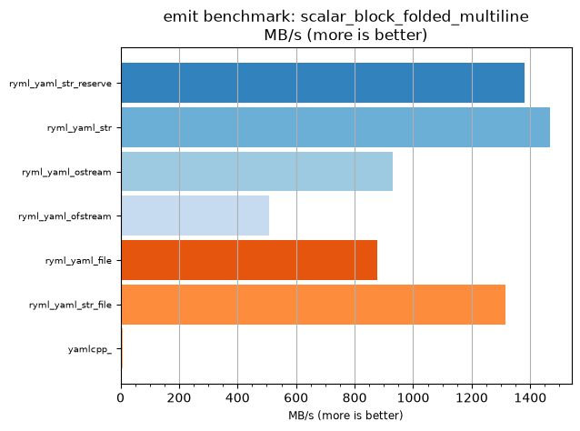
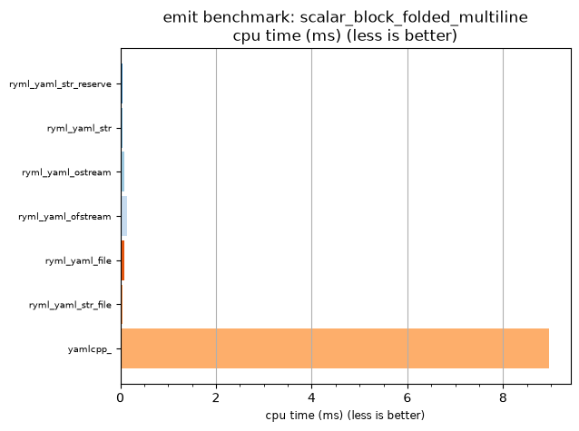

## emit benchmark: scalar_block_folded_multiline

<p>Data type benchmark results:</p>
<ul>
   <li><pre><a href='#ryml-bm-emit-scalar_block_folded_multiline-ryml_yaml_str_reserve'>ryml_yaml_str_reserve</a></pre></li> </ul>


<br/>
<br/>

---

<a id="ryml-bm-emit-scalar_block_folded_multiline-ryml_yaml_str_reserve"/>

### emit benchmark: scalar_block_folded_multiline

* Interactive html graphs
  * [MB/s](./ryml-bm-emit-scalar_block_folded_multiline-mega_bytes_per_second.html)
  * [CPU time](./ryml-bm-emit-scalar_block_folded_multiline-cpu_time_ms.html)

[](./ryml-bm-emit-scalar_block_folded_multiline-mega_bytes_per_second.png)
[](./ryml-bm-emit-scalar_block_folded_multiline-cpu_time_ms.png)

```
+---------------------------------------------------------------------------------------------------+
|                           emit benchmark: scalar_block_folded_multiline                           |
+-----------------------+---------+---------+-----------+---------------+-------------+-------------+
| function              |    MB/s | MB/s(x) |   MB/s(%) | cpu time (ms) | cpu time(x) | cpu time(%) |
+-----------------------+---------+---------+-----------+---------------+-------------+-------------+
| ryml_yaml_str_reserve | 1380.82 | 168.63x | 16762.75% |          0.05 |       0.01x |     -99.41% |
| ryml_yaml_str         | 1467.12 | 179.17x | 17816.67% |          0.05 |       0.01x |     -99.44% |
| ryml_yaml_ostream     |  930.71 | 113.66x | 11266.01% |          0.08 |       0.01x |     -99.12% |
| ryml_yaml_ofstream    |  508.06 |  62.04x |  6104.46% |          0.14 |       0.02x |     -98.39% |
| ryml_yaml_file        |  876.40 | 107.03x | 10602.70% |          0.08 |       0.01x |     -99.07% |
| ryml_yaml_str_file    | 1314.54 | 160.53x | 15953.33% |          0.06 |       0.01x |     -99.38% |
| yamlcpp_              |    8.19 |   1.00x |     0.00% |          8.96 |       1.00x |       0.00% |
+-----------------------+---------+---------+-----------+---------------+-------------+-------------+
```

