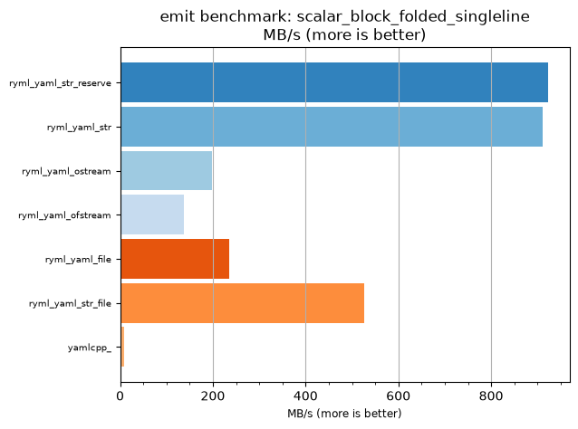
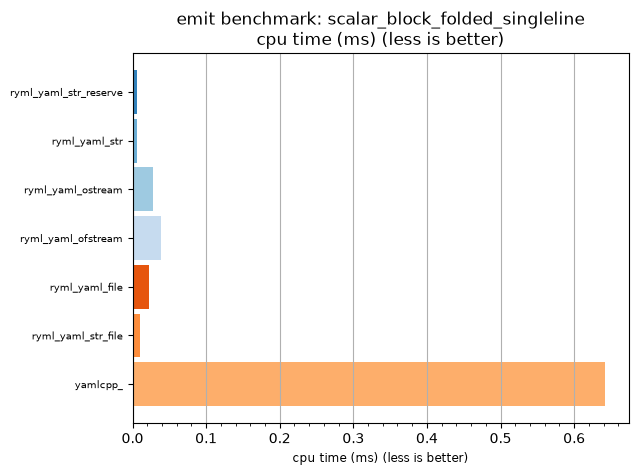

## emit benchmark: scalar_block_folded_singleline

<p>Data type benchmark results:</p>
<ul>
   <li><pre><a href='#ryml-bm-emit-scalar_block_folded_singleline-ryml_yaml_str_reserve'>ryml_yaml_str_reserve</a></pre></li> </ul>


<br/>
<br/>

---

<a id="ryml-bm-emit-scalar_block_folded_singleline-ryml_yaml_str_reserve"/>

### emit benchmark: scalar_block_folded_singleline

* Interactive html graphs
  * [MB/s](./ryml-bm-emit-scalar_block_folded_singleline-mega_bytes_per_second.html)
  * [CPU time](./ryml-bm-emit-scalar_block_folded_singleline-cpu_time_ms.html)

[](./ryml-bm-emit-scalar_block_folded_singleline-mega_bytes_per_second.png)
[](./ryml-bm-emit-scalar_block_folded_singleline-cpu_time_ms.png)

```
+---------------------------------------------------------------------------------------------------+
|                           emit benchmark: scalar_block_folded_singleline                          |
+-----------------------+---------+---------+-----------+---------------+-------------+-------------+
| function              |    MB/s | MB/s(x) |   MB/s(%) | cpu time (ms) | cpu time(x) | cpu time(%) |
+-----------------------+---------+---------+-----------+---------------+-------------+-------------+
| ryml_yaml_str_reserve |  922.62 | 109.52x | 10852.38% |          0.01 |       0.01x |     -99.09% |
| ryml_yaml_str         |  910.48 | 108.08x | 10708.27% |          0.01 |       0.01x |     -99.07% |
| ryml_yaml_ostream     |  198.21 |  23.53x |  2252.95% |          0.03 |       0.04x |     -95.75% |
| ryml_yaml_ofstream    |  137.78 |  16.36x |  1535.56% |          0.04 |       0.06x |     -93.89% |
| ryml_yaml_file        |  234.85 |  27.88x |  2687.91% |          0.02 |       0.04x |     -96.41% |
| ryml_yaml_str_file    |  527.21 |  62.59x |  6158.50% |          0.01 |       0.02x |     -98.40% |
| yamlcpp_              |    8.42 |   1.00x |     0.00% |          0.64 |       1.00x |       0.00% |
+-----------------------+---------+---------+-----------+---------------+-------------+-------------+
```

