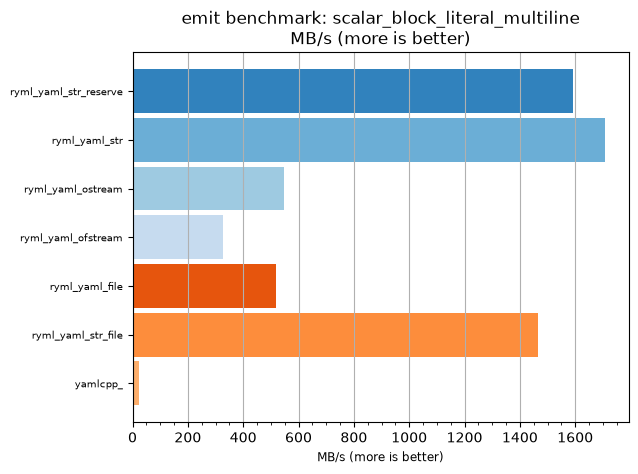
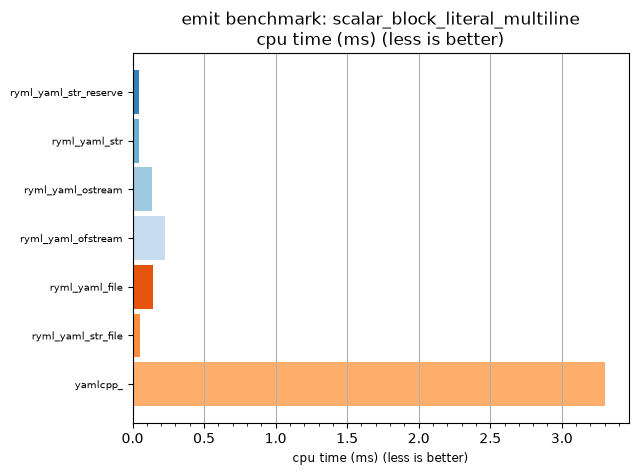

## emit benchmark: scalar_block_literal_multiline

<p>Data type benchmark results:</p>
<ul>
   <li><pre><a href='#ryml-bm-emit-scalar_block_literal_multiline-ryml_yaml_str_reserve'>ryml_yaml_str_reserve</a></pre></li> </ul>


<br/>
<br/>

---

<a id="ryml-bm-emit-scalar_block_literal_multiline-ryml_yaml_str_reserve"/>

### emit benchmark: scalar_block_literal_multiline

* Interactive html graphs
  * [MB/s](./ryml-bm-emit-scalar_block_literal_multiline-mega_bytes_per_second.html)
  * [CPU time](./ryml-bm-emit-scalar_block_literal_multiline-cpu_time_ms.html)

[](./ryml-bm-emit-scalar_block_literal_multiline-mega_bytes_per_second.png)
[](./ryml-bm-emit-scalar_block_literal_multiline-cpu_time_ms.png)

```
+--------------------------------------------------------------------------------------------------+
|                          emit benchmark: scalar_block_literal_multiline                          |
+-----------------------+---------+---------+----------+---------------+-------------+-------------+
| function              |    MB/s | MB/s(x) |  MB/s(%) | cpu time (ms) | cpu time(x) | cpu time(%) |
+-----------------------+---------+---------+----------+---------------+-------------+-------------+
| ryml_yaml_str_reserve | 1593.35 |  71.70x | 7070.13% |          0.05 |       0.01x |     -98.61% |
| ryml_yaml_str         | 1707.19 |  76.82x | 7582.46% |          0.04 |       0.01x |     -98.70% |
| ryml_yaml_ostream     |  546.30 |  24.58x | 2358.39% |          0.13 |       0.04x |     -95.93% |
| ryml_yaml_ofstream    |  326.12 |  14.68x | 1367.57% |          0.22 |       0.07x |     -93.19% |
| ryml_yaml_file        |  519.35 |  23.37x | 2237.09% |          0.14 |       0.04x |     -95.72% |
| ryml_yaml_str_file    | 1467.12 |  66.02x | 6502.11% |          0.05 |       0.02x |     -98.49% |
| yamlcpp_              |   22.22 |   1.00x |    0.00% |          3.30 |       1.00x |       0.00% |
+-----------------------+---------+---------+----------+---------------+-------------+-------------+
```

