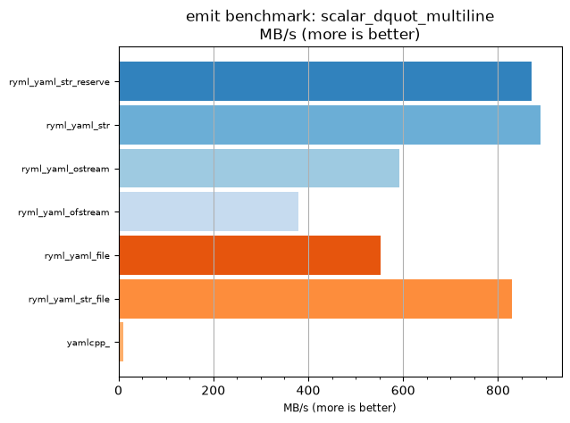
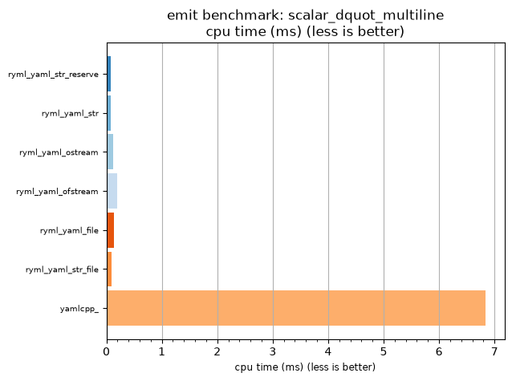

## emit benchmark: scalar_dquot_multiline

<p>Data type benchmark results:</p>
<ul>
   <li><pre><a href='#ryml-bm-emit-scalar_dquot_multiline-ryml_yaml_str_reserve'>ryml_yaml_str_reserve</a></pre></li> </ul>


<br/>
<br/>

---

<a id="ryml-bm-emit-scalar_dquot_multiline-ryml_yaml_str_reserve"/>

### emit benchmark: scalar_dquot_multiline

* Interactive html graphs
  * [MB/s](./ryml-bm-emit-scalar_dquot_multiline-mega_bytes_per_second.html)
  * [CPU time](./ryml-bm-emit-scalar_dquot_multiline-cpu_time_ms.html)

[](./ryml-bm-emit-scalar_dquot_multiline-mega_bytes_per_second.png)
[](./ryml-bm-emit-scalar_dquot_multiline-cpu_time_ms.png)

```
+--------------------------------------------------------------------------------------------------+
|                              emit benchmark: scalar_dquot_multiline                              |
+-----------------------+---------+---------+----------+---------------+-------------+-------------+
| function              |    MB/s | MB/s(x) |  MB/s(%) | cpu time (ms) | cpu time(x) | cpu time(%) |
+-----------------------+---------+---------+----------+---------------+-------------+-------------+
| ryml_yaml_str_reserve |  870.83 |  81.67x | 8066.67% |          0.08 |       0.01x |     -98.78% |
| ryml_yaml_str         |  889.36 |  83.40x | 8240.43% |          0.08 |       0.01x |     -98.80% |
| ryml_yaml_ostream     |  592.79 |  55.59x | 5459.17% |          0.12 |       0.02x |     -98.20% |
| ryml_yaml_ofstream    |  378.59 |  35.50x | 3450.41% |          0.19 |       0.03x |     -97.18% |
| ryml_yaml_file        |  552.93 |  51.85x | 5085.42% |          0.13 |       0.02x |     -98.07% |
| ryml_yaml_str_file    |  829.40 |  77.78x | 7678.13% |          0.09 |       0.01x |     -98.71% |
| yamlcpp_              |   10.66 |   1.00x |    0.00% |          6.84 |       1.00x |       0.00% |
+-----------------------+---------+---------+----------+---------------+-------------+-------------+
```

