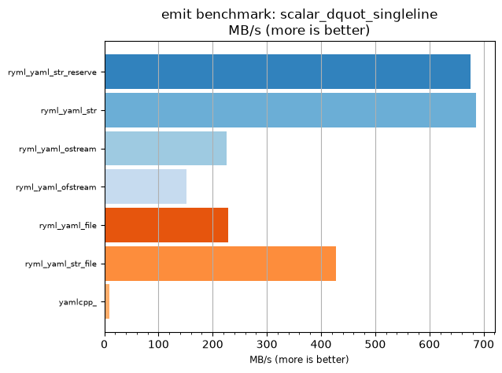
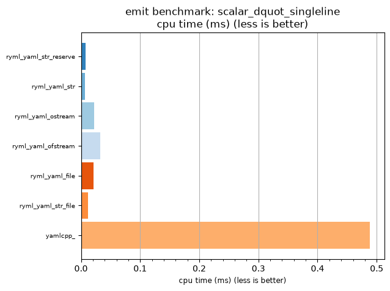

## emit benchmark: scalar_dquot_singleline

<p>Data type benchmark results:</p>
<ul>
   <li><pre><a href='#ryml-bm-emit-scalar_dquot_singleline-ryml_yaml_str_reserve'>ryml_yaml_str_reserve</a></pre></li> </ul>


<br/>
<br/>

---

<a id="ryml-bm-emit-scalar_dquot_singleline-ryml_yaml_str_reserve"/>

### emit benchmark: scalar_dquot_singleline

* Interactive html graphs
  * [MB/s](./ryml-bm-emit-scalar_dquot_singleline-mega_bytes_per_second.html)
  * [CPU time](./ryml-bm-emit-scalar_dquot_singleline-cpu_time_ms.html)

[](./ryml-bm-emit-scalar_dquot_singleline-mega_bytes_per_second.png)
[](./ryml-bm-emit-scalar_dquot_singleline-cpu_time_ms.png)

```
+--------------------------------------------------------------------------------------------------+
|                             emit benchmark: scalar_dquot_singleline                              |
+-----------------------+---------+---------+----------+---------------+-------------+-------------+
| function              |    MB/s | MB/s(x) |  MB/s(%) | cpu time (ms) | cpu time(x) | cpu time(%) |
+-----------------------+---------+---------+----------+---------------+-------------+-------------+
| ryml_yaml_str_reserve |  676.00 |  67.31x | 6630.77% |          0.01 |       0.01x |     -98.51% |
| ryml_yaml_str         |  685.89 |  68.29x | 6729.27% |          0.01 |       0.01x |     -98.54% |
| ryml_yaml_ostream     |  225.34 |  22.44x | 2143.62% |          0.02 |       0.04x |     -95.54% |
| ryml_yaml_ofstream    |  152.17 |  15.15x | 1415.13% |          0.03 |       0.07x |     -93.40% |
| ryml_yaml_file        |  228.26 |  22.73x | 2172.73% |          0.02 |       0.04x |     -95.60% |
| ryml_yaml_str_file    |  427.38 |  42.55x | 4155.32% |          0.01 |       0.02x |     -97.65% |
| yamlcpp_              |   10.04 |   1.00x |    0.00% |          0.49 |       1.00x |       0.00% |
+-----------------------+---------+---------+----------+---------------+-------------+-------------+
```

