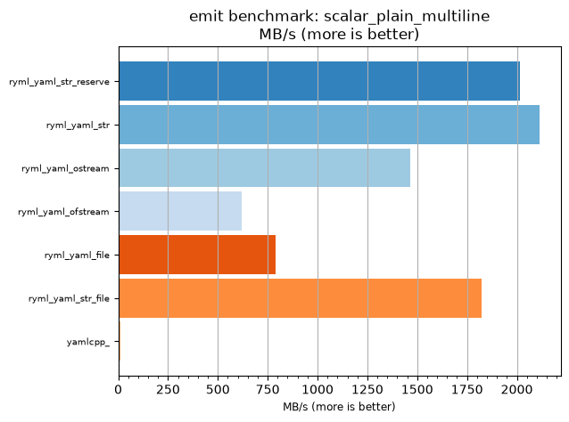
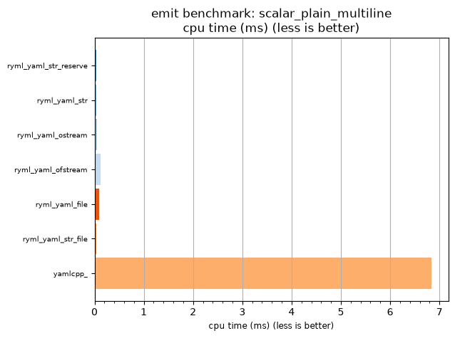

## emit benchmark: scalar_plain_multiline

<p>Data type benchmark results:</p>
<ul>
   <li><pre><a href='#ryml-bm-emit-scalar_plain_multiline-ryml_yaml_str_reserve'>ryml_yaml_str_reserve</a></pre></li> </ul>


<br/>
<br/>

---

<a id="ryml-bm-emit-scalar_plain_multiline-ryml_yaml_str_reserve"/>

### emit benchmark: scalar_plain_multiline

* Interactive html graphs
  * [MB/s](./ryml-bm-emit-scalar_plain_multiline-mega_bytes_per_second.html)
  * [CPU time](./ryml-bm-emit-scalar_plain_multiline-cpu_time_ms.html)

[](./ryml-bm-emit-scalar_plain_multiline-mega_bytes_per_second.png)
[](./ryml-bm-emit-scalar_plain_multiline-cpu_time_ms.png)

```
+---------------------------------------------------------------------------------------------------+
|                               emit benchmark: scalar_plain_multiline                              |
+-----------------------+---------+---------+-----------+---------------+-------------+-------------+
| function              |    MB/s | MB/s(x) |   MB/s(%) | cpu time (ms) | cpu time(x) | cpu time(%) |
+-----------------------+---------+---------+-----------+---------------+-------------+-------------+
| ryml_yaml_str_reserve | 2015.41 | 189.37x | 18836.94% |          0.04 |       0.01x |     -99.47% |
| ryml_yaml_str         | 2113.42 | 198.58x | 19757.85% |          0.03 |       0.01x |     -99.50% |
| ryml_yaml_ostream     | 1463.82 | 137.54x | 13654.17% |          0.05 |       0.01x |     -99.27% |
| ryml_yaml_ofstream    |  620.83 |  58.33x |  5733.33% |          0.12 |       0.02x |     -98.29% |
| ryml_yaml_file        |  790.18 |  74.25x |  7324.57% |          0.09 |       0.01x |     -98.65% |
| ryml_yaml_str_file    | 1823.43 | 171.33x | 17033.10% |          0.04 |       0.01x |     -99.42% |
| yamlcpp_              |   10.64 |   1.00x |     0.00% |          6.84 |       1.00x |       0.00% |
+-----------------------+---------+---------+-----------+---------------+-------------+-------------+
```

