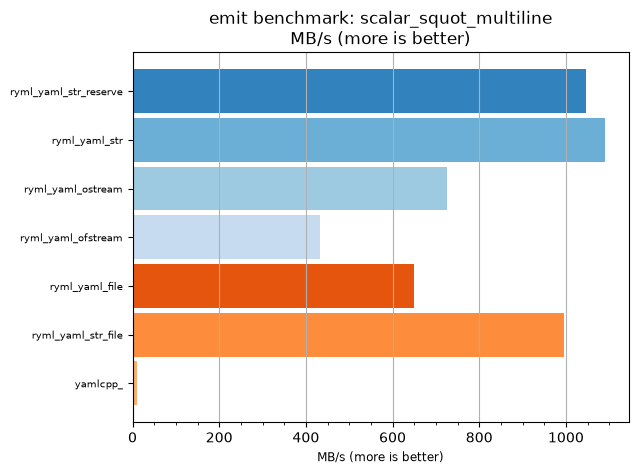
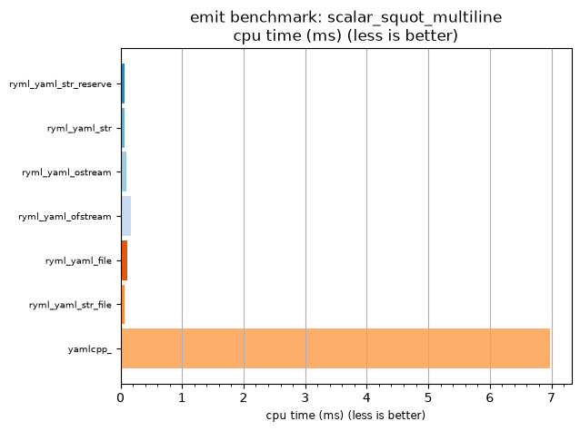

## emit benchmark: scalar_squot_multiline

<p>Data type benchmark results:</p>
<ul>
   <li><pre><a href='#ryml-bm-emit-scalar_squot_multiline-ryml_yaml_str_reserve'>ryml_yaml_str_reserve</a></pre></li> </ul>


<br/>
<br/>

---

<a id="ryml-bm-emit-scalar_squot_multiline-ryml_yaml_str_reserve"/>

### emit benchmark: scalar_squot_multiline

* Interactive html graphs
  * [MB/s](./ryml-bm-emit-scalar_squot_multiline-mega_bytes_per_second.html)
  * [CPU time](./ryml-bm-emit-scalar_squot_multiline-cpu_time_ms.html)

[](./ryml-bm-emit-scalar_squot_multiline-mega_bytes_per_second.png)
[](./ryml-bm-emit-scalar_squot_multiline-cpu_time_ms.png)

```
+---------------------------------------------------------------------------------------------------+
|                               emit benchmark: scalar_squot_multiline                              |
+-----------------------+---------+---------+-----------+---------------+-------------+-------------+
| function              |    MB/s | MB/s(x) |   MB/s(%) | cpu time (ms) | cpu time(x) | cpu time(%) |
+-----------------------+---------+---------+-----------+---------------+-------------+-------------+
| ryml_yaml_str_reserve | 1046.31 | 100.00x |  9900.00% |          0.07 |       0.01x |     -99.00% |
| ryml_yaml_str         | 1089.91 | 104.17x | 10316.67% |          0.07 |       0.01x |     -99.04% |
| ryml_yaml_ostream     |  724.79 |  69.27x |  6827.08% |          0.10 |       0.01x |     -98.56% |
| ryml_yaml_ofstream    |  432.39 |  41.33x |  4032.51% |          0.17 |       0.02x |     -97.58% |
| ryml_yaml_file        |  649.88 |  62.11x |  6111.18% |          0.11 |       0.02x |     -98.39% |
| ryml_yaml_str_file    |  996.49 |  95.24x |  9423.81% |          0.07 |       0.01x |     -98.95% |
| yamlcpp_              |   10.46 |   1.00x |     0.00% |          6.98 |       1.00x |       0.00% |
+-----------------------+---------+---------+-----------+---------------+-------------+-------------+
```

