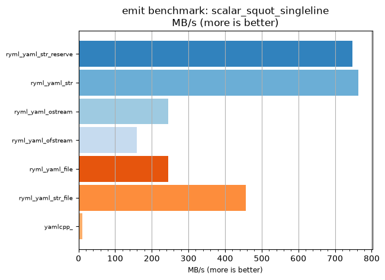
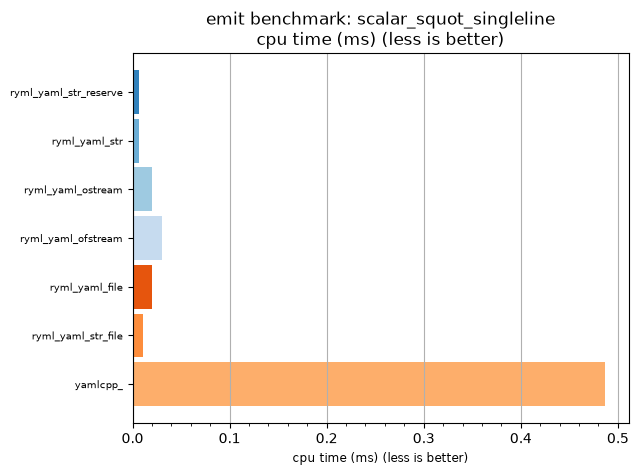

## emit benchmark: scalar_squot_singleline

<p>Data type benchmark results:</p>
<ul>
   <li><pre><a href='#ryml-bm-emit-scalar_squot_singleline-ryml_yaml_str_reserve'>ryml_yaml_str_reserve</a></pre></li> </ul>


<br/>
<br/>

---

<a id="ryml-bm-emit-scalar_squot_singleline-ryml_yaml_str_reserve"/>

### emit benchmark: scalar_squot_singleline

* Interactive html graphs
  * [MB/s](./ryml-bm-emit-scalar_squot_singleline-mega_bytes_per_second.html)
  * [CPU time](./ryml-bm-emit-scalar_squot_singleline-cpu_time_ms.html)

[](./ryml-bm-emit-scalar_squot_singleline-mega_bytes_per_second.png)
[](./ryml-bm-emit-scalar_squot_singleline-cpu_time_ms.png)

```
+--------------------------------------------------------------------------------------------------+
|                             emit benchmark: scalar_squot_singleline                              |
+-----------------------+---------+---------+----------+---------------+-------------+-------------+
| function              |    MB/s | MB/s(x) |  MB/s(%) | cpu time (ms) | cpu time(x) | cpu time(%) |
+-----------------------+---------+---------+----------+---------------+-------------+-------------+
| ryml_yaml_str_reserve |  747.30 |  74.21x | 7321.04% |          0.01 |       0.01x |     -98.65% |
| ryml_yaml_str         |  763.55 |  75.82x | 7482.37% |          0.01 |       0.01x |     -98.68% |
| ryml_yaml_ostream     |  245.62 |  24.39x | 2339.12% |          0.02 |       0.04x |     -95.90% |
| ryml_yaml_ofstream    |  159.65 |  15.85x | 1485.40% |          0.03 |       0.06x |     -93.69% |
| ryml_yaml_file        |  245.62 |  24.39x | 2339.12% |          0.02 |       0.04x |     -95.90% |
| ryml_yaml_str_file    |  456.15 |  45.30x | 4429.73% |          0.01 |       0.02x |     -97.79% |
| yamlcpp_              |   10.07 |   1.00x |    0.00% |          0.49 |       1.00x |       0.00% |
+-----------------------+---------+---------+----------+---------------+-------------+-------------+
```

