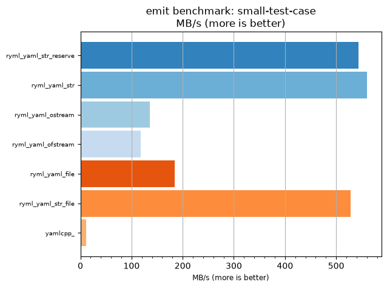
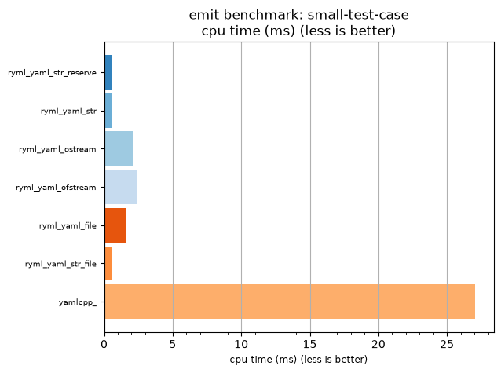

## emit benchmark: small-test-case

<p>Data type benchmark results:</p>
<ul>
   <li><pre><a href='#ryml-bm-emit-small-test-case-ryml_yaml_str_reserve'>ryml_yaml_str_reserve</a></pre></li> </ul>


<br/>
<br/>

---

<a id="ryml-bm-emit-small-test-case-ryml_yaml_str_reserve"/>

### emit benchmark: small-test-case

* Interactive html graphs
  * [MB/s](./ryml-bm-emit-small-test-case-mega_bytes_per_second.html)
  * [CPU time](./ryml-bm-emit-small-test-case-cpu_time_ms.html)

[](./ryml-bm-emit-small-test-case-mega_bytes_per_second.png)
[](./ryml-bm-emit-small-test-case-cpu_time_ms.png)

```
+--------------------------------------------------------------------------------------------------+
|                                 emit benchmark: small-test-case                                  |
+-----------------------+---------+---------+----------+---------------+-------------+-------------+
| function              |    MB/s | MB/s(x) |  MB/s(%) | cpu time (ms) | cpu time(x) | cpu time(%) |
+-----------------------+---------+---------+----------+---------------+-------------+-------------+
| ryml_yaml_str_reserve |  544.26 |  50.90x | 4990.50% |          0.53 |       0.02x |     -98.04% |
| ryml_yaml_str         |  560.15 |  52.39x | 5139.09% |          0.52 |       0.02x |     -98.09% |
| ryml_yaml_ostream     |  135.83 |  12.70x | 1170.46% |          2.13 |       0.08x |     -92.13% |
| ryml_yaml_ofstream    |  117.72 |  11.01x | 1001.06% |          2.46 |       0.09x |     -90.92% |
| ryml_yaml_file        |  184.23 |  17.23x | 1623.08% |          1.57 |       0.06x |     -94.20% |
| ryml_yaml_str_file    |  528.71 |  49.45x | 4845.05% |          0.55 |       0.02x |     -97.98% |
| yamlcpp_              |   10.69 |   1.00x |    0.00% |         27.04 |       1.00x |       0.00% |
+-----------------------+---------+---------+----------+---------------+-------------+-------------+
```

