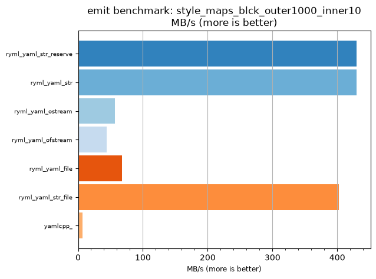
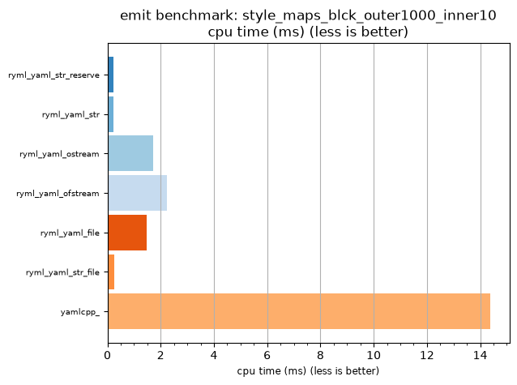

## emit benchmark: style_maps_blck_outer1000_inner10

<p>Data type benchmark results:</p>
<ul>
   <li><pre><a href='#ryml-bm-emit-style_maps_blck_outer1000_inner10-ryml_yaml_str_reserve'>ryml_yaml_str_reserve</a></pre></li> </ul>


<br/>
<br/>

---

<a id="ryml-bm-emit-style_maps_blck_outer1000_inner10-ryml_yaml_str_reserve"/>

### emit benchmark: style_maps_blck_outer1000_inner10

* Interactive html graphs
  * [MB/s](./ryml-bm-emit-style_maps_blck_outer1000_inner10-mega_bytes_per_second.html)
  * [CPU time](./ryml-bm-emit-style_maps_blck_outer1000_inner10-cpu_time_ms.html)

[](./ryml-bm-emit-style_maps_blck_outer1000_inner10-mega_bytes_per_second.png)
[](./ryml-bm-emit-style_maps_blck_outer1000_inner10-cpu_time_ms.png)

```
+--------------------------------------------------------------------------------------------------+
|                        emit benchmark: style_maps_blck_outer1000_inner10                         |
+-----------------------+---------+---------+----------+---------------+-------------+-------------+
| function              |    MB/s | MB/s(x) |  MB/s(%) | cpu time (ms) | cpu time(x) | cpu time(%) |
+-----------------------+---------+---------+----------+---------------+-------------+-------------+
| ryml_yaml_str_reserve |  429.70 |  62.46x | 6145.55% |          0.23 |       0.02x |     -98.40% |
| ryml_yaml_str         |  429.70 |  62.46x | 6145.55% |          0.23 |       0.02x |     -98.40% |
| ryml_yaml_ostream     |   57.25 |   8.32x |  732.09% |          1.73 |       0.12x |     -87.98% |
| ryml_yaml_ofstream    |   44.03 |   6.40x |  540.00% |          2.25 |       0.16x |     -84.38% |
| ryml_yaml_file        |   67.52 |   9.81x |  881.33% |          1.46 |       0.10x |     -89.81% |
| ryml_yaml_str_file    |  402.27 |  58.47x | 5746.89% |          0.25 |       0.02x |     -98.29% |
| yamlcpp_              |    6.88 |   1.00x |    0.00% |         14.38 |       1.00x |       0.00% |
+-----------------------+---------+---------+----------+---------------+-------------+-------------+
```

