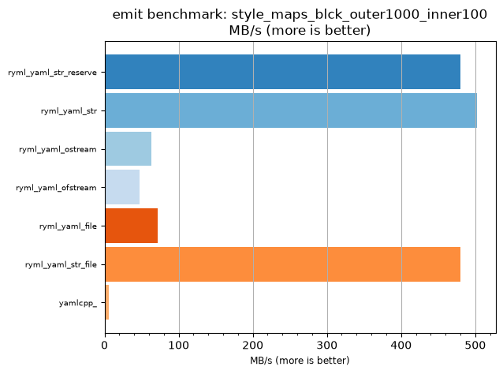
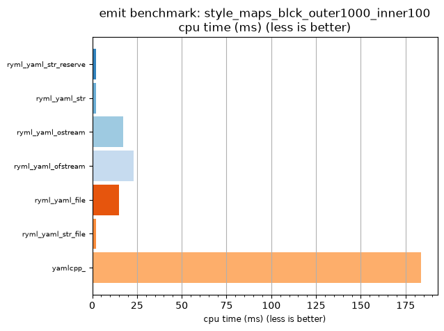

## emit benchmark: style_maps_blck_outer1000_inner100

<p>Data type benchmark results:</p>
<ul>
   <li><pre><a href='#ryml-bm-emit-style_maps_blck_outer1000_inner100-ryml_yaml_str_reserve'>ryml_yaml_str_reserve</a></pre></li> </ul>


<br/>
<br/>

---

<a id="ryml-bm-emit-style_maps_blck_outer1000_inner100-ryml_yaml_str_reserve"/>

### emit benchmark: style_maps_blck_outer1000_inner100

* Interactive html graphs
  * [MB/s](./ryml-bm-emit-style_maps_blck_outer1000_inner100-mega_bytes_per_second.html)
  * [CPU time](./ryml-bm-emit-style_maps_blck_outer1000_inner100-cpu_time_ms.html)

[](./ryml-bm-emit-style_maps_blck_outer1000_inner100-mega_bytes_per_second.png)
[](./ryml-bm-emit-style_maps_blck_outer1000_inner100-cpu_time_ms.png)

```
+--------------------------------------------------------------------------------------------------+
|                        emit benchmark: style_maps_blck_outer1000_inner100                        |
+-----------------------+---------+---------+----------+---------------+-------------+-------------+
| function              |    MB/s | MB/s(x) |  MB/s(%) | cpu time (ms) | cpu time(x) | cpu time(%) |
+-----------------------+---------+---------+----------+---------------+-------------+-------------+
| ryml_yaml_str_reserve |  480.39 |  81.74x | 8073.91% |          2.25 |       0.01x |     -98.78% |
| ryml_yaml_str         |  502.23 |  85.45x | 8445.45% |          2.15 |       0.01x |     -98.83% |
| ryml_yaml_ostream     |   62.92 |  10.71x |  970.56% |         17.15 |       0.09x |     -90.66% |
| ryml_yaml_ofstream    |   47.02 |   8.00x |  700.00% |         22.95 |       0.12x |     -87.50% |
| ryml_yaml_file        |   72.27 |  12.30x | 1129.65% |         14.93 |       0.08x |     -91.87% |
| ryml_yaml_str_file    |  480.39 |  81.74x | 8073.91% |          2.25 |       0.01x |     -98.78% |
| yamlcpp_              |    5.88 |   1.00x |    0.00% |        183.59 |       1.00x |       0.00% |
+-----------------------+---------+---------+----------+---------------+-------------+-------------+
```

