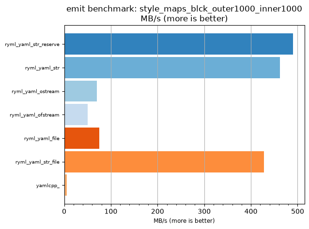
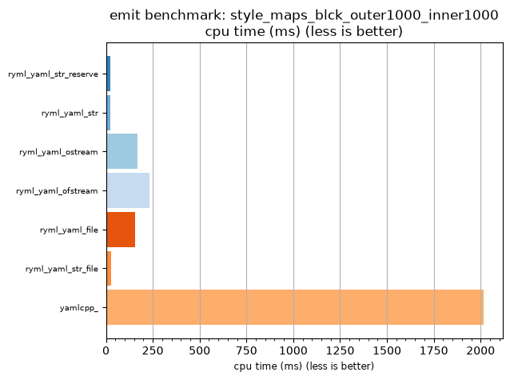

## emit benchmark: style_maps_blck_outer1000_inner1000

<p>Data type benchmark results:</p>
<ul>
   <li><pre><a href='#ryml-bm-emit-style_maps_blck_outer1000_inner1000-ryml_yaml_str_reserve'>ryml_yaml_str_reserve</a></pre></li> </ul>


<br/>
<br/>

---

<a id="ryml-bm-emit-style_maps_blck_outer1000_inner1000-ryml_yaml_str_reserve"/>

### emit benchmark: style_maps_blck_outer1000_inner1000

* Interactive html graphs
  * [MB/s](./ryml-bm-emit-style_maps_blck_outer1000_inner1000-mega_bytes_per_second.html)
  * [CPU time](./ryml-bm-emit-style_maps_blck_outer1000_inner1000-cpu_time_ms.html)

[](./ryml-bm-emit-style_maps_blck_outer1000_inner1000-mega_bytes_per_second.png)
[](./ryml-bm-emit-style_maps_blck_outer1000_inner1000-cpu_time_ms.png)

```
+--------------------------------------------------------------------------------------------------+
|                       emit benchmark: style_maps_blck_outer1000_inner1000                        |
+-----------------------+---------+---------+----------+---------------+-------------+-------------+
| function              |    MB/s | MB/s(x) |  MB/s(%) | cpu time (ms) | cpu time(x) | cpu time(%) |
+-----------------------+---------+---------+----------+---------------+-------------+-------------+
| ryml_yaml_str_reserve |  490.05 |  83.85x | 8285.00% |         24.04 |       0.01x |     -98.81% |
| ryml_yaml_str         |  462.63 |  79.16x | 7815.91% |         25.46 |       0.01x |     -98.74% |
| ryml_yaml_ostream     |   70.13 |  12.00x | 1100.00% |        167.97 |       0.08x |     -91.67% |
| ryml_yaml_ofstream    |   50.26 |   8.60x |  760.00% |        234.38 |       0.12x |     -88.37% |
| ryml_yaml_file        |   75.39 |  12.90x | 1190.00% |        156.25 |       0.08x |     -92.25% |
| ryml_yaml_str_file    |  428.36 |  73.30x | 7229.55% |         27.50 |       0.01x |     -98.64% |
| yamlcpp_              |    5.84 |   1.00x |    0.00% |       2015.62 |       1.00x |       0.00% |
+-----------------------+---------+---------+----------+---------------+-------------+-------------+
```

