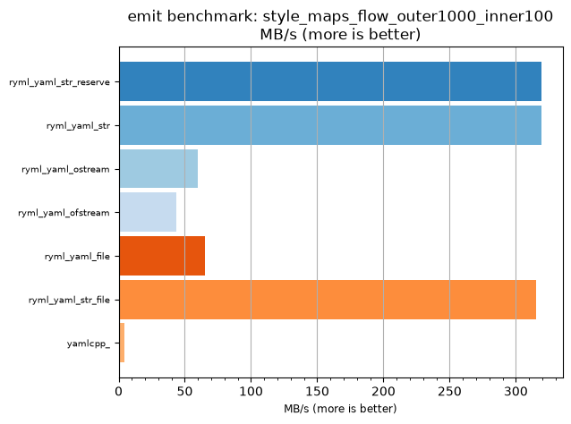
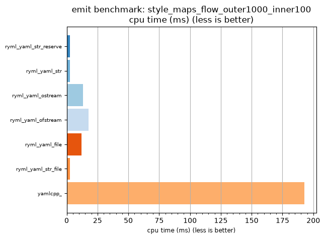

## emit benchmark: style_maps_flow_outer1000_inner100

<p>Data type benchmark results:</p>
<ul>
   <li><pre><a href='#ryml-bm-emit-style_maps_flow_outer1000_inner100-ryml_yaml_str_reserve'>ryml_yaml_str_reserve</a></pre></li> </ul>


<br/>
<br/>

---

<a id="ryml-bm-emit-style_maps_flow_outer1000_inner100-ryml_yaml_str_reserve"/>

### emit benchmark: style_maps_flow_outer1000_inner100

* Interactive html graphs
  * [MB/s](./ryml-bm-emit-style_maps_flow_outer1000_inner100-mega_bytes_per_second.html)
  * [CPU time](./ryml-bm-emit-style_maps_flow_outer1000_inner100-cpu_time_ms.html)

[](./ryml-bm-emit-style_maps_flow_outer1000_inner100-mega_bytes_per_second.png)
[](./ryml-bm-emit-style_maps_flow_outer1000_inner100-cpu_time_ms.png)

```
+--------------------------------------------------------------------------------------------------+
|                        emit benchmark: style_maps_flow_outer1000_inner100                        |
+-----------------------+---------+---------+----------+---------------+-------------+-------------+
| function              |    MB/s | MB/s(x) |  MB/s(%) | cpu time (ms) | cpu time(x) | cpu time(%) |
+-----------------------+---------+---------+----------+---------------+-------------+-------------+
| ryml_yaml_str_reserve |  319.30 |  78.48x | 7748.48% |          2.46 |       0.01x |     -98.73% |
| ryml_yaml_str         |  319.30 |  78.48x | 7748.48% |          2.46 |       0.01x |     -98.73% |
| ryml_yaml_ostream     |   59.78 |  14.70x | 1369.50% |         13.11 |       0.07x |     -93.19% |
| ryml_yaml_ofstream    |   43.77 |  10.76x |  975.89% |         17.91 |       0.09x |     -90.71% |
| ryml_yaml_file        |   65.35 |  16.06x | 1506.20% |         12.00 |       0.06x |     -93.77% |
| ryml_yaml_str_file    |  315.39 |  77.52x | 7652.38% |          2.49 |       0.01x |     -98.71% |
| yamlcpp_              |    4.07 |   1.00x |    0.00% |        192.71 |       1.00x |       0.00% |
+-----------------------+---------+---------+----------+---------------+-------------+-------------+
```

