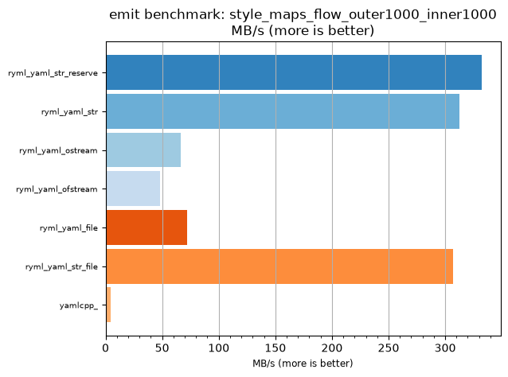
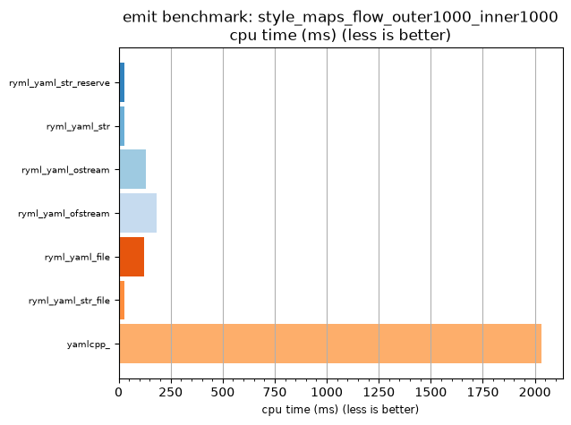

## emit benchmark: style_maps_flow_outer1000_inner1000

<p>Data type benchmark results:</p>
<ul>
   <li><pre><a href='#ryml-bm-emit-style_maps_flow_outer1000_inner1000-ryml_yaml_str_reserve'>ryml_yaml_str_reserve</a></pre></li> </ul>


<br/>
<br/>

---

<a id="ryml-bm-emit-style_maps_flow_outer1000_inner1000-ryml_yaml_str_reserve"/>

### emit benchmark: style_maps_flow_outer1000_inner1000

* Interactive html graphs
  * [MB/s](./ryml-bm-emit-style_maps_flow_outer1000_inner1000-mega_bytes_per_second.html)
  * [CPU time](./ryml-bm-emit-style_maps_flow_outer1000_inner1000-cpu_time_ms.html)

[](./ryml-bm-emit-style_maps_flow_outer1000_inner1000-mega_bytes_per_second.png)
[](./ryml-bm-emit-style_maps_flow_outer1000_inner1000-cpu_time_ms.png)

```
+--------------------------------------------------------------------------------------------------+
|                       emit benchmark: style_maps_flow_outer1000_inner1000                        |
+-----------------------+---------+---------+----------+---------------+-------------+-------------+
| function              |    MB/s | MB/s(x) |  MB/s(%) | cpu time (ms) | cpu time(x) | cpu time(%) |
+-----------------------+---------+---------+----------+---------------+-------------+-------------+
| ryml_yaml_str_reserve |  332.23 |  76.82x | 7581.82% |         26.44 |       0.01x |     -98.70% |
| ryml_yaml_str         |  312.36 |  72.22x | 7122.22% |         28.12 |       0.01x |     -98.62% |
| ryml_yaml_ostream     |   66.15 |  15.29x | 1429.41% |        132.81 |       0.07x |     -93.46% |
| ryml_yaml_ofstream    |   47.85 |  11.06x | 1006.38% |        183.59 |       0.09x |     -90.96% |
| ryml_yaml_file        |   71.78 |  16.60x | 1559.57% |        122.40 |       0.06x |     -93.97% |
| ryml_yaml_str_file    |  306.68 |  70.91x | 6990.91% |         28.65 |       0.01x |     -98.59% |
| yamlcpp_              |    4.32 |   1.00x |    0.00% |       2031.25 |       1.00x |       0.00% |
+-----------------------+---------+---------+----------+---------------+-------------+-------------+
```

