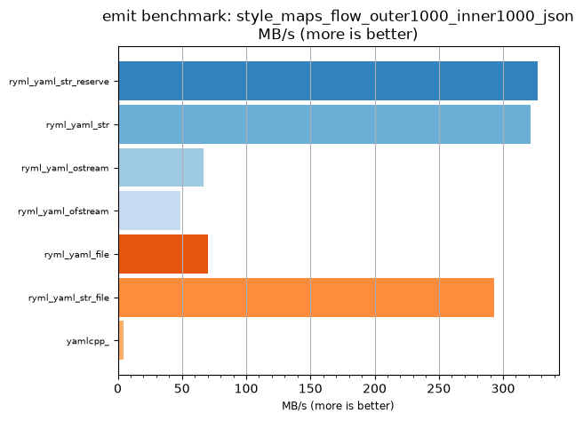
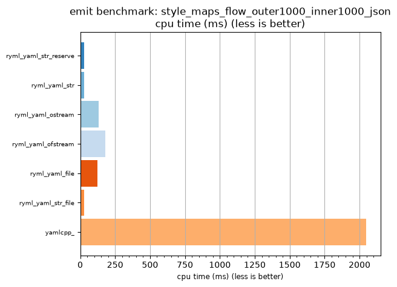

## emit benchmark: style_maps_flow_outer1000_inner1000_json

<p>Data type benchmark results:</p>
<ul>
   <li><pre><a href='#ryml-bm-emit-style_maps_flow_outer1000_inner1000_json-ryml_yaml_str_reserve'>ryml_yaml_str_reserve</a></pre></li> </ul>


<br/>
<br/>

---

<a id="ryml-bm-emit-style_maps_flow_outer1000_inner1000_json-ryml_yaml_str_reserve"/>

### emit benchmark: style_maps_flow_outer1000_inner1000_json

* Interactive html graphs
  * [MB/s](./ryml-bm-emit-style_maps_flow_outer1000_inner1000_json-mega_bytes_per_second.html)
  * [CPU time](./ryml-bm-emit-style_maps_flow_outer1000_inner1000_json-cpu_time_ms.html)

[](./ryml-bm-emit-style_maps_flow_outer1000_inner1000_json-mega_bytes_per_second.png)
[](./ryml-bm-emit-style_maps_flow_outer1000_inner1000_json-cpu_time_ms.png)

```
+--------------------------------------------------------------------------------------------------+
|                     emit benchmark: style_maps_flow_outer1000_inner1000_json                     |
+-----------------------+---------+---------+----------+---------------+-------------+-------------+
| function              |    MB/s | MB/s(x) |  MB/s(%) | cpu time (ms) | cpu time(x) | cpu time(%) |
+-----------------------+---------+---------+----------+---------------+-------------+-------------+
| ryml_yaml_str_reserve |  326.88 |  76.16x | 7516.28% |         26.88 |       0.01x |     -98.69% |
| ryml_yaml_str         |  321.28 |  74.86x | 7385.71% |         27.34 |       0.01x |     -98.66% |
| ryml_yaml_ostream     |   66.93 |  15.60x | 1459.52% |        131.25 |       0.06x |     -93.59% |
| ryml_yaml_ofstream    |   48.89 |  11.39x | 1039.13% |        179.69 |       0.09x |     -91.22% |
| ryml_yaml_file        |   70.28 |  16.38x | 1537.50% |        125.00 |       0.06x |     -93.89% |
| ryml_yaml_str_file    |  293.34 |  68.35x | 6734.78% |         29.95 |       0.01x |     -98.54% |
| yamlcpp_              |    4.29 |   1.00x |    0.00% |       2046.88 |       1.00x |       0.00% |
+-----------------------+---------+---------+----------+---------------+-------------+-------------+
```

