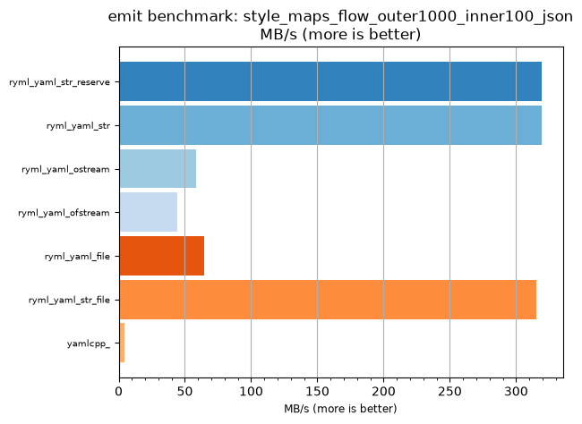
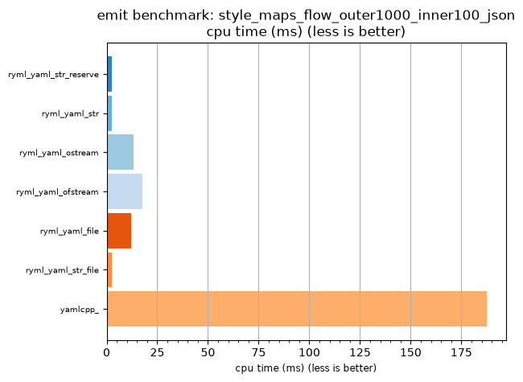

## emit benchmark: style_maps_flow_outer1000_inner100_json

<p>Data type benchmark results:</p>
<ul>
   <li><pre><a href='#ryml-bm-emit-style_maps_flow_outer1000_inner100_json-ryml_yaml_str_reserve'>ryml_yaml_str_reserve</a></pre></li> </ul>


<br/>
<br/>

---

<a id="ryml-bm-emit-style_maps_flow_outer1000_inner100_json-ryml_yaml_str_reserve"/>

### emit benchmark: style_maps_flow_outer1000_inner100_json

* Interactive html graphs
  * [MB/s](./ryml-bm-emit-style_maps_flow_outer1000_inner100_json-mega_bytes_per_second.html)
  * [CPU time](./ryml-bm-emit-style_maps_flow_outer1000_inner100_json-cpu_time_ms.html)

[](./ryml-bm-emit-style_maps_flow_outer1000_inner100_json-mega_bytes_per_second.png)
[](./ryml-bm-emit-style_maps_flow_outer1000_inner100_json-cpu_time_ms.png)

```
+--------------------------------------------------------------------------------------------------+
|                     emit benchmark: style_maps_flow_outer1000_inner100_json                      |
+-----------------------+---------+---------+----------+---------------+-------------+-------------+
| function              |    MB/s | MB/s(x) |  MB/s(%) | cpu time (ms) | cpu time(x) | cpu time(%) |
+-----------------------+---------+---------+----------+---------------+-------------+-------------+
| ryml_yaml_str_reserve |  319.30 |  76.36x | 7536.36% |          2.46 |       0.01x |     -98.69% |
| ryml_yaml_str         |  319.21 |  76.34x | 7534.04% |          2.46 |       0.01x |     -98.69% |
| ryml_yaml_ostream     |   58.34 |  13.95x | 1295.35% |         13.44 |       0.07x |     -92.83% |
| ryml_yaml_ofstream    |   44.20 |  10.57x |  957.14% |         17.74 |       0.09x |     -90.54% |
| ryml_yaml_file        |   64.23 |  15.36x | 1436.00% |         12.21 |       0.07x |     -93.49% |
| ryml_yaml_str_file    |  315.39 |  75.43x | 7442.86% |          2.49 |       0.01x |     -98.67% |
| yamlcpp_              |    4.18 |   1.00x |    0.00% |        187.50 |       1.00x |       0.00% |
+-----------------------+---------+---------+----------+---------------+-------------+-------------+
```

