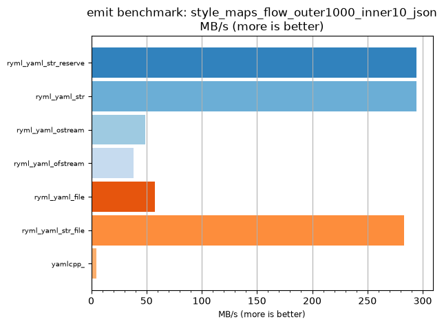
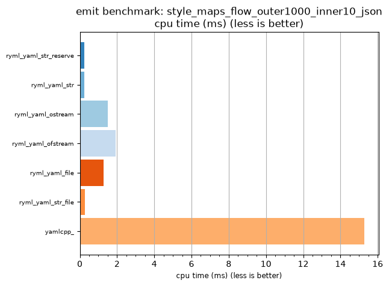

## emit benchmark: style_maps_flow_outer1000_inner10_json

<p>Data type benchmark results:</p>
<ul>
   <li><pre><a href='#ryml-bm-emit-style_maps_flow_outer1000_inner10_json-ryml_yaml_str_reserve'>ryml_yaml_str_reserve</a></pre></li> </ul>


<br/>
<br/>

---

<a id="ryml-bm-emit-style_maps_flow_outer1000_inner10_json-ryml_yaml_str_reserve"/>

### emit benchmark: style_maps_flow_outer1000_inner10_json

* Interactive html graphs
  * [MB/s](./ryml-bm-emit-style_maps_flow_outer1000_inner10_json-mega_bytes_per_second.html)
  * [CPU time](./ryml-bm-emit-style_maps_flow_outer1000_inner10_json-cpu_time_ms.html)

[](./ryml-bm-emit-style_maps_flow_outer1000_inner10_json-mega_bytes_per_second.png)
[](./ryml-bm-emit-style_maps_flow_outer1000_inner10_json-cpu_time_ms.png)

```
+--------------------------------------------------------------------------------------------------+
|                      emit benchmark: style_maps_flow_outer1000_inner10_json                      |
+-----------------------+---------+---------+----------+---------------+-------------+-------------+
| function              |    MB/s | MB/s(x) |  MB/s(%) | cpu time (ms) | cpu time(x) | cpu time(%) |
+-----------------------+---------+---------+----------+---------------+-------------+-------------+
| ryml_yaml_str_reserve |  294.30 |  60.84x | 5983.95% |          0.25 |       0.02x |     -98.36% |
| ryml_yaml_str         |  294.30 |  60.84x | 5983.95% |          0.25 |       0.02x |     -98.36% |
| ryml_yaml_ostream     |   49.07 |  10.14x |  914.44% |          1.51 |       0.10x |     -90.14% |
| ryml_yaml_ofstream    |   38.35 |   7.93x |  692.85% |          1.93 |       0.13x |     -87.39% |
| ryml_yaml_file        |   57.58 |  11.90x | 1090.34% |          1.28 |       0.08x |     -91.60% |
| ryml_yaml_str_file    |  283.25 |  58.56x | 5755.56% |          0.26 |       0.02x |     -98.29% |
| yamlcpp_              |    4.84 |   1.00x |    0.00% |         15.28 |       1.00x |       0.00% |
+-----------------------+---------+---------+----------+---------------+-------------+-------------+
```

