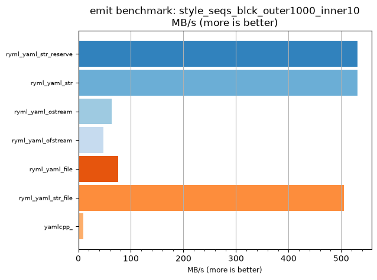
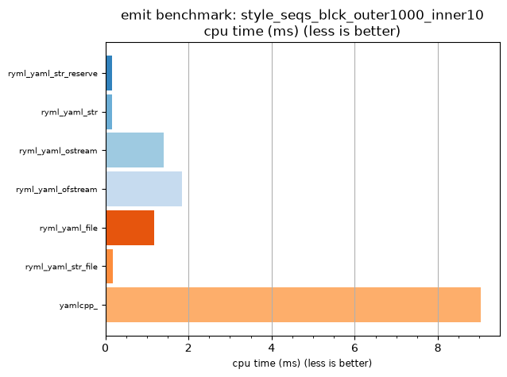

## emit benchmark: style_seqs_blck_outer1000_inner10

<p>Data type benchmark results:</p>
<ul>
   <li><pre><a href='#ryml-bm-emit-style_seqs_blck_outer1000_inner10-ryml_yaml_str_reserve'>ryml_yaml_str_reserve</a></pre></li> </ul>


<br/>
<br/>

---

<a id="ryml-bm-emit-style_seqs_blck_outer1000_inner10-ryml_yaml_str_reserve"/>

### emit benchmark: style_seqs_blck_outer1000_inner10

* Interactive html graphs
  * [MB/s](./ryml-bm-emit-style_seqs_blck_outer1000_inner10-mega_bytes_per_second.html)
  * [CPU time](./ryml-bm-emit-style_seqs_blck_outer1000_inner10-cpu_time_ms.html)

[](./ryml-bm-emit-style_seqs_blck_outer1000_inner10-mega_bytes_per_second.png)
[](./ryml-bm-emit-style_seqs_blck_outer1000_inner10-cpu_time_ms.png)

```
+--------------------------------------------------------------------------------------------------+
|                        emit benchmark: style_seqs_blck_outer1000_inner10                         |
+-----------------------+---------+---------+----------+---------------+-------------+-------------+
| function              |    MB/s | MB/s(x) |  MB/s(%) | cpu time (ms) | cpu time(x) | cpu time(%) |
+-----------------------+---------+---------+----------+---------------+-------------+-------------+
| ryml_yaml_str_reserve |  531.04 |  53.93x | 5292.59% |          0.17 |       0.02x |     -98.15% |
| ryml_yaml_str         |  531.04 |  53.93x | 5292.59% |          0.17 |       0.02x |     -98.15% |
| ryml_yaml_ostream     |   62.97 |   6.39x |  539.41% |          1.41 |       0.16x |     -84.36% |
| ryml_yaml_ofstream    |   48.23 |   4.90x |  389.80% |          1.84 |       0.20x |     -79.58% |
| ryml_yaml_file        |   75.86 |   7.70x |  670.37% |          1.17 |       0.13x |     -87.02% |
| ryml_yaml_str_file    |  505.70 |  51.35x | 5035.34% |          0.18 |       0.02x |     -98.05% |
| yamlcpp_              |    9.85 |   1.00x |    0.00% |          9.03 |       1.00x |       0.00% |
+-----------------------+---------+---------+----------+---------------+-------------+-------------+
```

