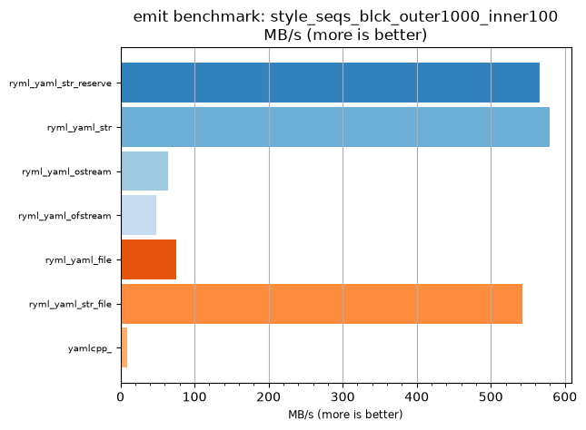
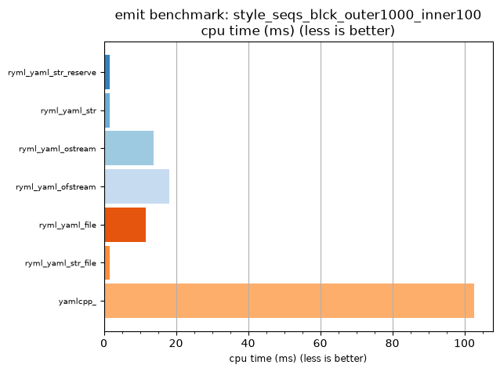

## emit benchmark: style_seqs_blck_outer1000_inner100

<p>Data type benchmark results:</p>
<ul>
   <li><pre><a href='#ryml-bm-emit-style_seqs_blck_outer1000_inner100-ryml_yaml_str_reserve'>ryml_yaml_str_reserve</a></pre></li> </ul>


<br/>
<br/>

---

<a id="ryml-bm-emit-style_seqs_blck_outer1000_inner100-ryml_yaml_str_reserve"/>

### emit benchmark: style_seqs_blck_outer1000_inner100

* Interactive html graphs
  * [MB/s](./ryml-bm-emit-style_seqs_blck_outer1000_inner100-mega_bytes_per_second.html)
  * [CPU time](./ryml-bm-emit-style_seqs_blck_outer1000_inner100-cpu_time_ms.html)

[](./ryml-bm-emit-style_seqs_blck_outer1000_inner100-mega_bytes_per_second.png)
[](./ryml-bm-emit-style_seqs_blck_outer1000_inner100-cpu_time_ms.png)

```
+--------------------------------------------------------------------------------------------------+
|                        emit benchmark: style_seqs_blck_outer1000_inner100                        |
+-----------------------+---------+---------+----------+---------------+-------------+-------------+
| function              |    MB/s | MB/s(x) |  MB/s(%) | cpu time (ms) | cpu time(x) | cpu time(%) |
+-----------------------+---------+---------+----------+---------------+-------------+-------------+
| ryml_yaml_str_reserve |  566.43 |  65.42x | 6442.22% |          1.57 |       0.02x |     -98.47% |
| ryml_yaml_str         |  579.31 |  66.91x | 6590.91% |          1.53 |       0.01x |     -98.51% |
| ryml_yaml_ostream     |   64.65 |   7.47x |  646.75% |         13.75 |       0.13x |     -86.61% |
| ryml_yaml_ofstream    |   48.96 |   5.65x |  465.45% |         18.16 |       0.18x |     -82.31% |
| ryml_yaml_file        |   75.86 |   8.76x |  776.19% |         11.72 |       0.11x |     -88.59% |
| ryml_yaml_str_file    |  542.33 |  62.64x | 6163.83% |          1.64 |       0.02x |     -98.40% |
| yamlcpp_              |    8.66 |   1.00x |    0.00% |        102.68 |       1.00x |       0.00% |
+-----------------------+---------+---------+----------+---------------+-------------+-------------+
```

