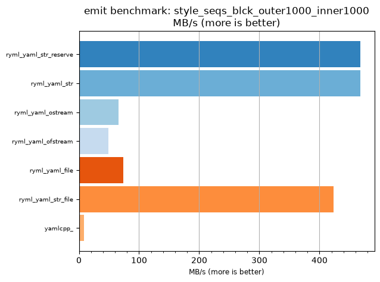
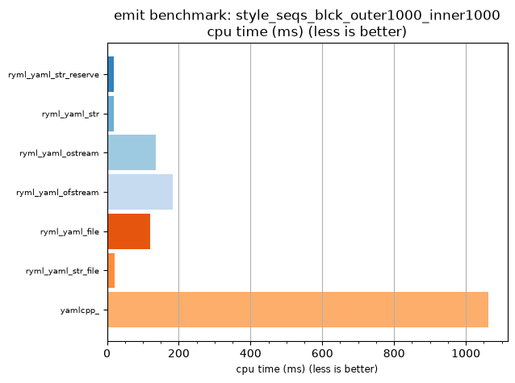

## emit benchmark: style_seqs_blck_outer1000_inner1000

<p>Data type benchmark results:</p>
<ul>
   <li><pre><a href='#ryml-bm-emit-style_seqs_blck_outer1000_inner1000-ryml_yaml_str_reserve'>ryml_yaml_str_reserve</a></pre></li> </ul>


<br/>
<br/>

---

<a id="ryml-bm-emit-style_seqs_blck_outer1000_inner1000-ryml_yaml_str_reserve"/>

### emit benchmark: style_seqs_blck_outer1000_inner1000

* Interactive html graphs
  * [MB/s](./ryml-bm-emit-style_seqs_blck_outer1000_inner1000-mega_bytes_per_second.html)
  * [CPU time](./ryml-bm-emit-style_seqs_blck_outer1000_inner1000-cpu_time_ms.html)

[](./ryml-bm-emit-style_seqs_blck_outer1000_inner1000-mega_bytes_per_second.png)
[](./ryml-bm-emit-style_seqs_blck_outer1000_inner1000-cpu_time_ms.png)

```
+--------------------------------------------------------------------------------------------------+
|                       emit benchmark: style_seqs_blck_outer1000_inner1000                        |
+-----------------------+---------+---------+----------+---------------+-------------+-------------+
| function              |    MB/s | MB/s(x) |  MB/s(%) | cpu time (ms) | cpu time(x) | cpu time(%) |
+-----------------------+---------+---------+----------+---------------+-------------+-------------+
| ryml_yaml_str_reserve |  467.81 |  55.91x | 5491.11% |         19.00 |       0.02x |     -98.21% |
| ryml_yaml_str         |  467.81 |  55.91x | 5491.11% |         19.00 |       0.02x |     -98.21% |
| ryml_yaml_ostream     |   65.65 |   7.85x |  684.62% |        135.42 |       0.13x |     -87.25% |
| ryml_yaml_ofstream    |   48.77 |   5.83x |  482.86% |        182.29 |       0.17x |     -82.84% |
| ryml_yaml_file        |   74.21 |   8.87x |  786.96% |        119.79 |       0.11x |     -88.73% |
| ryml_yaml_str_file    |  423.41 |  50.60x | 4960.47% |         21.00 |       0.02x |     -98.02% |
| yamlcpp_              |    8.37 |   1.00x |    0.00% |       1062.50 |       1.00x |       0.00% |
+-----------------------+---------+---------+----------+---------------+-------------+-------------+
```

