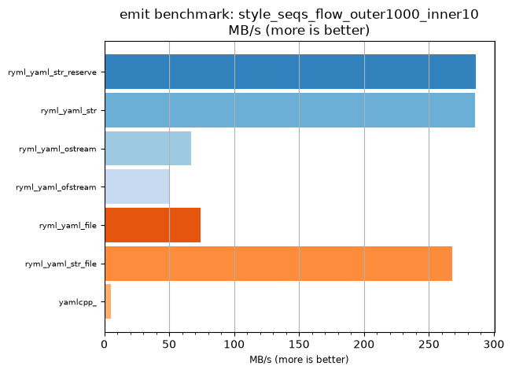
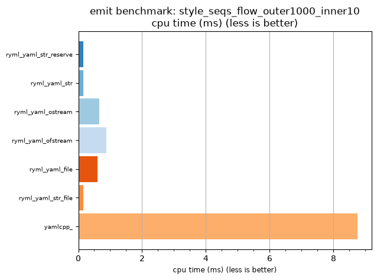

## emit benchmark: style_seqs_flow_outer1000_inner10

<p>Data type benchmark results:</p>
<ul>
   <li><pre><a href='#ryml-bm-emit-style_seqs_flow_outer1000_inner10-ryml_yaml_str_reserve'>ryml_yaml_str_reserve</a></pre></li> </ul>


<br/>
<br/>

---

<a id="ryml-bm-emit-style_seqs_flow_outer1000_inner10-ryml_yaml_str_reserve"/>

### emit benchmark: style_seqs_flow_outer1000_inner10

* Interactive html graphs
  * [MB/s](./ryml-bm-emit-style_seqs_flow_outer1000_inner10-mega_bytes_per_second.html)
  * [CPU time](./ryml-bm-emit-style_seqs_flow_outer1000_inner10-cpu_time_ms.html)

[](./ryml-bm-emit-style_seqs_flow_outer1000_inner10-mega_bytes_per_second.png)
[](./ryml-bm-emit-style_seqs_flow_outer1000_inner10-cpu_time_ms.png)

```
+--------------------------------------------------------------------------------------------------+
|                        emit benchmark: style_seqs_flow_outer1000_inner10                         |
+-----------------------+---------+---------+----------+---------------+-------------+-------------+
| function              |    MB/s | MB/s(x) |  MB/s(%) | cpu time (ms) | cpu time(x) | cpu time(%) |
+-----------------------+---------+---------+----------+---------------+-------------+-------------+
| ryml_yaml_str_reserve |  286.07 |  57.02x | 5601.82% |          0.15 |       0.02x |     -98.25% |
| ryml_yaml_str         |  285.44 |  56.89x | 5589.14% |          0.15 |       0.02x |     -98.24% |
| ryml_yaml_ostream     |   66.95 |  13.34x | 1234.47% |          0.66 |       0.07x |     -92.51% |
| ryml_yaml_ofstream    |   49.97 |   9.96x |  896.00% |          0.88 |       0.10x |     -89.96% |
| ryml_yaml_file        |   73.94 |  14.74x | 1373.68% |          0.59 |       0.07x |     -93.21% |
| ryml_yaml_str_file    |  267.81 |  53.38x | 5237.87% |          0.16 |       0.02x |     -98.13% |
| yamlcpp_              |    5.02 |   1.00x |    0.00% |          8.75 |       1.00x |       0.00% |
+-----------------------+---------+---------+----------+---------------+-------------+-------------+
```

