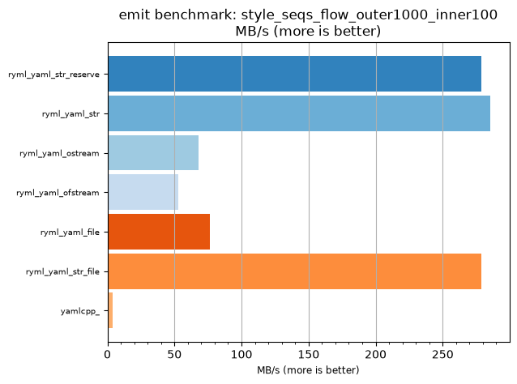
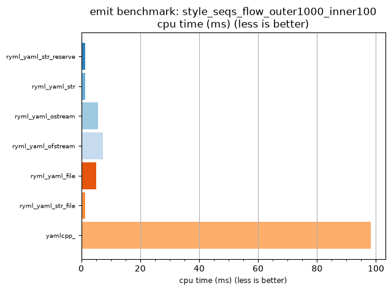

## emit benchmark: style_seqs_flow_outer1000_inner100

<p>Data type benchmark results:</p>
<ul>
   <li><pre><a href='#ryml-bm-emit-style_seqs_flow_outer1000_inner100-ryml_yaml_str_reserve'>ryml_yaml_str_reserve</a></pre></li> </ul>


<br/>
<br/>

---

<a id="ryml-bm-emit-style_seqs_flow_outer1000_inner100-ryml_yaml_str_reserve"/>

### emit benchmark: style_seqs_flow_outer1000_inner100

* Interactive html graphs
  * [MB/s](./ryml-bm-emit-style_seqs_flow_outer1000_inner100-mega_bytes_per_second.html)
  * [CPU time](./ryml-bm-emit-style_seqs_flow_outer1000_inner100-cpu_time_ms.html)

[](./ryml-bm-emit-style_seqs_flow_outer1000_inner100-mega_bytes_per_second.png)
[](./ryml-bm-emit-style_seqs_flow_outer1000_inner100-cpu_time_ms.png)

```
+--------------------------------------------------------------------------------------------------+
|                        emit benchmark: style_seqs_flow_outer1000_inner100                        |
+-----------------------+---------+---------+----------+---------------+-------------+-------------+
| function              |    MB/s | MB/s(x) |  MB/s(%) | cpu time (ms) | cpu time(x) | cpu time(%) |
+-----------------------+---------+---------+----------+---------------+-------------+-------------+
| ryml_yaml_str_reserve |  279.06 |  69.56x | 6856.19% |          1.41 |       0.01x |     -98.56% |
| ryml_yaml_str         |  285.40 |  71.14x | 7014.29% |          1.38 |       0.01x |     -98.59% |
| ryml_yaml_ostream     |   68.15 |  16.99x | 1598.84% |          5.78 |       0.06x |     -94.11% |
| ryml_yaml_ofstream    |   52.78 |  13.16x | 1215.61% |          7.47 |       0.08x |     -92.40% |
| ryml_yaml_file        |   76.33 |  19.03x | 1802.70% |          5.16 |       0.05x |     -94.74% |
| ryml_yaml_str_file    |  279.06 |  69.56x | 6856.19% |          1.41 |       0.01x |     -98.56% |
| yamlcpp_              |    4.01 |   1.00x |    0.00% |         98.21 |       1.00x |       0.00% |
+-----------------------+---------+---------+----------+---------------+-------------+-------------+
```

