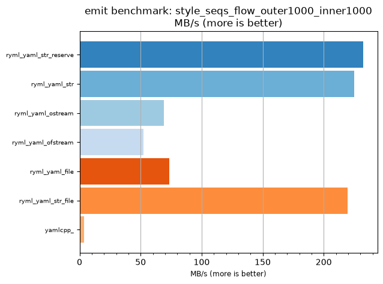
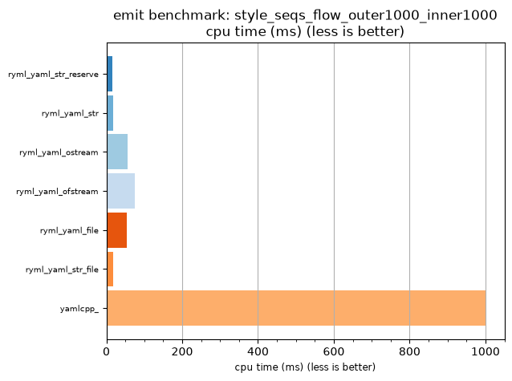

## emit benchmark: style_seqs_flow_outer1000_inner1000

<p>Data type benchmark results:</p>
<ul>
   <li><pre><a href='#ryml-bm-emit-style_seqs_flow_outer1000_inner1000-ryml_yaml_str_reserve'>ryml_yaml_str_reserve</a></pre></li> </ul>


<br/>
<br/>

---

<a id="ryml-bm-emit-style_seqs_flow_outer1000_inner1000-ryml_yaml_str_reserve"/>

### emit benchmark: style_seqs_flow_outer1000_inner1000

* Interactive html graphs
  * [MB/s](./ryml-bm-emit-style_seqs_flow_outer1000_inner1000-mega_bytes_per_second.html)
  * [CPU time](./ryml-bm-emit-style_seqs_flow_outer1000_inner1000-cpu_time_ms.html)

[](./ryml-bm-emit-style_seqs_flow_outer1000_inner1000-mega_bytes_per_second.png)
[](./ryml-bm-emit-style_seqs_flow_outer1000_inner1000-cpu_time_ms.png)

```
+--------------------------------------------------------------------------------------------------+
|                       emit benchmark: style_seqs_flow_outer1000_inner1000                        |
+-----------------------+---------+---------+----------+---------------+-------------+-------------+
| function              |    MB/s | MB/s(x) |  MB/s(%) | cpu time (ms) | cpu time(x) | cpu time(%) |
+-----------------------+---------+---------+----------+---------------+-------------+-------------+
| ryml_yaml_str_reserve |  232.28 |  59.64x | 5863.64% |         16.77 |       0.02x |     -98.32% |
| ryml_yaml_str         |  224.96 |  57.76x | 5675.61% |         17.31 |       0.02x |     -98.27% |
| ryml_yaml_ostream     |   69.24 |  17.78x | 1677.78% |         56.25 |       0.06x |     -94.38% |
| ryml_yaml_ofstream    |   52.17 |  13.40x | 1239.53% |         74.65 |       0.07x |     -92.53% |
| ryml_yaml_file        |   73.32 |  18.82x | 1782.35% |         53.12 |       0.05x |     -94.69% |
| ryml_yaml_str_file    |  219.60 |  56.38x | 5538.10% |         17.74 |       0.02x |     -98.23% |
| yamlcpp_              |    3.90 |   1.00x |    0.00% |       1000.00 |       1.00x |       0.00% |
+-----------------------+---------+---------+----------+---------------+-------------+-------------+
```

