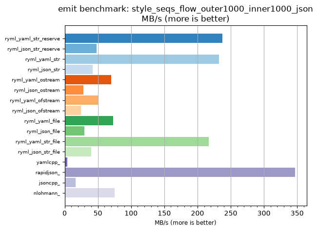
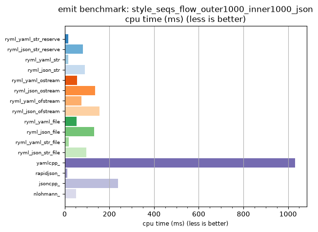

## emit benchmark: style_seqs_flow_outer1000_inner1000_json

<p>Data type benchmark results:</p>
<ul>
   <li><pre><a href='#ryml-bm-emit-style_seqs_flow_outer1000_inner1000_json-ryml_yaml_str_reserve'>ryml_yaml_str_reserve</a></pre></li> </ul>


<br/>
<br/>

---

<a id="ryml-bm-emit-style_seqs_flow_outer1000_inner1000_json-ryml_yaml_str_reserve"/>

### emit benchmark: style_seqs_flow_outer1000_inner1000_json

* Interactive html graphs
  * [MB/s](./ryml-bm-emit-style_seqs_flow_outer1000_inner1000_json-mega_bytes_per_second.html)
  * [CPU time](./ryml-bm-emit-style_seqs_flow_outer1000_inner1000_json-cpu_time_ms.html)

[](./ryml-bm-emit-style_seqs_flow_outer1000_inner1000_json-mega_bytes_per_second.png)
[](./ryml-bm-emit-style_seqs_flow_outer1000_inner1000_json-cpu_time_ms.png)

```
+--------------------------------------------------------------------------------------------------+
|                     emit benchmark: style_seqs_flow_outer1000_inner1000_json                     |
+-----------------------+---------+---------+----------+---------------+-------------+-------------+
| function              |    MB/s | MB/s(x) |  MB/s(%) | cpu time (ms) | cpu time(x) | cpu time(%) |
+-----------------------+---------+---------+----------+---------------+-------------+-------------+
| ryml_yaml_str_reserve |  237.69 |  62.93x | 6193.02% |         16.39 |       0.02x |     -98.41% |
| ryml_json_str_reserve |   47.73 |  12.64x | 1163.83% |         81.60 |       0.08x |     -92.09% |
| ryml_yaml_str         |  232.28 |  61.50x | 6050.00% |         16.77 |       0.02x |     -98.37% |
| ryml_json_str         |   42.56 |  11.27x | 1026.83% |         91.52 |       0.09x |     -91.13% |
| ryml_yaml_ostream     |   70.31 |  18.62x | 1761.54% |         55.40 |       0.05x |     -94.63% |
| ryml_json_ostream     |   28.33 |   7.50x |  650.00% |        137.50 |       0.13x |     -86.67% |
| ryml_yaml_ofstream    |   50.99 |  13.50x | 1250.00% |         76.39 |       0.07x |     -92.59% |
| ryml_json_ofstream    |   24.93 |   6.60x |  560.00% |        156.25 |       0.15x |     -84.85% |
| ryml_yaml_file        |   73.32 |  19.41x | 1841.18% |         53.12 |       0.05x |     -94.85% |
| ryml_json_file        |   29.68 |   7.86x |  685.71% |        131.25 |       0.13x |     -87.27% |
| ryml_yaml_str_file    |  217.32 |  57.54x | 5653.85% |         17.92 |       0.02x |     -98.26% |
| ryml_json_str_file    |   39.66 |  10.50x |  950.00% |         98.21 |       0.10x |     -90.48% |
| yamlcpp_              |    3.78 |   1.00x |    0.00% |       1031.25 |       1.00x |       0.00% |
| rapidjson_            |  346.82 |  91.83x | 9082.61% |         11.23 |       0.01x |     -98.91% |
| jsoncpp_              |   16.26 |   4.30x |  330.43% |        239.58 |       0.23x |     -76.77% |
| nlohmann_             |   75.54 |  20.00x | 1900.00% |         51.56 |       0.05x |     -95.00% |
+-----------------------+---------+---------+----------+---------------+-------------+-------------+
```

