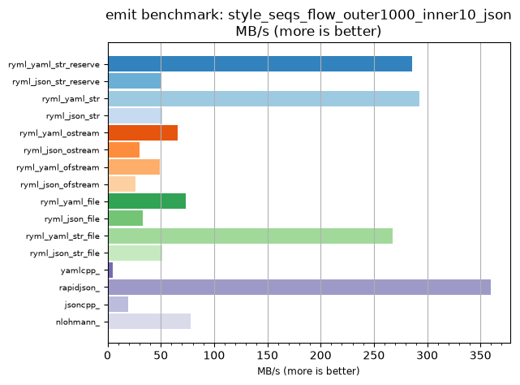
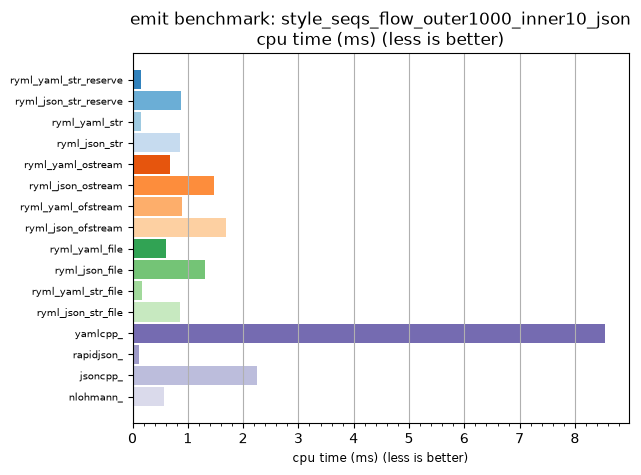

## emit benchmark: style_seqs_flow_outer1000_inner10_json

<p>Data type benchmark results:</p>
<ul>
   <li><pre><a href='#ryml-bm-emit-style_seqs_flow_outer1000_inner10_json-ryml_yaml_str_reserve'>ryml_yaml_str_reserve</a></pre></li> </ul>


<br/>
<br/>

---

<a id="ryml-bm-emit-style_seqs_flow_outer1000_inner10_json-ryml_yaml_str_reserve"/>

### emit benchmark: style_seqs_flow_outer1000_inner10_json

* Interactive html graphs
  * [MB/s](./ryml-bm-emit-style_seqs_flow_outer1000_inner10_json-mega_bytes_per_second.html)
  * [CPU time](./ryml-bm-emit-style_seqs_flow_outer1000_inner10_json-cpu_time_ms.html)

[](./ryml-bm-emit-style_seqs_flow_outer1000_inner10_json-mega_bytes_per_second.png)
[](./ryml-bm-emit-style_seqs_flow_outer1000_inner10_json-cpu_time_ms.png)

```
+--------------------------------------------------------------------------------------------------+
|                      emit benchmark: style_seqs_flow_outer1000_inner10_json                      |
+-----------------------+---------+---------+----------+---------------+-------------+-------------+
| function              |    MB/s | MB/s(x) |  MB/s(%) | cpu time (ms) | cpu time(x) | cpu time(%) |
+-----------------------+---------+---------+----------+---------------+-------------+-------------+
| ryml_yaml_str_reserve |  286.09 |  55.66x | 5466.06% |          0.15 |       0.02x |     -98.20% |
| ryml_json_str_reserve |   50.35 |   9.80x |  879.63% |          0.87 |       0.10x |     -89.79% |
| ryml_yaml_str         |  292.75 |  56.96x | 5595.50% |          0.15 |       0.02x |     -98.24% |
| ryml_json_str         |   51.19 |   9.96x |  896.00% |          0.86 |       0.10x |     -89.96% |
| ryml_yaml_ostream     |   65.56 |  12.76x | 1175.56% |          0.67 |       0.08x |     -92.16% |
| ryml_json_ostream     |   29.77 |   5.79x |  479.23% |          1.47 |       0.17x |     -82.74% |
| ryml_yaml_ofstream    |   49.37 |   9.60x |  860.42% |          0.89 |       0.10x |     -89.59% |
| ryml_json_ofstream    |   25.99 |   5.06x |  405.67% |          1.69 |       0.20x |     -80.22% |
| ryml_yaml_file        |   73.19 |  14.24x | 1323.88% |          0.60 |       0.07x |     -92.98% |
| ryml_json_file        |   33.32 |   6.48x |  548.19% |          1.32 |       0.15x |     -84.57% |
| ryml_yaml_str_file    |  267.83 |  52.11x | 5110.78% |          0.16 |       0.02x |     -98.08% |
| ryml_json_str_file    |   51.19 |   9.96x |  896.00% |          0.86 |       0.10x |     -89.96% |
| yamlcpp_              |    5.14 |   1.00x |    0.00% |          8.54 |       1.00x |       0.00% |
| rapidjson_            |  359.66 |  69.97x | 6897.33% |          0.12 |       0.01x |     -98.57% |
| jsoncpp_              |   19.55 |   3.80x |  280.29% |          2.25 |       0.26x |     -73.70% |
| nlohmann_             |   78.05 |  15.19x | 1418.52% |          0.56 |       0.07x |     -93.41% |
+-----------------------+---------+---------+----------+---------------+-------------+-------------+
```

