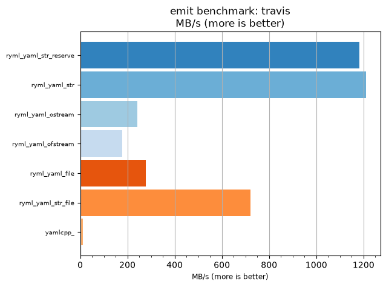
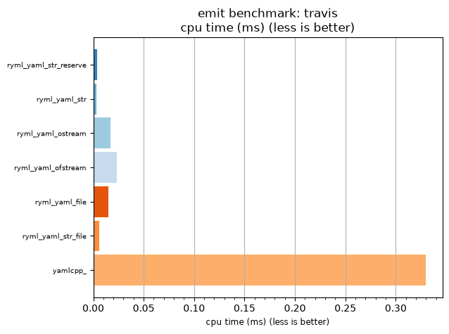

## emit benchmark: travis

<p>Data type benchmark results:</p>
<ul>
   <li><pre><a href='#ryml-bm-emit-travis-ryml_yaml_str_reserve'>ryml_yaml_str_reserve</a></pre></li> </ul>


<br/>
<br/>

---

<a id="ryml-bm-emit-travis-ryml_yaml_str_reserve"/>

### emit benchmark: travis

* Interactive html graphs
  * [MB/s](./ryml-bm-emit-travis-mega_bytes_per_second.html)
  * [CPU time](./ryml-bm-emit-travis-cpu_time_ms.html)

[](./ryml-bm-emit-travis-mega_bytes_per_second.png)
[](./ryml-bm-emit-travis-cpu_time_ms.png)

```
+--------------------------------------------------------------------------------------------------+
|                                      emit benchmark: travis                                      |
+-----------------------+---------+---------+----------+---------------+-------------+-------------+
| function              |    MB/s | MB/s(x) |  MB/s(%) | cpu time (ms) | cpu time(x) | cpu time(%) |
+-----------------------+---------+---------+----------+---------------+-------------+-------------+
| ryml_yaml_str_reserve | 1182.86 |  93.39x | 9239.39% |          0.00 |       0.01x |     -98.93% |
| ryml_yaml_str         | 1210.37 |  95.57x | 9456.62% |          0.00 |       0.01x |     -98.95% |
| ryml_yaml_ostream     |  241.83 |  19.09x | 1809.38% |          0.02 |       0.05x |     -94.76% |
| ryml_yaml_ofstream    |  177.34 |  14.00x | 1300.23% |          0.02 |       0.07x |     -92.86% |
| ryml_yaml_file        |  278.39 |  21.98x | 2098.02% |          0.01 |       0.05x |     -95.45% |
| ryml_yaml_str_file    |  722.16 |  57.02x | 5601.90% |          0.01 |       0.02x |     -98.25% |
| yamlcpp_              |   12.67 |   1.00x |    0.00% |          0.33 |       1.00x |       0.00% |
+-----------------------+---------+---------+----------+---------------+-------------+-------------+
```

