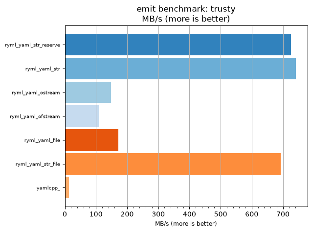
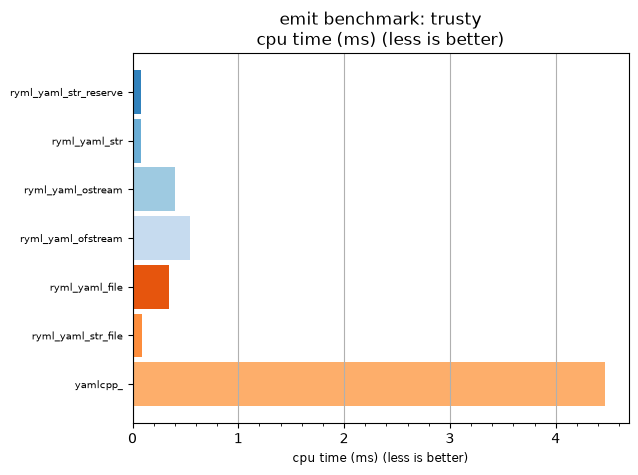

## emit benchmark: trusty

<p>Data type benchmark results:</p>
<ul>
   <li><pre><a href='#ryml-bm-emit-trusty-ryml_yaml_str_reserve'>ryml_yaml_str_reserve</a></pre></li> </ul>


<br/>
<br/>

---

<a id="ryml-bm-emit-trusty-ryml_yaml_str_reserve"/>

### emit benchmark: trusty

* Interactive html graphs
  * [MB/s](./ryml-bm-emit-trusty-mega_bytes_per_second.html)
  * [CPU time](./ryml-bm-emit-trusty-cpu_time_ms.html)

[](./ryml-bm-emit-trusty-mega_bytes_per_second.png)
[](./ryml-bm-emit-trusty-cpu_time_ms.png)

```
+--------------------------------------------------------------------------------------------------+
|                                      emit benchmark: trusty                                      |
+-----------------------+---------+---------+----------+---------------+-------------+-------------+
| function              |    MB/s | MB/s(x) |  MB/s(%) | cpu time (ms) | cpu time(x) | cpu time(%) |
+-----------------------+---------+---------+----------+---------------+-------------+-------------+
| ryml_yaml_str_reserve |  725.55 |  54.47x | 5346.81% |          0.08 |       0.02x |     -98.16% |
| ryml_yaml_str         |  741.32 |  55.65x | 5465.22% |          0.08 |       0.02x |     -98.20% |
| ryml_yaml_ostream     |  148.26 |  11.13x | 1013.04% |          0.40 |       0.09x |     -91.02% |
| ryml_yaml_ofstream    |  108.74 |   8.16x |  716.33% |          0.55 |       0.12x |     -87.75% |
| ryml_yaml_file        |  172.20 |  12.93x | 1192.70% |          0.35 |       0.08x |     -92.26% |
| ryml_yaml_str_file    |  693.14 |  52.03x | 5103.48% |          0.09 |       0.02x |     -98.08% |
| yamlcpp_              |   13.32 |   1.00x |    0.00% |          4.46 |       1.00x |       0.00% |
+-----------------------+---------+---------+----------+---------------+-------------+-------------+
```

