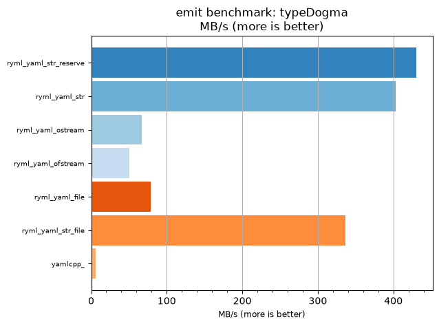
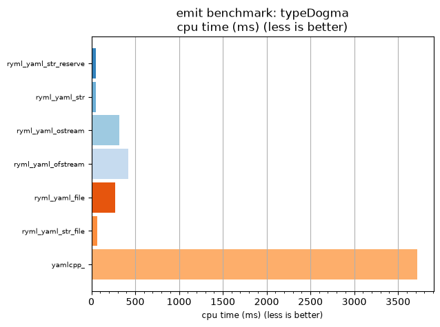

## emit benchmark: typeDogma

<p>Data type benchmark results:</p>
<ul>
   <li><pre><a href='#ryml-bm-emit-typeDogma-ryml_yaml_str_reserve'>ryml_yaml_str_reserve</a></pre></li> </ul>


<br/>
<br/>

---

<a id="ryml-bm-emit-typeDogma-ryml_yaml_str_reserve"/>

### emit benchmark: typeDogma

* Interactive html graphs
  * [MB/s](./ryml-bm-emit-typeDogma-mega_bytes_per_second.html)
  * [CPU time](./ryml-bm-emit-typeDogma-cpu_time_ms.html)

[](./ryml-bm-emit-typeDogma-mega_bytes_per_second.png)
[](./ryml-bm-emit-typeDogma-cpu_time_ms.png)

```
+--------------------------------------------------------------------------------------------------+
|                                    emit benchmark: typeDogma                                     |
+-----------------------+---------+---------+----------+---------------+-------------+-------------+
| function              |    MB/s | MB/s(x) |  MB/s(%) | cpu time (ms) | cpu time(x) | cpu time(%) |
+-----------------------+---------+---------+----------+---------------+-------------+-------------+
| ryml_yaml_str_reserve |  430.19 |  74.38x | 7337.50% |         50.00 |       0.01x |     -98.66% |
| ryml_yaml_str         |  402.91 |  69.66x | 6865.85% |         53.39 |       0.01x |     -98.56% |
| ryml_yaml_ostream     |   67.15 |  11.61x | 1060.98% |        320.31 |       0.09x |     -91.39% |
| ryml_yaml_ofstream    |   50.99 |   8.81x |  781.48% |        421.88 |       0.11x |     -88.66% |
| ryml_yaml_file        |   78.66 |  13.60x | 1260.00% |        273.44 |       0.07x |     -92.65% |
| ryml_yaml_str_file    |  336.50 |  58.18x | 5717.78% |         63.92 |       0.02x |     -98.28% |
| yamlcpp_              |    5.78 |   1.00x |    0.00% |       3718.75 |       1.00x |       0.00% |
+-----------------------+---------+---------+----------+---------------+-------------+-------------+
```

