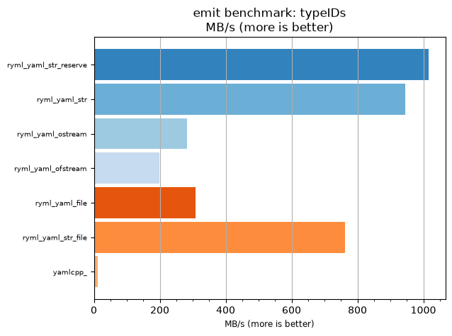
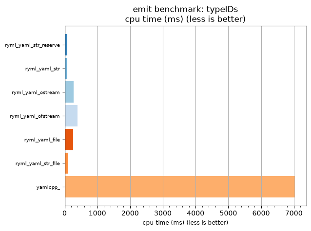

## emit benchmark: typeIDs

<p>Data type benchmark results:</p>
<ul>
   <li><pre><a href='#ryml-bm-emit-typeIDs-ryml_yaml_str_reserve'>ryml_yaml_str_reserve</a></pre></li> </ul>


<br/>
<br/>

---

<a id="ryml-bm-emit-typeIDs-ryml_yaml_str_reserve"/>

### emit benchmark: typeIDs

* Interactive html graphs
  * [MB/s](./ryml-bm-emit-typeIDs-mega_bytes_per_second.html)
  * [CPU time](./ryml-bm-emit-typeIDs-cpu_time_ms.html)

[](./ryml-bm-emit-typeIDs-mega_bytes_per_second.png)
[](./ryml-bm-emit-typeIDs-cpu_time_ms.png)

```
+--------------------------------------------------------------------------------------------------+
|                                     emit benchmark: typeIDs                                      |
+-----------------------+---------+---------+----------+---------------+-------------+-------------+
| function              |    MB/s | MB/s(x) |  MB/s(%) | cpu time (ms) | cpu time(x) | cpu time(%) |
+-----------------------+---------+---------+----------+---------------+-------------+-------------+
| ryml_yaml_str_reserve | 1015.77 |  90.00x | 8900.00% |         78.12 |       0.01x |     -98.89% |
| ryml_yaml_str         |  944.90 |  83.72x | 8272.09% |         83.98 |       0.01x |     -98.81% |
| ryml_yaml_ostream     |  282.16 |  25.00x | 2400.00% |        281.25 |       0.04x |     -96.00% |
| ryml_yaml_ofstream    |  199.17 |  17.65x | 1664.71% |        398.44 |       0.06x |     -94.33% |
| ryml_yaml_file        |  307.81 |  27.27x | 2627.27% |        257.81 |       0.04x |     -96.33% |
| ryml_yaml_str_file    |  761.82 |  67.50x | 6650.00% |        104.17 |       0.01x |     -98.52% |
| yamlcpp_              |   11.29 |   1.00x |    0.00% |       7031.25 |       1.00x |       0.00% |
+-----------------------+---------+---------+----------+---------------+-------------+-------------+
```

