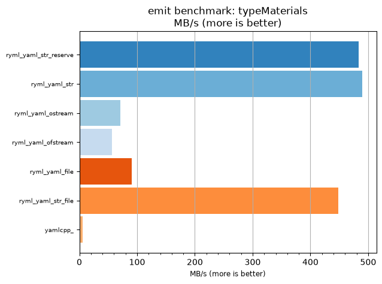
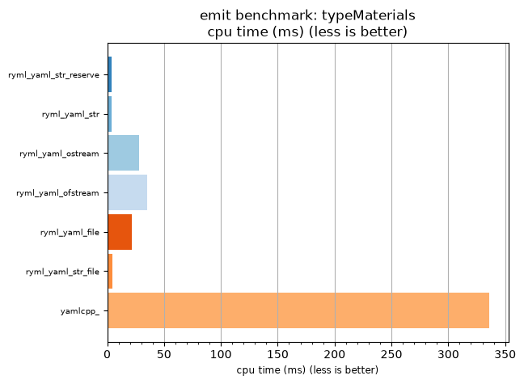

## emit benchmark: typeMaterials

<p>Data type benchmark results:</p>
<ul>
   <li><pre><a href='#ryml-bm-emit-typeMaterials-ryml_yaml_str_reserve'>ryml_yaml_str_reserve</a></pre></li> </ul>


<br/>
<br/>

---

<a id="ryml-bm-emit-typeMaterials-ryml_yaml_str_reserve"/>

### emit benchmark: typeMaterials

* Interactive html graphs
  * [MB/s](./ryml-bm-emit-typeMaterials-mega_bytes_per_second.html)
  * [CPU time](./ryml-bm-emit-typeMaterials-cpu_time_ms.html)

[](./ryml-bm-emit-typeMaterials-mega_bytes_per_second.png)
[](./ryml-bm-emit-typeMaterials-cpu_time_ms.png)

```
+--------------------------------------------------------------------------------------------------+
|                                  emit benchmark: typeMaterials                                   |
+-----------------------+---------+---------+----------+---------------+-------------+-------------+
| function              |    MB/s | MB/s(x) |  MB/s(%) | cpu time (ms) | cpu time(x) | cpu time(%) |
+-----------------------+---------+---------+----------+---------------+-------------+-------------+
| ryml_yaml_str_reserve |  483.29 |  81.11x | 8011.36% |          4.14 |       0.01x |     -98.77% |
| ryml_yaml_str         |  489.63 |  82.18x | 8117.78% |          4.09 |       0.01x |     -98.78% |
| ryml_yaml_ostream     |   71.17 |  11.94x | 1094.44% |         28.12 |       0.08x |     -91.63% |
| ryml_yaml_ofstream    |   56.60 |   9.50x |  850.00% |         35.36 |       0.11x |     -89.47% |
| ryml_yaml_file        |   91.09 |  15.29x | 1428.89% |         21.97 |       0.07x |     -93.46% |
| ryml_yaml_str_file    |  448.35 |  75.25x | 7425.00% |          4.46 |       0.01x |     -98.67% |
| yamlcpp_              |    5.96 |   1.00x |    0.00% |        335.94 |       1.00x |       0.00% |
+-----------------------+---------+---------+----------+---------------+-------------+-------------+
```

