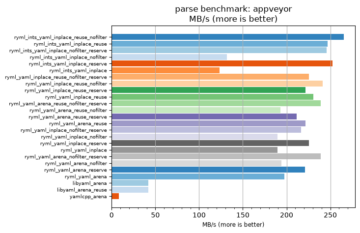
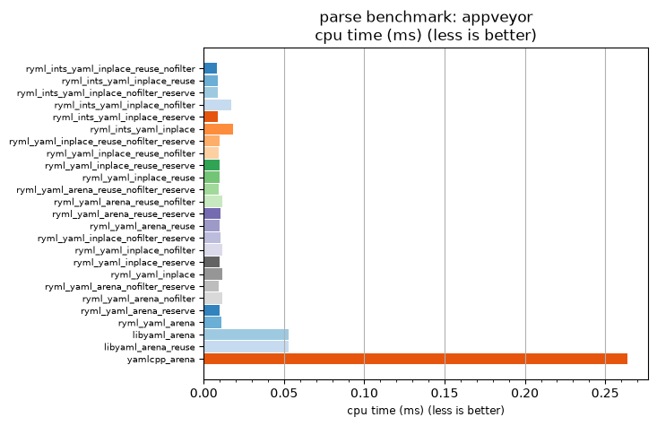

## parse benchmark: appveyor

<p>Data type benchmark results:</p>
<ul>
   <li><pre><a href='#ryml-bm-parse-appveyor-ryml_ints_yaml_inplace_reuse_nofilter'>ryml_ints_yaml_inplace_reuse_nofilter</a></pre></li> </ul>


<br/>
<br/>

---

<a id="ryml-bm-parse-appveyor-ryml_ints_yaml_inplace_reuse_nofilter"/>

### parse benchmark: appveyor

* Interactive html graphs
  * [MB/s](./ryml-bm-parse-appveyor-mega_bytes_per_second.html)
  * [CPU time](./ryml-bm-parse-appveyor-cpu_time_ms.html)

[](./ryml-bm-parse-appveyor-mega_bytes_per_second.png)
[](./ryml-bm-parse-appveyor-cpu_time_ms.png)

```
+---------------------------------------------------------------------------------------------------------------------+
|                                              parse benchmark: appveyor                                              |
+------------------------------------------+---------+---------+----------+---------------+-------------+-------------+
| function                                 |    MB/s | MB/s(x) |  MB/s(%) | cpu time (ms) | cpu time(x) | cpu time(%) |
+------------------------------------------+---------+---------+----------+---------------+-------------+-------------+
| ryml_ints_yaml_inplace_reuse_nofilter    |  265.22 |  31.50x | 3049.87% |          0.01 |       0.03x |     -96.83% |
| ryml_ints_yaml_inplace_reuse             |  246.71 |  29.30x | 2830.11% |          0.01 |       0.03x |     -96.59% |
| ryml_ints_yaml_inplace_nofilter_reserve  |  245.76 |  29.19x | 2818.79% |          0.01 |       0.03x |     -96.57% |
| ryml_ints_yaml_inplace_nofilter          |  131.51 |  15.62x | 1461.90% |          0.02 |       0.06x |     -93.60% |
| ryml_ints_yaml_inplace_reserve           |  252.59 |  30.00x | 2899.88% |          0.01 |       0.03x |     -96.67% |
| ryml_ints_yaml_inplace                   |  123.36 |  14.65x | 1365.04% |          0.02 |       0.07x |     -93.17% |
| ryml_yaml_inplace_reuse_nofilter_reserve |  225.72 |  26.81x | 2580.74% |          0.01 |       0.04x |     -96.27% |
| ryml_yaml_inplace_reuse_nofilter         |  241.11 |  28.64x | 2763.52% |          0.01 |       0.03x |     -96.51% |
| ryml_yaml_inplace_reuse_reserve          |  221.78 |  26.34x | 2534.03% |          0.01 |       0.04x |     -96.20% |
| ryml_yaml_inplace_reuse                  |  230.62 |  27.39x | 2639.02% |          0.01 |       0.04x |     -96.35% |
| ryml_yaml_arena_reuse_nofilter_reserve   |  239.29 |  28.42x | 2741.98% |          0.01 |       0.04x |     -96.48% |
| ryml_yaml_arena_reuse_nofilter           |  192.89 |  22.91x | 2190.82% |          0.01 |       0.04x |     -95.63% |
| ryml_yaml_arena_reuse_reserve            |  211.47 |  25.12x | 2411.52% |          0.01 |       0.04x |     -96.02% |
| ryml_yaml_arena_reuse                    |  221.78 |  26.34x | 2534.03% |          0.01 |       0.04x |     -96.20% |
| ryml_yaml_inplace_nofilter_reserve       |  216.50 |  25.71x | 2471.31% |          0.01 |       0.04x |     -96.11% |
| ryml_yaml_inplace_nofilter               |  189.44 |  22.50x | 2149.90% |          0.01 |       0.04x |     -95.56% |
| ryml_yaml_inplace_reserve                |  225.72 |  26.81x | 2580.74% |          0.01 |       0.04x |     -96.27% |
| ryml_yaml_inplace                        |  189.44 |  22.50x | 2149.90% |          0.01 |       0.04x |     -95.56% |
| ryml_yaml_arena_nofilter_reserve         |  239.29 |  28.42x | 2741.98% |          0.01 |       0.04x |     -96.48% |
| ryml_yaml_arena_nofilter                 |  194.06 |  23.05x | 2204.78% |          0.01 |       0.04x |     -95.66% |
| ryml_yaml_arena_reserve                  |  221.01 |  26.25x | 2524.88% |          0.01 |       0.04x |     -96.19% |
| ryml_yaml_arena                          |  197.68 |  23.48x | 2247.72% |          0.01 |       0.04x |     -95.74% |
| libyaml_arena                            |   41.88 |   4.97x |  397.35% |          0.05 |       0.20x |     -79.89% |
| libyaml_arena_reuse                      |   41.79 |   4.96x |  396.30% |          0.05 |       0.20x |     -79.85% |
| yamlcpp_arena                            |    8.42 |   1.00x |    0.00% |          0.26 |       1.00x |       0.00% |
+------------------------------------------+---------+---------+----------+---------------+-------------+-------------+
```

