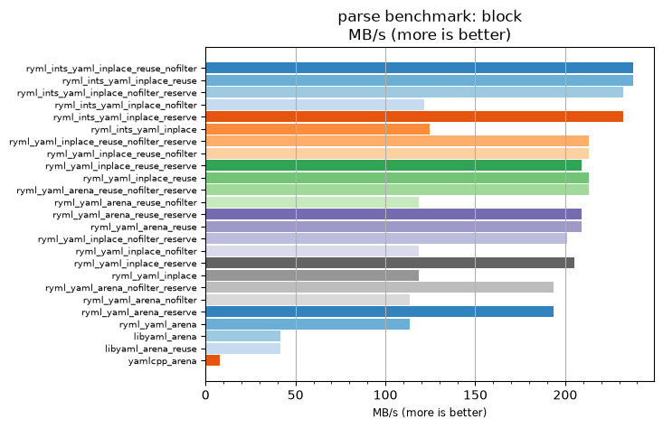
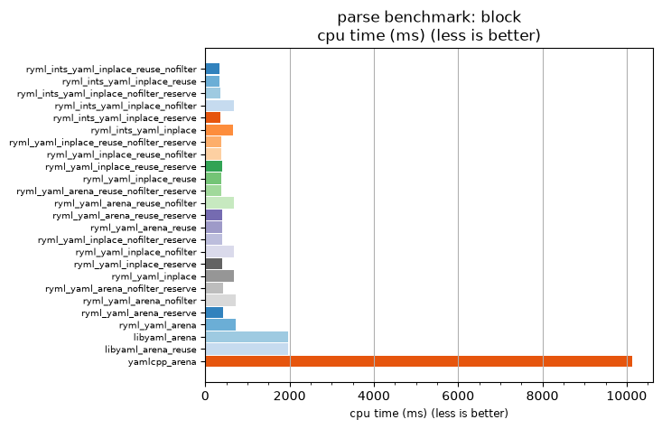

## parse benchmark: block

<p>Data type benchmark results:</p>
<ul>
   <li><pre><a href='#ryml-bm-parse-block-ryml_ints_yaml_inplace_reuse_nofilter'>ryml_ints_yaml_inplace_reuse_nofilter</a></pre></li> </ul>


<br/>
<br/>

---

<a id="ryml-bm-parse-block-ryml_ints_yaml_inplace_reuse_nofilter"/>

### parse benchmark: block

* Interactive html graphs
  * [MB/s](./ryml-bm-parse-block-mega_bytes_per_second.html)
  * [CPU time](./ryml-bm-parse-block-cpu_time_ms.html)

[](./ryml-bm-parse-block-mega_bytes_per_second.png)
[](./ryml-bm-parse-block-cpu_time_ms.png)

```
+---------------------------------------------------------------------------------------------------------------------+
|                                                parse benchmark: block                                               |
+------------------------------------------+---------+---------+----------+---------------+-------------+-------------+
| function                                 |    MB/s | MB/s(x) |  MB/s(%) | cpu time (ms) | cpu time(x) | cpu time(%) |
+------------------------------------------+---------+---------+----------+---------------+-------------+-------------+
| ryml_ints_yaml_inplace_reuse_nofilter    |  237.62 |  29.45x | 2845.45% |        343.75 |       0.03x |     -96.60% |
| ryml_ints_yaml_inplace_reuse             |  237.62 |  29.45x | 2845.45% |        343.75 |       0.03x |     -96.60% |
| ryml_ints_yaml_inplace_nofilter_reserve  |  232.34 |  28.80x | 2780.00% |        351.56 |       0.03x |     -96.53% |
| ryml_ints_yaml_inplace_nofilter          |  121.57 |  15.07x | 1406.98% |        671.88 |       0.07x |     -93.36% |
| ryml_ints_yaml_inplace_reserve           |  232.34 |  28.80x | 2780.00% |        351.56 |       0.03x |     -96.53% |
| ryml_ints_yaml_inplace                   |  124.47 |  15.43x | 1442.86% |        656.25 |       0.06x |     -93.52% |
| ryml_yaml_inplace_reuse_nofilter_reserve |  213.38 |  26.45x | 2544.90% |        382.81 |       0.04x |     -96.22% |
| ryml_yaml_inplace_reuse_nofilter         |  213.38 |  26.45x | 2544.90% |        382.81 |       0.04x |     -96.22% |
| ryml_yaml_inplace_reuse_reserve          |  209.11 |  25.92x | 2492.00% |        390.62 |       0.04x |     -96.14% |
| ryml_yaml_inplace_reuse                  |  213.38 |  26.45x | 2544.90% |        382.81 |       0.04x |     -96.22% |
| ryml_yaml_arena_reuse_nofilter_reserve   |  213.38 |  26.45x | 2544.90% |        382.81 |       0.04x |     -96.22% |
| ryml_yaml_arena_reuse_nofilter           |  118.81 |  14.73x | 1372.73% |        687.50 |       0.07x |     -93.21% |
| ryml_yaml_arena_reuse_reserve            |  209.11 |  25.92x | 2492.00% |        390.62 |       0.04x |     -96.14% |
| ryml_yaml_arena_reuse                    |  209.11 |  25.92x | 2492.00% |        390.62 |       0.04x |     -96.14% |
| ryml_yaml_inplace_nofilter_reserve       |  201.07 |  24.92x | 2392.31% |        406.25 |       0.04x |     -95.99% |
| ryml_yaml_inplace_nofilter               |  118.81 |  14.73x | 1372.73% |        687.50 |       0.07x |     -93.21% |
| ryml_yaml_inplace_reserve                |  205.01 |  25.41x | 2441.18% |        398.44 |       0.04x |     -96.06% |
| ryml_yaml_inplace                        |  118.81 |  14.73x | 1372.73% |        687.50 |       0.07x |     -93.21% |
| ryml_yaml_arena_nofilter_reserve         |  193.62 |  24.00x | 2300.00% |        421.88 |       0.04x |     -95.83% |
| ryml_yaml_arena_nofilter                 |  113.65 |  14.09x | 1308.70% |        718.75 |       0.07x |     -92.90% |
| ryml_yaml_arena_reserve                  |  193.62 |  24.00x | 2300.00% |        421.88 |       0.04x |     -95.83% |
| ryml_yaml_arena                          |  113.65 |  14.09x | 1308.70% |        718.75 |       0.07x |     -92.90% |
| libyaml_arena                            |   41.49 |   5.14x |  414.29% |       1968.75 |       0.19x |     -80.56% |
| libyaml_arena_reuse                      |   41.49 |   5.14x |  414.29% |       1968.75 |       0.19x |     -80.56% |
| yamlcpp_arena                            |    8.07 |   1.00x |    0.00% |      10125.00 |       1.00x |       0.00% |
+------------------------------------------+---------+---------+----------+---------------+-------------+-------------+
```

