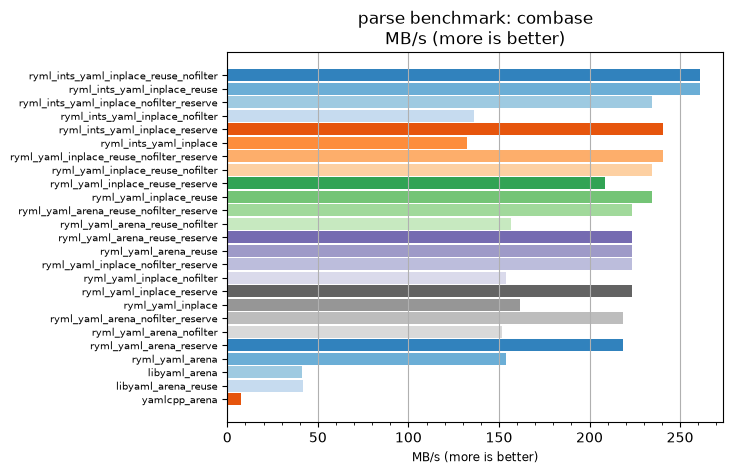
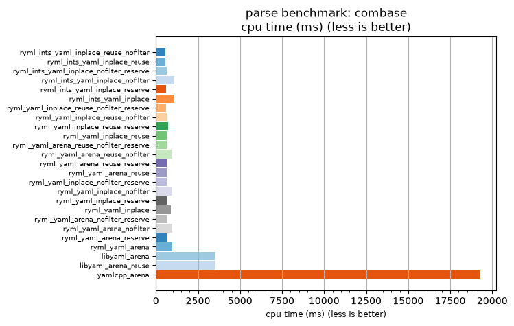

## parse benchmark: combase

<p>Data type benchmark results:</p>
<ul>
   <li><pre><a href='#ryml-bm-parse-combase-ryml_ints_yaml_inplace_reuse_nofilter'>ryml_ints_yaml_inplace_reuse_nofilter</a></pre></li> </ul>


<br/>
<br/>

---

<a id="ryml-bm-parse-combase-ryml_ints_yaml_inplace_reuse_nofilter"/>

### parse benchmark: combase

* Interactive html graphs
  * [MB/s](./ryml-bm-parse-combase-mega_bytes_per_second.html)
  * [CPU time](./ryml-bm-parse-combase-cpu_time_ms.html)

[](./ryml-bm-parse-combase-mega_bytes_per_second.png)
[](./ryml-bm-parse-combase-cpu_time_ms.png)

```
+---------------------------------------------------------------------------------------------------------------------+
|                                               parse benchmark: combase                                              |
+------------------------------------------+---------+---------+----------+---------------+-------------+-------------+
| function                                 |    MB/s | MB/s(x) |  MB/s(%) | cpu time (ms) | cpu time(x) | cpu time(%) |
+------------------------------------------+---------+---------+----------+---------------+-------------+-------------+
| ryml_ints_yaml_inplace_reuse_nofilter    |  260.83 |  34.28x | 3327.78% |        562.50 |       0.03x |     -97.08% |
| ryml_ints_yaml_inplace_reuse             |  260.83 |  34.28x | 3327.78% |        562.50 |       0.03x |     -97.08% |
| ryml_ints_yaml_inplace_nofilter_reserve  |  234.74 |  30.85x | 2985.00% |        625.00 |       0.03x |     -96.76% |
| ryml_ints_yaml_inplace_nofilter          |  136.08 |  17.88x | 1688.41% |       1078.12 |       0.06x |     -94.41% |
| ryml_ints_yaml_inplace_reserve           |  240.76 |  31.64x | 3064.10% |        609.38 |       0.03x |     -96.84% |
| ryml_ints_yaml_inplace                   |  132.25 |  17.38x | 1638.03% |       1109.38 |       0.06x |     -94.25% |
| ryml_yaml_inplace_reuse_nofilter_reserve |  240.76 |  31.64x | 3064.10% |        609.38 |       0.03x |     -96.84% |
| ryml_yaml_inplace_reuse_nofilter         |  234.74 |  30.85x | 2985.00% |        625.00 |       0.03x |     -96.76% |
| ryml_yaml_inplace_reuse_reserve          |  208.66 |  27.42x | 2642.22% |        703.12 |       0.04x |     -96.35% |
| ryml_yaml_inplace_reuse                  |  234.74 |  30.85x | 2985.00% |        625.00 |       0.03x |     -96.76% |
| ryml_yaml_arena_reuse_nofilter_reserve   |  223.56 |  29.38x | 2838.10% |        656.25 |       0.03x |     -96.60% |
| ryml_yaml_arena_reuse_nofilter           |  156.50 |  20.57x | 1956.67% |        937.50 |       0.05x |     -95.14% |
| ryml_yaml_arena_reuse_reserve            |  223.56 |  29.38x | 2838.10% |        656.25 |       0.03x |     -96.60% |
| ryml_yaml_arena_reuse                    |  223.56 |  29.38x | 2838.10% |        656.25 |       0.03x |     -96.60% |
| ryml_yaml_inplace_nofilter_reserve       |  223.56 |  29.38x | 2838.10% |        656.25 |       0.03x |     -96.60% |
| ryml_yaml_inplace_nofilter               |  153.93 |  20.23x | 1922.95% |        953.12 |       0.05x |     -95.06% |
| ryml_yaml_inplace_reserve                |  223.56 |  29.38x | 2838.10% |        656.25 |       0.03x |     -96.60% |
| ryml_yaml_inplace                        |  161.89 |  21.28x | 2027.59% |        906.25 |       0.05x |     -95.30% |
| ryml_yaml_arena_nofilter_reserve         |  218.37 |  28.70x | 2769.77% |        671.88 |       0.03x |     -96.52% |
| ryml_yaml_arena_nofilter                 |  151.45 |  19.90x | 1890.32% |        968.75 |       0.05x |     -94.98% |
| ryml_yaml_arena_reserve                  |  218.37 |  28.70x | 2769.77% |        671.88 |       0.03x |     -96.52% |
| ryml_yaml_arena                          |  153.93 |  20.23x | 1922.95% |        953.12 |       0.05x |     -95.06% |
| libyaml_arena                            |   41.36 |   5.44x |  443.61% |       3546.88 |       0.18x |     -81.60% |
| libyaml_arena_reuse                      |   41.92 |   5.51x |  450.89% |       3500.00 |       0.18x |     -81.85% |
| yamlcpp_arena                            |    7.61 |   1.00x |    0.00% |      19281.25 |       1.00x |       0.00% |
+------------------------------------------+---------+---------+----------+---------------+-------------+-------------+
```

