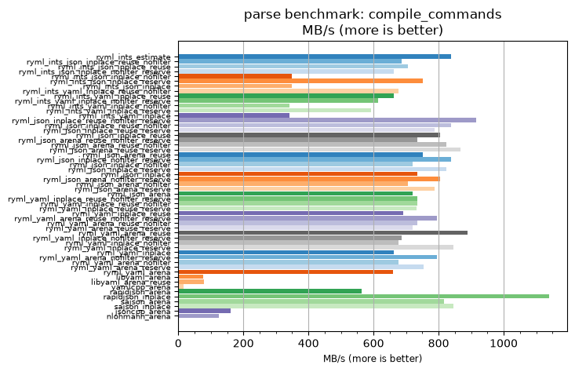
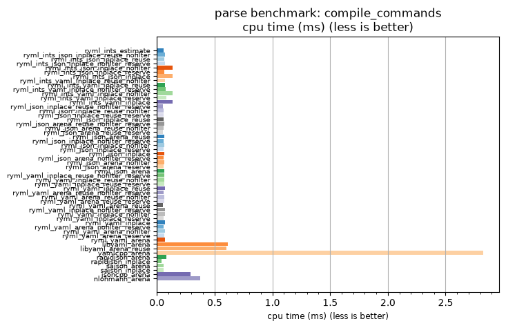

## parse benchmark: compile_commands

<p>Data type benchmark results:</p>
<ul>
   <li><pre><a href='#ryml-bm-parse-compile_commands-ryml_ints_estimate'>ryml_ints_estimate</a></pre></li> </ul>


<br/>
<br/>

---

<a id="ryml-bm-parse-compile_commands-ryml_ints_estimate"/>

### parse benchmark: compile_commands

* Interactive html graphs
  * [MB/s](./ryml-bm-parse-compile_commands-mega_bytes_per_second.html)
  * [CPU time](./ryml-bm-parse-compile_commands-cpu_time_ms.html)

[](./ryml-bm-parse-compile_commands-mega_bytes_per_second.png)
[](./ryml-bm-parse-compile_commands-cpu_time_ms.png)

```
+---------------------------------------------------------------------------------------------------------------------+
|                                          parse benchmark: compile_commands                                          |
+------------------------------------------+---------+---------+----------+---------------+-------------+-------------+
| function                                 |    MB/s | MB/s(x) |  MB/s(%) | cpu time (ms) | cpu time(x) | cpu time(%) |
+------------------------------------------+---------+---------+----------+---------------+-------------+-------------+
| ryml_ints_estimate                       |  838.88 |  50.20x | 4920.08% |          0.06 |       0.02x |     -98.01% |
| ryml_ints_json_inplace_reuse_nofilter    |  686.36 |  41.07x | 4007.34% |          0.07 |       0.02x |     -97.57% |
| ryml_ints_json_inplace_reuse             |  704.66 |  42.17x | 4116.87% |          0.07 |       0.02x |     -97.63% |
| ryml_ints_json_inplace_nofilter_reserve  |  663.24 |  39.69x | 3868.99% |          0.07 |       0.03x |     -97.48% |
| ryml_ints_json_inplace_nofilter          |  349.61 |  20.92x | 1992.18% |          0.13 |       0.05x |     -95.22% |
| ryml_ints_json_inplace_reserve           |  751.64 |  44.98x | 4397.99% |          0.06 |       0.02x |     -97.78% |
| ryml_ints_json_inplace                   |  349.61 |  20.92x | 1992.18% |          0.13 |       0.05x |     -95.22% |
| ryml_ints_yaml_inplace_reuse_nofilter    |  676.47 |  40.48x | 3948.19% |          0.07 |       0.02x |     -97.53% |
| ryml_ints_yaml_inplace_reuse             |  663.21 |  39.69x | 3868.82% |          0.07 |       0.03x |     -97.48% |
| ryml_ints_yaml_inplace_nofilter_reserve  |  614.98 |  36.80x | 3580.18% |          0.08 |       0.03x |     -97.28% |
| ryml_ints_yaml_inplace_nofilter          |  341.67 |  20.45x | 1944.63% |          0.14 |       0.05x |     -95.11% |
| ryml_ints_yaml_inplace_reserve           |  593.40 |  35.51x | 3451.05% |          0.08 |       0.03x |     -97.18% |
| ryml_ints_yaml_inplace                   |  341.67 |  20.45x | 1944.63% |          0.14 |       0.05x |     -95.11% |
| ryml_json_inplace_reuse_nofilter_reserve |  915.14 |  54.76x | 5376.45% |          0.05 |       0.02x |     -98.17% |
| ryml_json_inplace_reuse_nofilter         |  838.88 |  50.20x | 4920.08% |          0.06 |       0.02x |     -98.01% |
| ryml_json_inplace_reuse_reserve          |  786.60 |  47.07x | 4607.20% |          0.06 |       0.02x |     -97.88% |
| ryml_json_inplace_reuse                  |  805.32 |  48.19x | 4719.28% |          0.06 |       0.02x |     -97.92% |
| ryml_json_arena_reuse_nofilter_reserve   |  735.30 |  44.00x | 4300.21% |          0.06 |       0.02x |     -97.73% |
| ryml_json_arena_reuse_nofilter           |  824.97 |  49.37x | 4836.82% |          0.06 |       0.02x |     -97.97% |
| ryml_json_arena_reuse_reserve            |  867.27 |  51.90x | 5089.99% |          0.05 |       0.02x |     -98.07% |
| ryml_json_arena_reuse                    |  751.64 |  44.98x | 4397.99% |          0.06 |       0.02x |     -97.78% |
| ryml_json_inplace_nofilter_reserve       |  838.88 |  50.20x | 4920.08% |          0.06 |       0.02x |     -98.01% |
| ryml_json_inplace_nofilter               |  719.65 |  43.07x | 4206.59% |          0.07 |       0.02x |     -97.68% |
| ryml_json_inplace_reserve                |  824.97 |  49.37x | 4836.82% |          0.06 |       0.02x |     -97.97% |
| ryml_json_inplace                        |  735.30 |  44.00x | 4300.21% |          0.06 |       0.02x |     -97.73% |
| ryml_json_arena_nofilter_reserve         |  805.32 |  48.19x | 4719.28% |          0.06 |       0.02x |     -97.92% |
| ryml_json_arena_nofilter                 |  704.66 |  42.17x | 4116.87% |          0.07 |       0.02x |     -97.63% |
| ryml_json_arena_reserve                  |  786.60 |  47.07x | 4607.20% |          0.06 |       0.02x |     -97.88% |
| ryml_json_arena                          |  719.65 |  43.07x | 4206.59% |          0.07 |       0.02x |     -97.68% |
| ryml_yaml_inplace_reuse_nofilter_reserve |  735.30 |  44.00x | 4300.21% |          0.06 |       0.02x |     -97.73% |
| ryml_yaml_inplace_reuse_nofilter         |  735.30 |  44.00x | 4300.21% |          0.06 |       0.02x |     -97.73% |
| ryml_yaml_inplace_reuse_reserve          |  731.32 |  43.76x | 4276.42% |          0.06 |       0.02x |     -97.72% |
| ryml_yaml_inplace_reuse                  |  690.28 |  41.31x | 4030.81% |          0.07 |       0.02x |     -97.58% |
| ryml_yaml_arena_reuse_nofilter_reserve   |  795.85 |  47.63x | 4662.58% |          0.06 |       0.02x |     -97.90% |
| ryml_yaml_arena_reuse_nofilter           |  735.30 |  44.00x | 4300.21% |          0.06 |       0.02x |     -97.73% |
| ryml_yaml_arena_reuse_reserve            |  719.04 |  43.03x | 4202.93% |          0.07 |       0.02x |     -97.68% |
| ryml_yaml_arena_reuse                    |  888.23 |  53.15x | 5215.38% |          0.05 |       0.02x |     -98.12% |
| ryml_yaml_inplace_nofilter_reserve       |  686.36 |  41.07x | 4007.34% |          0.07 |       0.02x |     -97.57% |
| ryml_yaml_inplace_nofilter               |  676.47 |  40.48x | 3948.19% |          0.07 |       0.02x |     -97.53% |
| ryml_yaml_inplace_reserve                |  845.59 |  50.60x | 4960.24% |          0.06 |       0.02x |     -98.02% |
| ryml_yaml_inplace                        |  663.21 |  39.69x | 3868.82% |          0.07 |       0.03x |     -97.48% |
| ryml_yaml_arena_nofilter_reserve         |  795.85 |  47.63x | 4662.58% |          0.06 |       0.02x |     -97.90% |
| ryml_yaml_arena_nofilter                 |  676.47 |  40.48x | 3948.19% |          0.07 |       0.02x |     -97.53% |
| ryml_yaml_arena_reserve                  |  754.99 |  45.18x | 4418.07% |          0.06 |       0.02x |     -97.79% |
| ryml_yaml_arena                          |  659.97 |  39.49x | 3849.46% |          0.07 |       0.03x |     -97.47% |
| libyaml_arena                            |   76.87 |   4.60x |  360.02% |          0.61 |       0.22x |     -78.26% |
| libyaml_arena_reuse                      |   78.66 |   4.71x |  370.72% |          0.60 |       0.21x |     -78.76% |
| yamlcpp_arena                            |   16.71 |   1.00x |    0.00% |          2.82 |       1.00x |       0.00% |
| rapidjson_arena                          |  563.73 |  33.73x | 3273.49% |          0.08 |       0.03x |     -97.04% |
| rapidjson_inplace                        | 1138.87 |  68.15x | 6715.31% |          0.04 |       0.01x |     -98.53% |
| sajson_arena                             |  816.21 |  48.84x | 4784.40% |          0.06 |       0.02x |     -97.95% |
| sajson_inplace                           |  845.59 |  50.60x | 4960.24% |          0.06 |       0.02x |     -98.02% |
| jsoncpp_arena                            |  161.84 |   9.69x |  868.51% |          0.29 |       0.10x |     -89.67% |
| nlohmann_arena                           |  125.30 |   7.50x |  649.80% |          0.38 |       0.13x |     -86.66% |
+------------------------------------------+---------+---------+----------+---------------+-------------+-------------+
```

