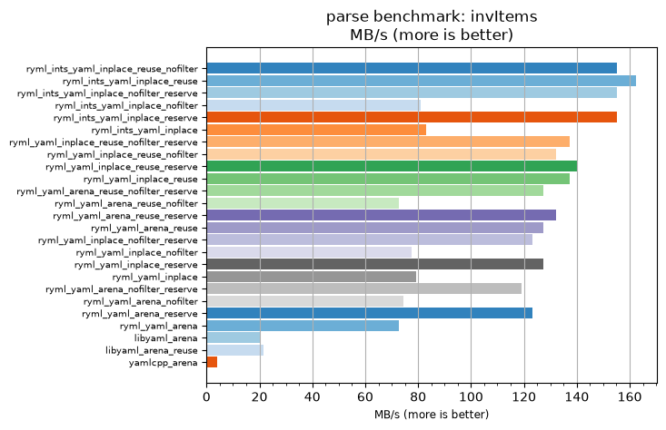
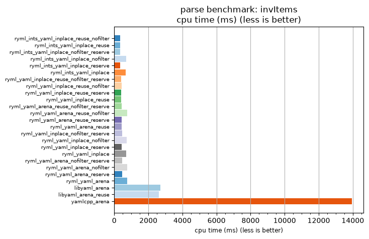

## parse benchmark: invItems

<p>Data type benchmark results:</p>
<ul>
   <li><pre><a href='#ryml-bm-parse-invItems-ryml_ints_yaml_inplace_reuse_nofilter'>ryml_ints_yaml_inplace_reuse_nofilter</a></pre></li> </ul>


<br/>
<br/>

---

<a id="ryml-bm-parse-invItems-ryml_ints_yaml_inplace_reuse_nofilter"/>

### parse benchmark: invItems

* Interactive html graphs
  * [MB/s](./ryml-bm-parse-invItems-mega_bytes_per_second.html)
  * [CPU time](./ryml-bm-parse-invItems-cpu_time_ms.html)

[](./ryml-bm-parse-invItems-mega_bytes_per_second.png)
[](./ryml-bm-parse-invItems-cpu_time_ms.png)

```
+---------------------------------------------------------------------------------------------------------------------+
|                                              parse benchmark: invItems                                              |
+------------------------------------------+---------+---------+----------+---------------+-------------+-------------+
| function                                 |    MB/s | MB/s(x) |  MB/s(%) | cpu time (ms) | cpu time(x) | cpu time(%) |
+------------------------------------------+---------+---------+----------+---------------+-------------+-------------+
| ryml_ints_yaml_inplace_reuse_nofilter    |  155.22 |  38.78x | 3778.26% |        359.38 |       0.03x |     -97.42% |
| ryml_ints_yaml_inplace_reuse             |  162.27 |  40.55x | 3954.55% |        343.75 |       0.02x |     -97.53% |
| ryml_ints_yaml_inplace_nofilter_reserve  |  155.22 |  38.78x | 3778.26% |        359.38 |       0.03x |     -97.42% |
| ryml_ints_yaml_inplace_nofilter          |   81.14 |  20.27x | 1927.27% |        687.50 |       0.05x |     -95.07% |
| ryml_ints_yaml_inplace_reserve           |  155.22 |  38.78x | 3778.26% |        359.38 |       0.03x |     -97.42% |
| ryml_ints_yaml_inplace                   |   83.02 |  20.74x | 1974.42% |        671.88 |       0.05x |     -95.18% |
| ryml_yaml_inplace_reuse_nofilter_reserve |  137.31 |  34.31x | 3330.77% |        406.25 |       0.03x |     -97.09% |
| ryml_yaml_inplace_reuse_nofilter         |  132.22 |  33.04x | 3203.70% |        421.88 |       0.03x |     -96.97% |
| ryml_yaml_inplace_reuse_reserve          |  140.00 |  34.98x | 3398.04% |        398.44 |       0.03x |     -97.14% |
| ryml_yaml_inplace_reuse                  |  137.31 |  34.31x | 3330.77% |        406.25 |       0.03x |     -97.09% |
| ryml_yaml_arena_reuse_nofilter_reserve   |  127.50 |  31.86x | 3085.71% |        437.50 |       0.03x |     -96.86% |
| ryml_yaml_arena_reuse_nofilter           |   72.86 |  18.20x | 1720.41% |        765.62 |       0.05x |     -94.51% |
| ryml_yaml_arena_reuse_reserve            |  132.22 |  33.04x | 3203.70% |        421.88 |       0.03x |     -96.97% |
| ryml_yaml_arena_reuse                    |  127.50 |  31.86x | 3085.71% |        437.50 |       0.03x |     -96.86% |
| ryml_yaml_inplace_nofilter_reserve       |  123.10 |  30.76x | 2975.86% |        453.12 |       0.03x |     -96.75% |
| ryml_yaml_inplace_nofilter               |   77.61 |  19.39x | 1839.13% |        718.75 |       0.05x |     -94.84% |
| ryml_yaml_inplace_reserve                |  127.50 |  31.86x | 3085.71% |        437.50 |       0.03x |     -96.86% |
| ryml_yaml_inplace                        |   79.33 |  19.82x | 1882.22% |        703.12 |       0.05x |     -94.96% |
| ryml_yaml_arena_nofilter_reserve         |  119.00 |  29.73x | 2873.33% |        468.75 |       0.03x |     -96.64% |
| ryml_yaml_arena_nofilter                 |   74.38 |  18.58x | 1758.33% |        750.00 |       0.05x |     -94.62% |
| ryml_yaml_arena_reserve                  |  123.10 |  30.76x | 2975.86% |        453.12 |       0.03x |     -96.75% |
| ryml_yaml_arena                          |   72.86 |  18.20x | 1720.41% |        765.62 |       0.05x |     -94.51% |
| libyaml_arena                            |   20.52 |   5.13x |  412.64% |       2718.75 |       0.20x |     -80.49% |
| libyaml_arena_reuse                      |   21.38 |   5.34x |  434.13% |       2609.38 |       0.19x |     -81.28% |
| yamlcpp_arena                            |    4.00 |   1.00x |    0.00% |      13937.50 |       1.00x |       0.00% |
+------------------------------------------+---------+---------+----------+---------------+-------------+-------------+
```

