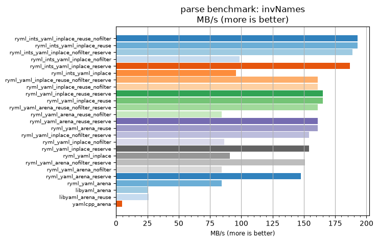
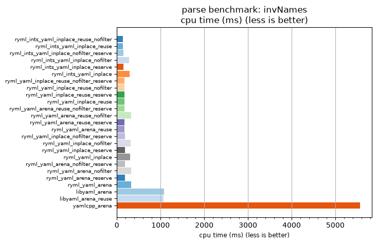

## parse benchmark: invNames

<p>Data type benchmark results:</p>
<ul>
   <li><pre><a href='#ryml-bm-parse-invNames-ryml_ints_yaml_inplace_reuse_nofilter'>ryml_ints_yaml_inplace_reuse_nofilter</a></pre></li> </ul>


<br/>
<br/>

---

<a id="ryml-bm-parse-invNames-ryml_ints_yaml_inplace_reuse_nofilter"/>

### parse benchmark: invNames

* Interactive html graphs
  * [MB/s](./ryml-bm-parse-invNames-mega_bytes_per_second.html)
  * [CPU time](./ryml-bm-parse-invNames-cpu_time_ms.html)

[](./ryml-bm-parse-invNames-mega_bytes_per_second.png)
[](./ryml-bm-parse-invNames-cpu_time_ms.png)

```
+---------------------------------------------------------------------------------------------------------------------+
|                                              parse benchmark: invNames                                              |
+------------------------------------------+---------+---------+----------+---------------+-------------+-------------+
| function                                 |    MB/s | MB/s(x) |  MB/s(%) | cpu time (ms) | cpu time(x) | cpu time(%) |
+------------------------------------------+---------+---------+----------+---------------+-------------+-------------+
| ryml_ints_yaml_inplace_reuse_nofilter    |  192.75 |  38.70x | 3769.57% |        143.75 |       0.03x |     -97.42% |
| ryml_ints_yaml_inplace_reuse             |  192.75 |  38.70x | 3769.57% |        143.75 |       0.03x |     -97.42% |
| ryml_ints_yaml_inplace_nofilter_reserve  |  188.65 |  37.87x | 3687.23% |        146.88 |       0.03x |     -97.36% |
| ryml_ints_yaml_inplace_nofilter          |   98.52 |  19.78x | 1877.78% |        281.25 |       0.05x |     -94.94% |
| ryml_ints_yaml_inplace_reserve           |  186.66 |  37.47x | 3647.37% |        148.44 |       0.03x |     -97.33% |
| ryml_ints_yaml_inplace                   |   95.85 |  19.24x | 1824.32% |        289.06 |       0.05x |     -94.80% |
| ryml_yaml_inplace_reuse_nofilter_reserve |  161.21 |  32.36x | 3136.36% |        171.88 |       0.03x |     -96.91% |
| ryml_yaml_inplace_reuse_nofilter         |  161.21 |  32.36x | 3136.36% |        171.88 |       0.03x |     -96.91% |
| ryml_yaml_inplace_reuse_reserve          |  164.96 |  33.12x | 3211.63% |        167.97 |       0.03x |     -96.98% |
| ryml_yaml_inplace_reuse                  |  164.96 |  33.12x | 3211.63% |        167.97 |       0.03x |     -96.98% |
| ryml_yaml_arena_reuse_nofilter_reserve   |  161.21 |  32.36x | 3136.36% |        171.88 |       0.03x |     -96.91% |
| ryml_yaml_arena_reuse_nofilter           |   84.44 |  16.95x | 1595.24% |        328.12 |       0.06x |     -94.10% |
| ryml_yaml_arena_reuse_reserve            |  161.21 |  32.36x | 3136.36% |        171.88 |       0.03x |     -96.91% |
| ryml_yaml_arena_reuse                    |  161.21 |  32.36x | 3136.36% |        171.88 |       0.03x |     -96.91% |
| ryml_yaml_inplace_nofilter_reserve       |  154.20 |  30.96x | 2995.65% |        179.69 |       0.03x |     -96.77% |
| ryml_yaml_inplace_nofilter               |   86.50 |  17.37x | 1636.59% |        320.31 |       0.06x |     -94.24% |
| ryml_yaml_inplace_reserve                |  154.20 |  30.96x | 2995.65% |        179.69 |       0.03x |     -96.77% |
| ryml_yaml_inplace                        |   90.94 |  18.26x | 1725.64% |        304.69 |       0.05x |     -94.52% |
| ryml_yaml_arena_nofilter_reserve         |  150.92 |  30.30x | 2929.79% |        183.59 |       0.03x |     -96.70% |
| ryml_yaml_arena_nofilter                 |   84.44 |  16.95x | 1595.24% |        328.12 |       0.06x |     -94.10% |
| ryml_yaml_arena_reserve                  |  147.77 |  29.67x | 2866.67% |        187.50 |       0.03x |     -96.63% |
| ryml_yaml_arena                          |   84.44 |  16.95x | 1595.24% |        328.12 |       0.06x |     -94.10% |
| libyaml_arena                            |   25.70 |   5.16x |  415.94% |       1078.12 |       0.19x |     -80.62% |
| libyaml_arena_reuse                      |   26.08 |   5.24x |  423.53% |       1062.50 |       0.19x |     -80.90% |
| yamlcpp_arena                            |    4.98 |   1.00x |    0.00% |       5562.50 |       1.00x |       0.00% |
+------------------------------------------+---------+---------+----------+---------------+-------------+-------------+
```

